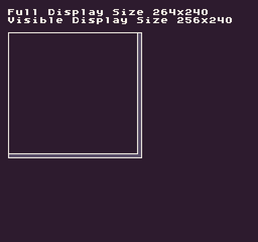

# Display

The display's size defines the visible area where pixel data exists on the screen. Calculating this is important for knowing how to position sprites on the screen. The `Display()` method allows you to get the resolution of the display at run time. By default, this will return the visible screen area based on the overscan value set on the display chip. To calculate the exact overscan in pixels, you must subtract the full size from the visible size. Simply supply false as an argument to get the full display dimensions.

## Usage

`Display ( visible )`

## Arguments

<table>
  <tr>
    <td>Name</td>
    <td>Value</td>
    <td>Description</td>
  </tr>
  <tr>
    <td>visible</td>
    <td>bool</td>
    <td>This is optional and sets the value to true. Passing in false will return the full size of the display.</td>
  </tr>
</table>

## Returns

<table>
  <tr>
    <td>Value</td>
    <td>Description</td>
  </tr>
  <tr>
    <td>Point</td>
    <td>Returns a point with X representing Width and Y representing Height.</td>
  </tr>
</table>

## Example

In this example, we get the full size of the display and the visible size. The visible size represents the full size minus the right and bottom overscan values:

    class DisplayExample : GameChip
    {

        // Save a reference to the canvas
        private Canvas canvas;

        public override void Init()
        { 
            // Create a canvas to visualize the screen sizes
            canvas = new Canvas(256, 240, this);

            // Get the full size of the display
            var sizeA = Display(false);

            // Get the visible size of the display
            var sizeB = Display();

            // Draw the two sizes to the display
            DrawText("Full Display Size " + sizeA.X + "x" +sizeB.Y, 1, 1, DrawMode.Tile, "large", 15);
            DrawText("Visible Display Size " + sizeB.X + "x" +sizeB.Y, 1, 2, DrawMode.Tile, "large", 15);

            // Set the canvas stroke to white
            canvas.SetStroke(new int[]{ 15}, 1, 1);

            // Set the fill color to 5 and draw the full size square
            canvas.SetPattern(new int[] {5}, 1, 1);
            canvas.DrawSquare(8, 32, sizeA.X / 2 + 8, sizeA.Y / 2 + 32, true);

            // Set the fill color to 0 and draw the visible size square
            canvas.SetPattern(new int[] {0}, 1, 1);
            canvas.DrawSquare(8, 32, sizeB.X / 2 + 8, sizeB.Y / 2 + 32, true);

        }

        public override void Draw()
        { 
            // Redraw the display
            RedrawDisplay();

            // Draw the canvas to the display
            canvas.DrawPixels();
        }
    }

Running this code will output the following:


