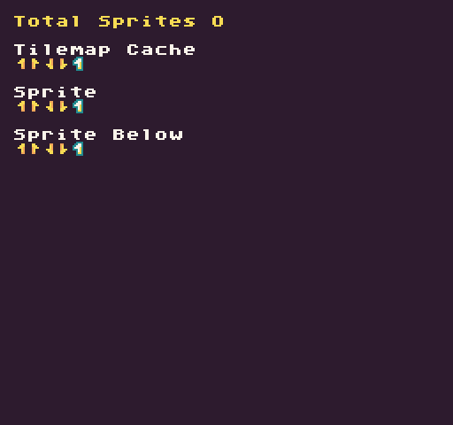

# DrawPixels

The `DrawPixels()` API allows you to push raw pixel data directly to the display. While `DrawPixels()` is used under the hood by all of the drawing APIs, you lose some performance by calling it directly, especially in Lua. Since this bypasses the sprite counter, there is no limit to the number of draw calls you can make to any of the sprite layers. While this may be advantageous in some situations, you also lose the built-in sprite pixel data caching and draw call limitation imposed by the `SpriteChip`.

You can also use `DrawPixels()` to make changes to the tilemap cache layer. Since `DrawPixels()` doesn’t have a width or height restriction, you can use this API to draw irregularly shaped data directly to the tilemap cache without using any sprites. On the flip side, there is no way to use `DrawPixels()` on the tile layer, so using it will cancel the draw call. It is important to note that when you change a tile's sprite ID or color offset, the tilemap redraws it back to the cache, overwriting any pixel data that was previously there.

## Usage

`DrawPixels ( pixelData, x, y, width, height, flipH, flipV, drawMode, colorOffset )`

## Arguments

<table>
  <tr>
    <td>Name</td>
    <td>Value</td>
    <td>Description</td>
  </tr>
  <tr>
    <td>pixelData</td>
    <td>int[]</td>
    <td>The pixelData argument accepts an int array representing references to color IDs. The pixelData array length needs to be the same size as the supplied width and height, or it will throw an error.</td>
  </tr>
  <tr>
    <td>x</td>
    <td>int</td>
    <td>The x position where to display the new pixel data. The display's horizontal 0 position is on the far left-hand side. When using DrawMode.TilemapCache, the pixel data is drawn into the tilemap's cache instead of directly on the display when using DrawMode.Sprite.</td>
  </tr>
  <tr>
    <td>y</td>
    <td>int</td>
    <td>The Y position where to display the new pixel data. The display's vertical 0 position is on the top. When using DrawMode.TilemapCache, the pixel data is drawn into the tilemap's cache instead of directly on the display when using DrawMode.Sprite.</td>
  </tr>
  <tr>
    <td>width</td>
    <td>int</td>
    <td>The width of the pixel data to use when rendering to the display.</td>
  </tr>
  <tr>
    <td>height</td>
    <td>int</td>
    <td>The height of the pixel data to use when rendering to the display.</td>
  </tr>
  <tr>
    <td>flipH</td>
    <td>bool</td>
    <td>This is an optional argument which accepts a bool. The default value is set to false but passing in true flips the pixel data horizontally.</td>
  </tr>
  <tr>
    <td>flipV</td>
    <td>bool</td>
    <td>This is an optional argument which accepts a bool. The default value is set to false but passing in true flips the pixel data vertically.</td>
  </tr>
  <tr>
    <td>drawMode</td>
    <td>DrawMode</td>
    <td>This argument accepts the DrawMode enum. You can use Sprite, SpriteBelow, and TilemapCache to change where the pixel data is drawn to. By default, this value is DrawMode.Sprite.</td>
  </tr>
  <tr>
    <td>colorOffset</td>
    <td>int</td>
    <td>This optional argument accepts an int that offsets all the color IDs in the pixel data array. This value is added to each int, in the pixel data array, allowing you to simulate palette shifting.</td>
  </tr>
</table>

## Draw Modes

The `DrawPixels()` API supports the following draw modes:

<table>
  <tr>
    <td>DrawMode</td>
    <td>Layer ID</td>
    <td>Supported</td>
  </tr>
  <tr>
    <td>TilemapCache</td>
    <td>-1</td>
    <td>Yes</td>
  </tr>
  <tr>
    <td>Background</td>
    <td>0</td>
    <td>No</td>
  </tr>
  <tr>
    <td>SpriteBelow</td>
    <td>1</td>
    <td>Yes</td>
  </tr>
  <tr>
    <td>Tile</td>
    <td>2</td>
    <td>No</td>
  </tr>
  <tr>
    <td>Sprite</td>
    <td>3</td>
    <td>Yes</td>
  </tr>
  <tr>
    <td>UI</td>
    <td>4</td>
    <td>Yes</td>
  </tr>
  <tr>
    <td>SpriteAbove</td>
    <td>5</td>
    <td>Yes</td>
  </tr>
</table>

Attempting to use an unsupported draw mode will cancel the draw request. 

## Example

In this example, we will take an array of color IDs and push them to the display using the DrawPixels() API. There are 3 draw mode examples showing off how to use this API in different situations:

    class DrawPixelsExample : GameChip
    {
        int[] pixelData = {
            -1, -1, -1, 0, 0, 0, 0, -1,
            -1, -1, 0, 0, 14, 14, 0, -1,
            -1, 0, 0, 14, 14, 14, 0, -1,
            -1, 0, 14, 14, 14, 13, 0, -1,
            -1, 0, 0, 0, 14, 13, 0, -1,
            -1, -1, -1, 0, 14, 13, 0, -1,
            -1, -1, -1, 0, 13, 13, 0, -1,
            -1, -1, -1, 0, 0, 0, 0, -1,
        };

        public override void Init()
        { 
            // Draw the sprite data to the tilemap cache
            DrawText("Tilemap Cache", 1, 3, DrawMode.Tile, "large", 15);
            DrawPixels(pixelData, 8, 32, 8, 8, false, false, DrawMode.TilemapCache);
            DrawPixels(pixelData, 16, 32, 8, 8, true, false, DrawMode.TilemapCache);
            DrawPixels(pixelData, 24, 32, 8, 8, false, true, DrawMode.TilemapCache);
            DrawPixels(pixelData, 32, 32, 8, 8, true, true, DrawMode.TilemapCache);

            // Shfit the pixel data color IDs by 1
            DrawPixels(pixelData, 40, 32, 8, 8, false, false, DrawMode.TilemapCache, 1);

        }

        public override void Draw()
        { 
            // Redraw the display
            RedrawDisplay();

            // Label for the sprite layer examples
            DrawText("Sprite", 1, 6, DrawMode.Tile, "large", 15);

            // You can simplify the call if you are not flipping the pixel data
            DrawPixels(pixelData, 8, 56, 8, 8);

            // Fliping the pixel data on the sprite layer, which is used by default when not provided
            DrawPixels(pixelData, 16, 56, 8, 8, true, false);
            DrawPixels(pixelData, 24, 56, 8, 8, false, true);
            DrawPixels(pixelData, 32, 56, 8, 8, true, true);

            // Shift the pixel data color IDs over by 1 requires passing in the draw mode
            DrawPixels(pixelData, 40, 56, 8, 8, false, false, DrawMode.Sprite, 1);

            // Draw pixel data to the sprite below layer
            DrawText("Sprite Below", 1, 9, DrawMode.Tile, "large", 15);
            DrawPixels(pixelData, 8, 80, 8, 8, false, false, DrawMode.SpriteBelow);
            DrawPixels(pixelData, 16, 80, 8, 8, true, false, DrawMode.SpriteBelow);
            DrawPixels(pixelData, 24, 80, 8, 8, false, true, DrawMode.SpriteBelow);
            DrawPixels(pixelData, 32, 80, 8, 8, true, true, DrawMode.SpriteBelow);
            DrawPixels(pixelData, 40, 80, 8, 8, false, false, DrawMode.SpriteBelow, 1);

            // Display the total sprites used during this frame
            DrawText("Total Sprites " + CurrentSprites, 8, 8, DrawMode.Sprite, "large", 14);

        }
    }

Running this code will output the following:


