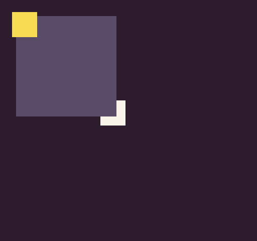

# DrawRect

The `DrawRect()` API allows you to display a rectangle with a fill color on the screen. Since this API uses `DrawPixels()`, rectangles can be drawn to the tilemap cache or sprite layers. You can also use `DrawRect()` to quickly clear the screen or debug objects on the screen such as bounding boxes for collision detection. It’s important to note that the rectangle’s pixel data is created every time the draw request is called, so there could be a performance hit if `DrawRect()` is used too much on each frame.

## Usage

`DrawRect ( x, y, width, height, color, drawMode )`

## Arguments

<table>
  <tr>
    <td>Name</td>
    <td>Value</td>
    <td>Description</td>
  </tr>
  <tr>
    <td>x</td>
    <td>int</td>
    <td>The x position where to display the rectangle’s pixel data. The display's horizontal 0 position is on the far left-hand side. When using DrawMode.TilemapCache, the pixel data is drawn into the tilemap's cache instead of directly on the display when using DrawMode.Sprite.</td>
  </tr>
  <tr>
    <td>y</td>
    <td>int</td>
    <td>The Y position where to display the rectangle’s pixel data. The display's vertical 0 position is on the top. When using DrawMode.TilemapCache, the pixel data is drawn into the tilemap's cache instead of directly on the display when using DrawMode.Sprite.</td>
  </tr>
  <tr>
    <td>width</td>
    <td>int</td>
    <td>The width of the pixel data to use when rendering the rectangle to the display.</td>
  </tr>
  <tr>
    <td>height</td>
    <td>int</td>
    <td>The height of the pixel data to use when rendering the rectangle to the display.</td>
  </tr>
  <tr>
    <td>color</td>
    <td>int</td>
    <td>The color to use when filling the rectangle’s pixel data.</td>
  </tr>
  <tr>
    <td>drawMode</td>
    <td>DrawMode</td>
    <td>This argument accepts the DrawMode enum. You can use Sprite, SpriteBelow, and TilemapCache to change where the rectangle’s pixel data is drawn to. By default, this value is DrawMode.Sprite.</td>
  </tr>
</table>

## Draw Modes

The `DrawPixels()` API supports the following draw modes:

<table>
  <tr>
    <td>DrawMode</td>
    <td>Layer ID</td>
    <td>Supported</td>
  </tr>
  <tr>
    <td>TilemapCache</td>
    <td>-1</td>
    <td>Yes</td>
  </tr>
  <tr>
    <td>Background</td>
    <td>0</td>
    <td>No</td>
  </tr>
  <tr>
    <td>SpriteBelow</td>
    <td>1</td>
    <td>Yes</td>
  </tr>
  <tr>
    <td>Tile</td>
    <td>2</td>
    <td>No</td>
  </tr>
  <tr>
    <td>Sprite</td>
    <td>3</td>
    <td>Yes</td>
  </tr>
  <tr>
    <td>UI</td>
    <td>4</td>
    <td>Yes</td>
  </tr>
  <tr>
    <td>SpriteAbove</td>
    <td>5</td>
    <td>Yes</td>
  </tr>
</table>

Attempting to use an unsupported draw mode will cancel the draw request.

## Example

In this example, we draw three rectangles to the display using different draw modes:

    class DrawRectExample : GameChip
    {
        public override void Init()
        { 
            // Draw a 100 x 100 pixel rect to the display
            DrawRect(16, 16, 100, 100, 5, DrawMode.TilemapCache);

        }

        public override void Draw()
        { 
            // Redraw the display
            RedrawDisplay();

            // Draw a rect to the sprite layer
            DrawRect(12, 12, 25, 25, 14, DrawMode.Sprite);

            // Draw a rect to the sprite below layer
            DrawRect(100, 100, 25, 25, 15, DrawMode.SpriteBelow);

        }

    }

Running this code will output the following:


