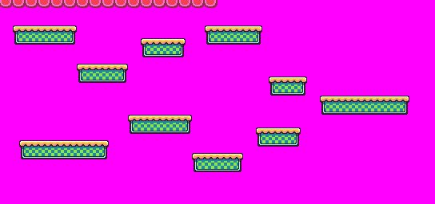
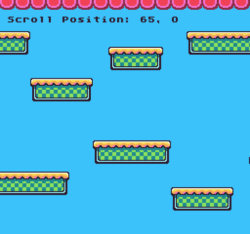

# DrawTilemap

By default, the tilemap renders to the display by simply calling `DrawTilemap()`. This automatically fills the entire display with the visible portion of the tilemap. To have need more granular control for drawing the tilemap, you can supply an optional `X` and `Y` position to change where it draws on the screen. You can also modify the `width` (columns) and `height `(rows) that are displayed too. This is useful if you want to show a HUD or some other kind of image on the screen that is not overridden by the tilemap. 

The `DrawTilemap() `API automatically uses the scroll position to offset where to start drawing the tilemap to the display. By default, a scroll position of `0`,`0` would be the top left corner of the tilemap. When you call `ScrollPosition()` and change the value, it will move the sample area to the new position of the tilemap. You can override this by supplying an optional `offsetX `and `offsetY `value. For example, if you want to render a HUD at the top of the screen with a scroll position `X` value of `100`, you’d pass `0` in for the `offsetX `value to reset the sampling area.

Finally, the `DrawTilemap()` API doesn’t accept a draw mode since it’s hardcoded to render on the tile layer. When you call `DrawTilemap()`, it will sample the pixel data from the tilemap cache layer and copy it to the tile layer. The tilemap cache layer doesn’t actually get rendered, which is its layer ID is `-1` below the background. So keep in mind, whatever you draw into the tilemap cache layer will be displayed when you call `DrawTilemap()`.

## Usage

`DrawTilemap ( x, y, columns, rows, offsetX, offsetY)`

## Arguments

<table>
  <tr>
    <td>Name</td>
    <td>Value</td>
    <td>Description</td>
  </tr>
  <tr>
    <td>x</td>
    <td>int</td>
    <td>An optional int value representing the X position to render the tilemap on the display. If set to 0, it renders on the far left-hand side of the screen.</td>
  </tr>
  <tr>
    <td>y</td>
    <td>int</td>
    <td>An optional int value representing the Y position to render the tilemap on the display. If set to 0, it renders on the top of the screen.</td>
  </tr>
  <tr>
    <td>columns</td>
    <td>int</td>
    <td>An optional int value representing how many horizontal tiles to include when drawing the map. By default, this is 0 which automatically uses the fully visible width of the display, while taking into account the X position offset.</td>
  </tr>
  <tr>
    <td>rows</td>
    <td>int</td>
    <td>An optional int value representing how many vertical tiles to include when drawing the map. By default, this is 0 which automatically uses the full visible height of the display, while taking into account the Y position offset.</td>
  </tr>
  <tr>
    <td>offsetX</td>
    <td>int</td>
    <td>An optional int value to override the scroll X position. This is useful when you need to change the left x position from where to sample the tilemap data from.</td>
  </tr>
  <tr>
    <td>offsetY</td>
    <td>int</td>
    <td>An optional int value to override the scroll Y position. This is useful when you need to change the top y position from where to sample the tilemap data from.</td>
  </tr>
</table>

## Example

In this example, we are going to create two `DrawTilemap()` calls to display the tilemap. The first call will draw a static border on the top and the second call will display the tilemap as it scrolls. This is what the tilemap looks like:

Since we continue to increase the `ScrollPosition()`’s `X` value, the tilemap will wrap around once it reaches the end. Since we are drawing the text as sprites over the tilemap, the characters will stay fixed on the screen since they are not using the `ScrollPosition()` value to draw their `X` and `Y` position:

    class DrawTilemapExample : GameChip
    {
        // Use floats to store the subpixel position
        private float speed = 5;
        private float nextPos;

        // Use this point to position the  sprites
        private Point pos;

        public override void Update(int timeDelta)
        {
            // Calculate the next position
            nextPos = nextPos + (speed * (timeDelta / 100f));

            // Need to convert the nextPoint to an int, so we'll save it in a point
            pos.X = (int) nextPos;
            pos.Y = (int) nextPos;

            // Update the scroll position
            ScrollPosition(pos.X);

        }

        public override void Draw()
        {
            // Clear the background
            Clear();

            // Draw the actual tilemap starting below the top border and manually adjust the scroll offset values
            DrawTilemap(0, 16, 32, 28, pos.X, 16);

            // Draw the tilemap top border over everything else and lock the x scroll value
            DrawTilemap(0, 0, 32, 2, 0);

            // Display the scroll position
            DrawText("Scroll Position: " + ScrollPosition().X + ", " + ScrollPosition().Y, 8, 16, DrawMode.Sprite,
                "large");

        }
    }

Running this code will output the following:


