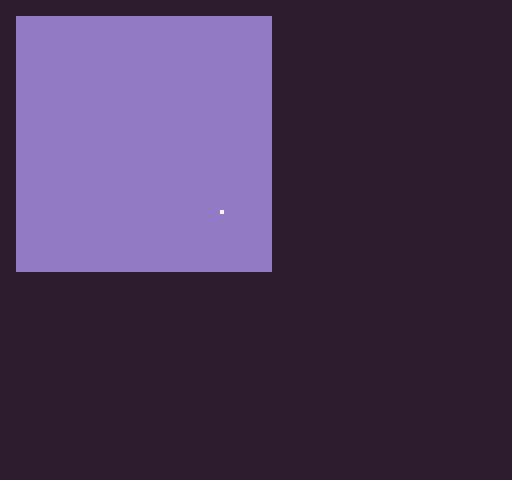

# NewRect

A `Rectangle `is a Pixel Vision 8 primitive used for defining the bounds of an object on the display. It contains an `X`, `W`, `Width` and `Height` property. The Rectangle object class also has some additional methods to aid with collision detection.

## Usage

`NewRect ( x, y, w, h )`

## Arguments

<table>
  <tr>
    <td>Name</td>
    <td>Value</td>
    <td>Description</td>
  </tr>
  <tr>
    <td>x</td>
    <td>int</td>
    <td>The x position of the rect as an int.</td>
  </tr>
  <tr>
    <td>y</td>
    <td>int</td>
    <td>The y position of the rect as an int.</td>
  </tr>
  <tr>
    <td>w</td>
    <td>int</td>
    <td>The width value of the rect as an int.</td>
  </tr>
  <tr>
    <td>h</td>
    <td>int</td>
    <td>The height value of the rect as an int.</td>
  </tr>
</table>

## Returns

<table>
  <tr>
    <td>Value</td>
    <td>Description</td>
  </tr>
  <tr>
    <td>Rect</td>
    <td>Returns a new instance of a Rect to be used as a Lua object.</td>
  </tr>
</table>

## Collision APIs

The Rectangle has three methods you can use to determine if there is a collision.

<table>
  <tr>
    <td>Name</td>
    <td>Description</td>
  </tr>
  <tr>
    <td>Contains( x, y )</td>
    <td>Test to see if an X and Y position are inside of the Rectangle.</td>
  </tr>
  <tr>
    <td>Contains( point )</td>
    <td>Test to see if a point is inside of the Rectangle.</td>
  </tr>
  <tr>
    <td>Contains( rectangle )</td>
    <td>Test to see if another Rectangle intersects with the Rectangle.</td>
  </tr>
</table>

## Example

In this example, we are going to create two rectangles and test to see if they collide with one another:

    class NewRectExample : GameChip
    {
        // Store the rectangle
        Rectangle rectA;

        // This will store the mouse position
        private Point mousePos;

        // This will store the collision state
        private bool collision = false;

        public override void Init()
        {
            // Use the game's NewRect() to create a rectangle instance
            rectA = NewRect(8, 8, 128, 128);
        }

        public override void Update(int timeDelta)
        {
            // Get the mouse position
            mousePos = MousePosition();

            // Test for the collision
            collision = rectA.Contains(mousePos);

        }

        public override void Draw()
        {

            // Redraw the display
            RedrawDisplay();

            // Draw rectA and change the color if there is a collision
            DrawRect(rectA.X, rectA.Y, rectA.Width, rectA.Height, collision ? 6 : 5);

            // Draw the mouse cursor on the screen
            DrawRect(mousePos.X - 1, mousePos.Y - 1, 2, 2, 15);

        }
    }

Running this code will output the following:


