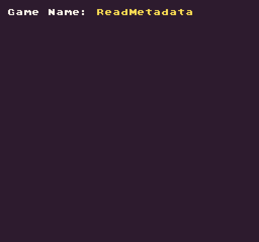

# ReadMetadata

The `ReadMetadata()` API allows you to read the `metadata `that is passed into the game when it loads. This is used by the Pixel Vision 8 Runner to pass data between load sessions. When a game is restarted, it will get a copy of the original `metadata `that was used to launch the game for the first time. The `metadata `is eventually cleared as the Runner loads new games, so it’s important to save any of the `metadata `you need between sessions to the game’s `saves.json` file. Finally, all keys and values are strings. This means if you are reading an integer or boolean, you’ll need to convert it in order to get its native type.

## Summary

`ReadMetaData ( key, defaultValue )`

## Arguments

<table>
  <tr>
    <td>Name</td>
    <td>Value</td>
    <td>Description</td>
  </tr>
  <tr>
    <td>key</td>
    <td>string</td>
    <td>The name of the metadata’s key</td>
  </tr>
  <tr>
    <td>defaultValue</td>
    <td>string</td>
    <td>A default value to return if the key doesn’t exist on the metadata.</td>
  </tr>
</table>

## Returns

<table>
  <tr>
    <td>Value</td>
    <td>Description</td>
  </tr>
  <tr>
    <td>string</td>
    <td>The string value from the metadata’s key or the default value if the key does not exist.</td>
  </tr>
</table>

## Common Keys

The Pixel Vision 8 Runner adds the following metadata keys whenever it loads up a game:

<table>
  <tr>
    <td>Name</td>
    <td>Description</td>
  </tr>
  <tr>
    <td>name</td>
    <td></td>
  </tr>
  <tr>
    <td>GameName</td>
    <td></td>
  </tr>
  <tr>
    <td>RootPath</td>
    <td></td>
  </tr>
  <tr>
    <td>Player1UpKey</td>
    <td></td>
  </tr>
  <tr>
    <td>Player1DownKey</td>
    <td></td>
  </tr>
  <tr>
    <td>Player1RightKey</td>
    <td></td>
  </tr>
  <tr>
    <td>Player1LeftKey</td>
    <td></td>
  </tr>
  <tr>
    <td>Player1SelectKey</td>
    <td></td>
  </tr>
  <tr>
    <td>Player1StartKey</td>
    <td></td>
  </tr>
  <tr>
    <td>Player1AKey</td>
    <td></td>
  </tr>
  <tr>
    <td>Player1BKey</td>
    <td></td>
  </tr>
  <tr>
    <td>Player1UpButton</td>
    <td></td>
  </tr>
  <tr>
    <td>Player1DownButton</td>
    <td></td>
  </tr>
  <tr>
    <td>Player1RightButton</td>
    <td></td>
  </tr>
  <tr>
    <td>Player1LeftButton</td>
    <td></td>
  </tr>
  <tr>
    <td>Player1SelectButton</td>
    <td></td>
  </tr>
  <tr>
    <td>Player1StartButton</td>
    <td></td>
  </tr>
  <tr>
    <td>Player1AButton</td>
    <td></td>
  </tr>
  <tr>
    <td>Player1BButton</td>
    <td></td>
  </tr>
  <tr>
    <td>Player2UpKey</td>
    <td></td>
  </tr>
  <tr>
    <td>Player2DownKey</td>
    <td></td>
  </tr>
  <tr>
    <td>Player2RightKey</td>
    <td></td>
  </tr>
  <tr>
    <td>Player2LeftKey</td>
    <td></td>
  </tr>
  <tr>
    <td>Player2SelectKey</td>
    <td></td>
  </tr>
  <tr>
    <td>Player2StartKey</td>
    <td></td>
  </tr>
  <tr>
    <td>Player2AKey</td>
    <td></td>
  </tr>
  <tr>
    <td>Player2BKey</td>
    <td></td>
  </tr>
  <tr>
    <td>Player2UpButton</td>
    <td></td>
  </tr>
  <tr>
    <td>Player2DownButton</td>
    <td></td>
  </tr>
  <tr>
    <td>Player2RightButton</td>
    <td></td>
  </tr>
  <tr>
    <td>Player2LeftButton</td>
    <td></td>
  </tr>
  <tr>
    <td>Player2SelectButton</td>
    <td></td>
  </tr>
  <tr>
    <td>Player2StartButton</td>
    <td></td>
  </tr>
  <tr>
    <td>Player2AButton</td>
    <td></td>
  </tr>
  <tr>
    <td>Player2BButton</td>
    <td></td>
  </tr>
  <tr>
    <td>reset</td>
    <td></td>
  </tr>
  <tr>
    <td>ShowEjectAnimation</td>
    <td></td>
  </tr>
  <tr>
    <td>errorMessage</td>
    <td></td>
  </tr>
  <tr>
    <td>exceptionMessage</td>
    <td></td>
  </tr>
</table>

## Example

In this example, we are going to iterate over all of the game’s metadata keys and output what we can to the display:

    class ReadMetadataExample : GameChip
    {
         
         public override void Init()
        { 

            // Display the name of the game from the game's metadata
            DrawText("Game Name:", 1, 1, DrawMode.Tile, "large", 15);
            DrawText(ReadMetadata("GameName", "Untitled"), 12, 1, DrawMode.Tile, "large", 14);

        }

        public override void Draw()
        { 

            // Redraw the display
            RedrawDisplay();

        }
    }

Running this code will output the following:


