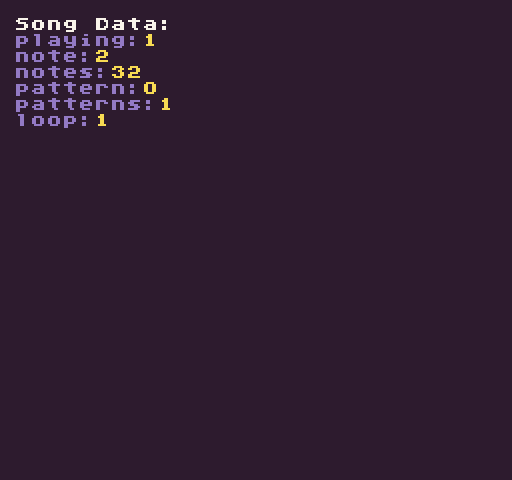

# RewindSong ( position, patternID)

The `RewindSong()` API allows you rewind the currently playing song to a specific position and pattern ID. Calling this API without any arguments will simply rewind the song to the beginning of the first pattern. After rewinding a song, it will stop playing. You will have to call the PlaySong() API to have it continue from the rewound position.

## Usage

`RewindSong ( position, patternID)`

## Arguments

<table>
  <tr>
    <td>Name</td>
    <td>Value</td>
    <td>Description</td>
  </tr>
  <tr>
    <td>position</td>
    <td>int</td>
    <td>Position in the loop to start playing at.</td>
  </tr>
  <tr>
    <td>patternID</td>
    <td>int</td>
    <td>The loop to rewind too.</td>
  </tr>
</table>

These arguments are currently not supported and will be added in a future release.

## Example

In this example, we’ll play the first song on a loop and when the left mouse button is released, rewind it back to the beginning:

    class RewindSongExample : GameChip
    {
        public override void Init()
        {

            //Draw the song data label
            DrawText("Song Data:", 1, 1, DrawMode.Tile, "large", 15);

            // Start playing the song on a loop
            PlaySong(0, true);

        }

        public override void Update(int timeDelta)
        { 

            // Test if the left mouse button was released to rewind the song
            if (MouseButton(0, InputState.Released))
            { 

                // Rewinds the currently playing song back to the beginning and stops playback
                RewindSong();

                // After rewinding a song, we'll need to start the playback again
                PlaySong(0, true);

            }
        }

        public override void Draw()
        { 
            //Redraw display
            RedrawDisplay();

            // Reset the next row value so we know where to draw the first line of text
            var nextRow = 2;

            // Display the song's metadata
            foreach (var data in SongData())
            {
                
                //Draw the key value pair from the song data table
                DrawText(data.Key+":", 8, nextRow * 8, DrawMode.Sprite, "large", 6);
                DrawText(data.Value.ToString(), 16 + (data.Key.Length * 8), nextRow * 8, DrawMode.Sprite, "large", 14);

                //Increment the row by 1 for the next loop

                nextRow = nextRow + 1;

            }
        }
    }

Running this code will output the following:


