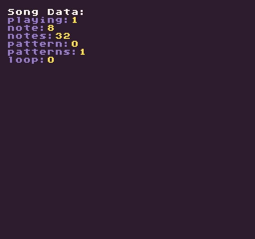

# SongData

Returns a dictionary with information about the current state of the `MusicChip`. This includes whether or not a song is playing, what not it’s on, how many patterns there are and the total times the song has looped.

## Summary

`SongData ( )`

## Returns

<table>
  <tr>
    <td>Value</td>
    <td>Description</td>
  </tr>
  <tr>
    <td>Dictionary</td>
    <td>This returns a dictionary with a string key and integer value representing the data for the currently playing song.</td>
  </tr>
</table>

## Keys

These are the keys to use when reading from the song data dictionary:

<table>
  <tr>
    <td>Key</td>
    <td>Description</td>
  </tr>
  <tr>
    <td>playing</td>
    <td>Returns a 1 for true or 2 for false</td>
  </tr>
  <tr>
    <td>notes</td>
    <td>The currently playing note.</td>
  </tr>
  <tr>
    <td>notes</td>
    <td>The total number of notes in the currently playing pattern.</td>
  </tr>
  <tr>
    <td>pattern</td>
    <td>The ID of the currently playing pattern.</td>
  </tr>
  <tr>
    <td>patterns</td>
    <td>The total number of patterns in the currently playing song.</td>
  </tr>
  <tr>
    <td>loop</td>
    <td>The number of times the song has looped.</td>
  </tr>
</table>

## Example

In this example, we are going to automatically play a song when the game loads up and display the song data for it:

    class SongDataExample : GameChip
    {
        public override void Init()
        {
            // Play the first song with no repeat
            PlaySong(0, false); ;
        }

        public override void Draw()
        {

            // Redraw display
            RedrawDisplay();

            // Reset the next row value so we know where to draw the first line of text
            var nextRow = 2;

            // Draw the song data label
            DrawText("Song Data:", 8, 8, DrawMode.Sprite, "large", 15);

            // Display the song's meta data
            foreach (var data in SongData())
            {

                // Draw the key value pair from the song data table
                DrawText(data.Key + ":", 8, nextRow * 8, DrawMode.Sprite, "large", 6);
                DrawText(data.Value.ToString(), 16 + (data.Key.Length * 8), nextRow * 8, DrawMode.Sprite, "large",
                    14);

                // Increment the row by 1 for the next loop
                nextRow++;

            }
        }
    }

Running this code will output the following:


