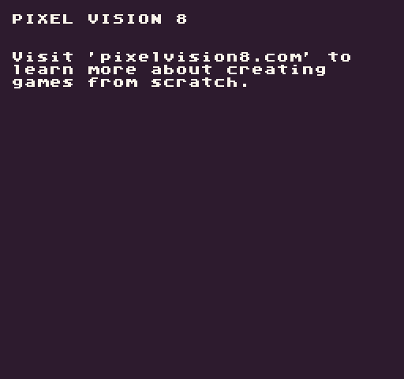

# SplitLines

The `SplitLines()` API converts text with line breaks (`\n`) into an array. This can be used in conjunction with the `WordWrap()` helper to render large blocks of text line by line with the `DrawText()` API.

## Summary

`SplitLines ( str )`

## Arguments

<table>
  <tr>
    <td>Name</td>
    <td>Value</td>
    <td>Description</td>
  </tr>
  <tr>
    <td>str</td>
    <td>string</td>
    <td>The string of text to split.</td>
  </tr>
</table>

## Returns

<table>
  <tr>
    <td>Value</td>
    <td>Description</td>
  </tr>
  <tr>
    <td>string[]</td>
    <td>Returns an array of strings representing each line of text.</td>
  </tr>
</table>

## Example

In this example, we are going to use the `SplitLines()` API to create an array of text to draw to the display:

    class SplitLinesExample : GameChip
    {
        
        // Message to display on the screen
        private string message = "PIXEL VISION 8\n\n\nVisit 'pixelvision8.com' to learn more about creating games from scratch.";

        public override void Init()
        { 

            // To convert the message into lines of text we need to wrap it then split it
            var wrap = WordWrap(message, (Display().X / 8) - 2);
            var lines = SplitLines(wrap);

            // Loop through each line of text and draw it to the display
            for (int i = 0; i &lt; lines.Length; i++)
            {
                DrawText(lines[i], 1, i+1, DrawMode.Tile, "large", 15);
            }

        }

        public override void Draw()
        { 
            // Redraw the display
            RedrawDisplay();
        }
    }

Running this code will output the following:


