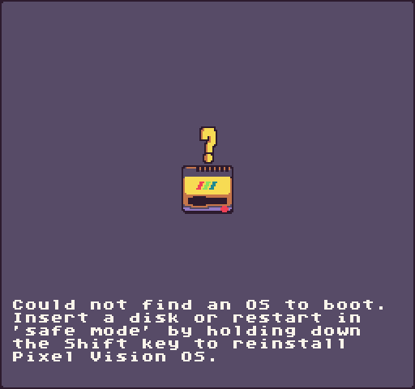
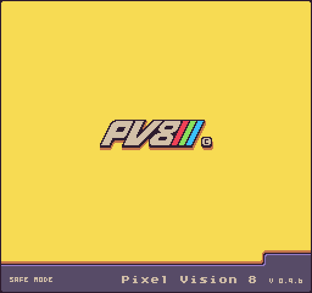

When you build Pixel Vision 8 from the source code it will not have a default OS installed. You’ll see the following screen after you compile it.

You can boot into Pixel Vision OS directly by dragging the OS disk folder onto the PV8 window.

You can find the `PixelVisionOS `folder inside of the `/PixelVision8/Disks/` directory. After the OS is loaded it will boot up and load the Workspace Tool. The next time you compile Pixel Vision 8, it will automatically load the last disk path that was saved to the `bios.json` file.

If you run into any issues when booting up, you can boot into Safe Mode by holding down the `Shift Key` when Pixel Vision 8 loads up.

This will ignore the user’s bios settings and display the missing OS screen again allowing you to reload the Pixel Vision OS or any other PV8 disk.


