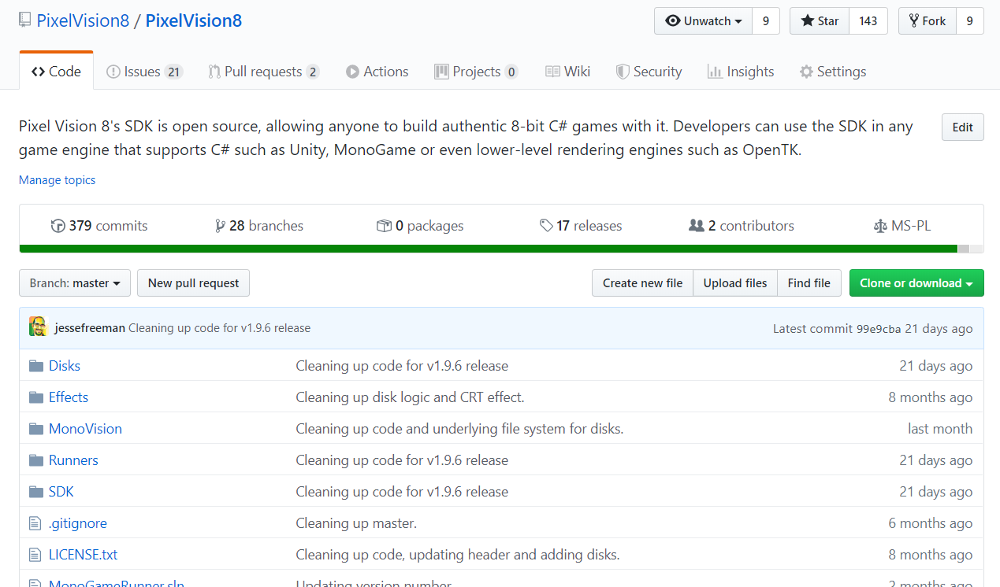
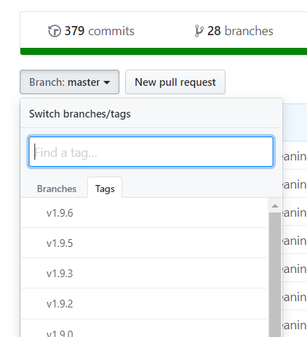
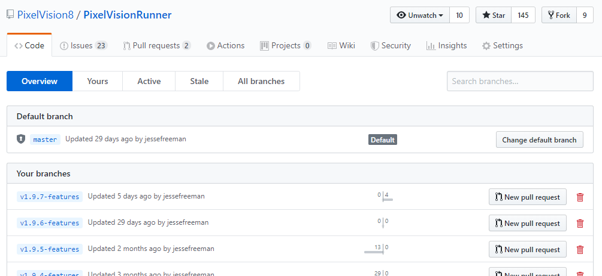
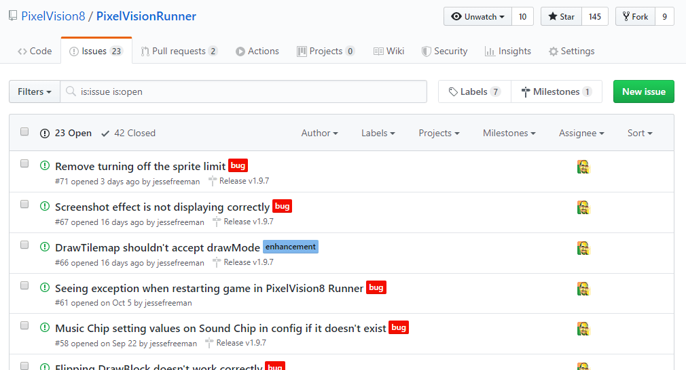

# Cloning From Github

Before you clone from Github, let’s talk about how the repo is structured, and which branch or tag you should clone. While you can simply check out the master branch, each stable build is tagged based on its version.

Each tag is considered "stable" and will no longer get updated. The master branch will always represent the lastest stable codebase and is updated after each new version is released. That means you’ll need to do a pull to get updates after each release.

Finally, for those looking for nightly builds or patches to bugs as they are closed, the branches offer the most up-to-date fixes. Simply find the latest version if you are looking for patches to issues recently closed.

The is an up to date list of issues currently being worked on and each issue is tagged to the version they will be fixed. Feel free to log bugs or submit fixes and we’ll figure out how to handle them.


