# Making C# Games

Let’s take a look at how you can use Pixel Vision OS and Visual Studio to make a PV8 game with C#. When it comes to making Pixel Vision 8 games in C#,  you will need to adopt a hybrid workflow. This tutorial assumes you are using Visual Studio on a PC. You can also follow the same steps on Visual Studio for the Mac or if you are using Jetbrain’s Rider. To get started, you’ll want to download a zip copy of the Github repo instead of cloning.

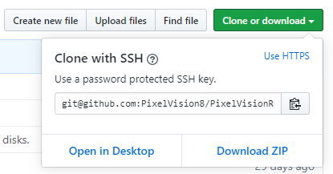

Once it’s downloaded, unzip the file, move it to your Documents folder, and rename it to PixelVision8Games. You can work on multiple Pixel Vision 8 C# games in the same Visual Studio solution.

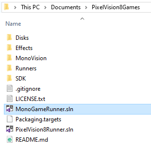

Next, you’ll want to open up the `MonoGameRunner.sln` file in Visual Studio. This solution contains two Runners, one for C# and the other for Lua. Remove the Lua project since we won’t be needing it.

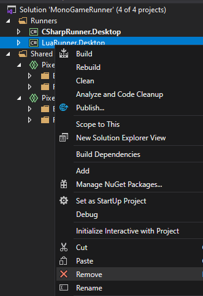

Now we’ll need to make a copy of the default C# project and import it back into our solution. On the file system, open up the `PixelVision8Games/Runners/` directory and make a copy of the `CSharpRunner` folder. Rename the folder to `MyGame` and you’ll need to do the same for the project file inside. 

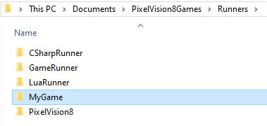

Before we import this in Visual Studio, we’ll need to make a few changes to the `MyGame.Desktop.csproj` file you just renamed.  Look for the `ProjectGuid` node. We need to give this a unique ID so we don’t get a conflict with other projects in the solution.

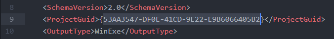

You can use an [online generator](https://guidgenerator.com/) to or make it up yourself. You can also use this opportunity to make changes to the any of the project’s other values such as its name and version number. After you’ve made your changes, add the project to the solution by right-clicking on the Runner folder and selecting Existing Project from the menu.

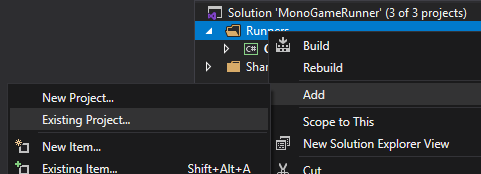

At this point, you should have a solution with the default C# project and the new one you created.

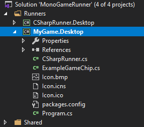

Currently, the MyGame project is referencing a default project in the Disks folder which is not part of the solution. If you go back into the `MyGame.Desktop` project file, you’ll see where it is being referenced by looking for a reference to `\Disks\PixelVision8System\`. 

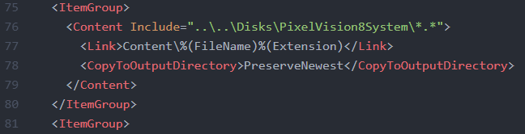

If you are Visual Studio, you will need to unload the project first, or you can just find the file in the `Runners/CSharpRunner/CSharpRunner.Desktop.csproj` and edit outside of Visual Studio.

In order to make a new game, we need to make a copy of the `PixelVision8System` folder then renaming it `MyGame`. You can put this in the Disks folder to keep track of it easier. 

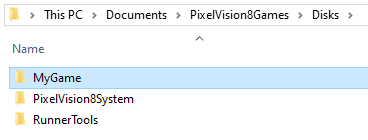

Once you’ve created the new project folder, change the path in the `CSharpRunner.Desktop` file. You can also delete the `code.lua` file in the game folder since we won’t be using it in C#.

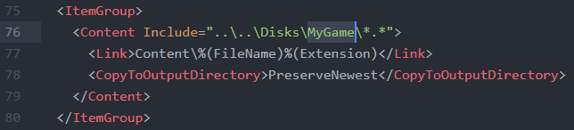

Now, when you return to Visual Studio and reload the solution, you’ll all of the files from the `MyGame` folder, referenced in the project’s `Content` folder.

Let’s go ahead and rename the `ExampleGameChip.cs` file as well. You’ll want to go in and change the class name to `MyGame` and update the `CSharpRunner.cs` project to use the new class. 

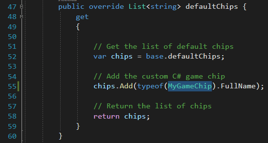

At this point, we should be able to run the game. But, before we do that, open up the `MyGameChip.cs` file and change the message to read "MY NEW GAME" instead of “EMPTY GAME”. When you compile your game, you’ll see the following.

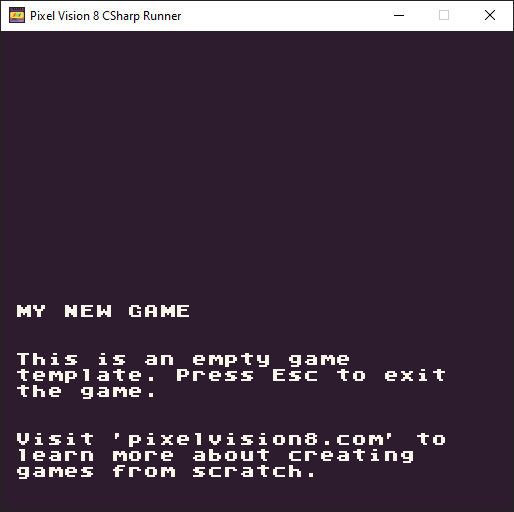

At this point, you should have everything you need to start building your new C# game in Visual Studio. If you don’t have a copy of Pixel Vision 8 installed yet, [get a copy from the site](https://www.pixelvision8.com/play) and [install Pixel Vision OS](https://www.pixelvision8.com/getting-started). We’ll be using the Pixel Vision OS tools to help us build our C# game.

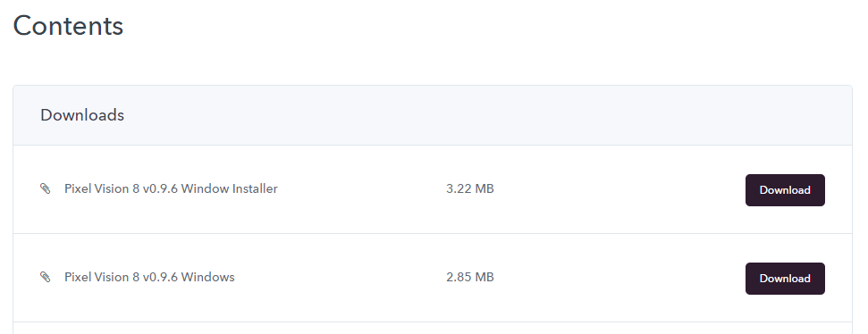

The last thing we’ll cover is how to use Pixel Vision OS’s tool to make changes to your game files. Once you have Pixel Vision 8 booted up, you’ll want to drag the `MyGame` folder you created in the `Disks` directory onto the Pixel Vision 8 window. That should mount your game as a disk on the desktop. Open the disk and you’ll see all of the files inside of the folder on your computer.

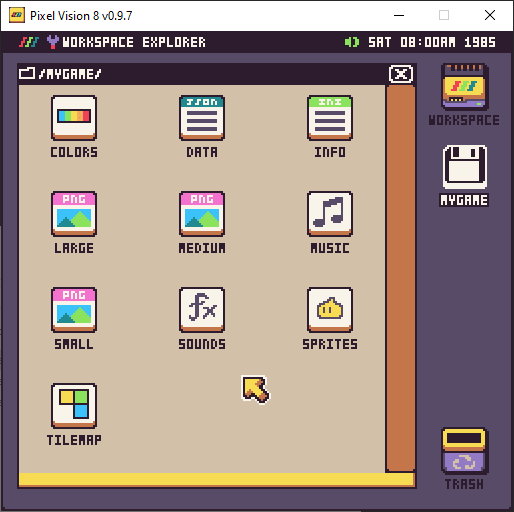

Now you can use all of Pixel Vision OS’s built-in tools, including the Pro Tools if you have them installed, to edit your games files. With this workflow, you’ll do all of your coding in Visual Studio, and all of your configuration and game file editing in Pixel Vision 8. When you want to see any changes, you’ll need to rebuild the game in Visual Studio.

It’s important to note that if you are adding or deleting files outside of Visual Studio, you may need to unload and reload the project to see the changes in the Contents folder. Since we are using a pattern to match any files inside of the Disks/MyGame directory and copy them over to the Contents directory, they should be copied over but sometime Visual Studio loses track of the changes.

When you are ready to make a new C# game, you can simply copy the default project and rename it for the new game just like we did before.


