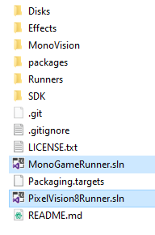

# Runners

A Pixel Vision 8 Runner is any code wrapper that bridges the gap between the core engine and the host OS. The Runner performs the following tasks:

* Facilitates rendering the `DisplayChip`’s pixel data on the screen.

* It provides a native application wrapper so PV8 can run as a self-contained executable.

* Calls the `GameChip`’s `Init()`method on startup as well as the `Update()` and `Draw()` methods during each frame.

* Feeds the engine input data such as the mouse, keyboard and any connected controllers.

* It provides a way to play audio.

* Manages the loading and playing of games plus their associated files.

Runners are relatively easy to build with Visual Studio or Rider. Once you’ve cloned or downloaded the repo, you’ll find two Runner solutions.

The `MonoGameRunner.sln` solution will launch a project with a simple C# and Lua Runner on top of MonoGame. The `PixelVision8Runner.sln` solution will launch a project with two Pixel Vision 8 branded runners using a custom build of MonoGame called MonoVision. The MonoGame Runner will boot directly into a game while the Pixel Vision 8 Runner contains a full file system and can be used to run Pixel Vision OS.


