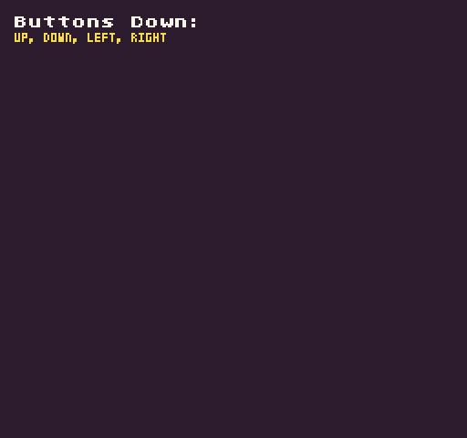

The main form of input for Pixel Vision 8 is the controller's buttons. You can get the current state of any button by calling the `Button()` method and supplying a button ID. There are optional parameters for specifying an `InputState` and the controller ID. When called, the `Button()` method returns a `bool` for the requested button and its state. 

The `InputState `enum contains options for testing the `Down `and `Released `states of the supplied button ID. By default, `Down `is automatically used which returns `true `when the key was pressed in the current frame. When using `Released`, the method returns `true `if the key is currently up but was down in the last frame.

## Usage

`Button ( button, state, controllerID )`

## Arguments

<table>
  <tr>
    <td>Name</td>
    <td>Value</td>
    <td>Description</td>
  </tr>
  <tr>
    <td>button</td>
    <td>Buttons</td>
    <td>Accepts the Buttons enum or int for the button's ID.</td>
  </tr>
  <tr>
    <td>state</td>
    <td>InputState</td>
    <td>Optional InputState enum. Returns down state by default.</td>
  </tr>
  <tr>
    <td>controllerID</td>
    <td>int</td>
    <td>An optional int representing a controller ID. Player 1 is 0 and player 2 is 1. leaving this empty will deafult to player 1.</td>
  </tr>
</table>

## Returns

<table>
  <tr>
    <td>Value</td>
    <td>Description</td>
  </tr>
  <tr>
    <td>bool</td>
    <td>Returns a bool based on the state of the button.</td>
  </tr>
</table>

## Button Enums

Each controller has 8 buttons. A button has a specific ID or you can reference it by the button’s enum name.

 

<table>
  <tr>
    <td>Enum</td>
    <td>Value</td>
  </tr>
  <tr>
    <td>Buttons.Up</td>
    <td>0</td>
  </tr>
  <tr>
    <td>Buttons.Down</td>
    <td>1</td>
  </tr>
  <tr>
    <td>Buttons.Left</td>
    <td>2</td>
  </tr>
  <tr>
    <td>Buttons.Right</td>
    <td>3</td>
  </tr>
  <tr>
    <td>Buttons.A</td>
    <td>4</td>
  </tr>
  <tr>
    <td>Buttons.B</td>
    <td>5</td>
  </tr>
  <tr>
    <td>Buttons.Select</td>
    <td>6</td>
  </tr>
  <tr>
    <td>Buttons.Start</td>
    <td>7</td>
  </tr>
</table>

## Input State Enums

There are two input states you can use to test a button’s current state:

<table>
  <tr>
    <td>Enum</td>
    <td>Value</td>
  </tr>
  <tr>
    <td>InputState.Down</td>
    <td>0</td>
  </tr>
  <tr>
    <td>InputState.Released</td>
    <td>1</td>
  </tr>
</table>

## Example

In this example, we will loop through all of the buttons on controller 1 and display their names on the screen:

    class ButtonExample : GameChip
    {
        // This array will store any buttons pressed during the current frame
        private List&lt;string&gt; pressedButtons = new List&lt;string&gt;();

        // A list of all the buttons to check on each frame
        private Buttons[] buttons = 
        {
            Buttons.Up,
            Buttons.Down,
            Buttons.Left,
            Buttons.Right,
            Buttons.A,
            Buttons.B,
            Buttons.Select,
            Buttons.Start
        };

        public override void Update(int timeDelta)
        { 

            // Clear the pressedButtons array on each frame
            pressedButtons.Clear();

            // Loop through all the buttons
            for (int i = 0; i &lt; buttons.Length; i++)
            {
            
                // Test if player 1's current button is down and save it to the pressedButtons array
                if(Button(buttons[i], InputState.Down, 0))
                {
                    pressedButtons.Add(buttons[i].ToString());
                }

            }
        }

        public override void Draw()
        { 

            // Clear the display
            Clear();

            // Convert the pressedButtons into a string and draw to the display
            var message = string.Concat(pressedButtons.ToArray()).ToUpper();
            DrawText("Buttons Down:", 8, 8, DrawMode.Sprite, "large", 15);
            DrawText(message.Substring(0, message.Length), 8, 16, DrawMode.Sprite, "medium", 14, - 4);

        }
    }

Running this code will output the following:


