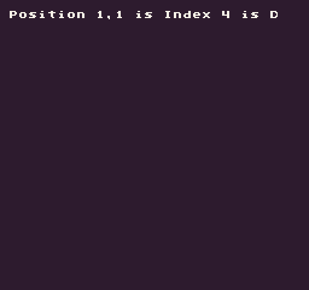

Converts an `X` and `Y` position into an index value. This is useful for finding positions in 1D arrays that represent 2D data.

## Usage

`CalculateIndex ( x, y, width )`

## Arguments

<table>
  <tr>
    <td>Name</td>
    <td>Value</td>
    <td>Description</td>
  </tr>
  <tr>
    <td>x</td>
    <td>int</td>
    <td>The x position.</td>
  </tr>
  <tr>
    <td>y</td>
    <td>int</td>
    <td>The y position.</td>
  </tr>
  <tr>
    <td>width</td>
    <td>int</td>
    <td>The width of the data if it was represented as a 2D array.</td>
  </tr>
</table>

## Returns

<table>
  <tr>
    <td>Value</td>
    <td>Description</td>
  </tr>
  <tr>
    <td>int</td>
    <td>Returns an int value representing the X and Y position in a 1D array.</td>
  </tr>
</table>

## Example

In this example, we will treat a 1D as a 2D array and get a value from it based on an `X`, `Y` position:

    class CalculateIndexExample : GameChip
    {
        
        // A 1D array of example values
        private string[] exampleGrid =
        {
            "A", "B", "C",
            "D", "E", "F",
            "G", "H", "I",
        };

        public override void Init()
        { 
            // Calculate the center index based on a grid with 3 columns
            var index = CalculateIndex(1, 1, 3);

            // Draw the index and value to the display
            DrawText("Position 1,1 is Index " + index + " is " + exampleGrid[index], 1, 1, DrawMode.Tile, "large",
                15);

        }

        public override void Draw()
        { 
            // Redraw the display
            RedrawDisplay();
        }

    }

Running this code will output the following:


