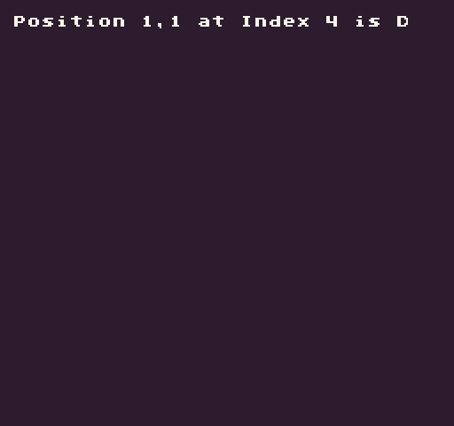

# CalculatePosition

Converts an index value into a point with an `X` and `Y` value to help when working with 1D arrays that represent 2D data.

## Usage

`CalculatePosition ( index, width )`

## Arguments

<table>
  <tr>
    <td>Name</td>
    <td>Value</td>
    <td>Description</td>
  </tr>
  <tr>
    <td>index</td>
    <td>int</td>
    <td>The position of the 1D array.</td>
  </tr>
  <tr>
    <td>width</td>
    <td>int</td>
    <td>The width of the data if it was a 2D array.</td>
  </tr>
</table>

## 
Returns

<table>
  <tr>
    <td>Value</td>
    <td>Description</td>
  </tr>
  <tr>
    <td>int</td>
    <td>Returns a vector representing the X and Y position of an index in a 1D array.</td>
  </tr>
</table>

## Example

In this example, we will treat a 1D as a 2D array and convert an index into a `X`, `Y` position:

    class CalculatePositionExample : GameChip
    {
        // A 1D array of example values
        private string[] exampleGrid =
        {
            "A", "B", "C",
            "D", "E", "F",
            "G", "H", "I",
        };

        public override void Init()
        {
            var index = 4;

            // Calculate the center index based on a grid with 3 columns
            var position = CalculatePosition(index, 3);

            // Draw the index and value to the display
            DrawText("Position "+position.X+","+position.Y+" at Index "+index+" is "+exampleGrid[index], 1, 1, DrawMode.Tile, "large", 15);

        }

        public override void Draw()
        {
            // Redraw the display
            RedrawDisplay();
        }

    }

Running this code will output the following:


