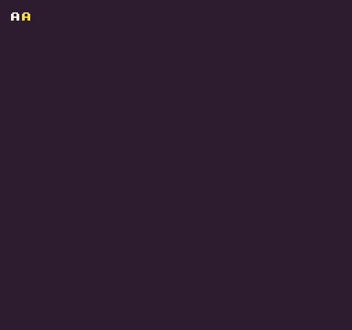

The `CharacterToPixelData()` API converts a single font character into raw pixel data.

## Usage

`CharacterToPixelData ( character, fontName )`

## Arguments

<table>
  <tr>
    <td>Name</td>
    <td>Value</td>
    <td>Description</td>
  </tr>
  <tr>
    <td>character</td>
    <td>char</td>
    <td>A single character.</td>
  </tr>
  <tr>
    <td>fontName</td>
    <td>string</td>
    <td>The name of the font to use.</td>
  </tr>
</table>

## Returns

<table>
  <tr>
    <td>Value</td>
    <td>Description</td>
  </tr>
  <tr>
    <td>int[]</td>
    <td>Returns an array with integers representing color ID values.</td>
  </tr>
</table>

## Example

In this example, we use the default `DrawText()` API to display an `A` on the screen. To make it white, we will have to shift the color offset over by `15`. Next to it, we’ll display the raw pixel data of the font character. When we call `CharacterToPixelData()` API to get a reference to the character’s pixel data, we’ll loop through and replace the default color of `0` with `14`. After altering the raw draw the pixel data, we no longer need to supply a color offset when drawing it to the display:

    class CharacterToPixelDataExample : GameChip
    {

        private int[] pixelData;

        public override void Init()
        {

            // Get the raw pixel data for the A character
            pixelData = CharacterToPixelData('A', "large");

            // Loop through all of the pixels
            for (int i = 0; i &lt; pixelData.Length; i++)
            {
                 
                // Test to see if the pixel is set to the color ID 0
                if(pixelData[i] == 0)
                { 

                // Change the color ID to 14
                pixelData[i] = 14;

                }

            }

        }

        public override void Draw()
        {

            // Redraw display
            RedrawDisplay();

            // Use the normal DrawText() API to display the A
            DrawText("A", 8, 8, DrawMode.Sprite, "large", 15);

            // Draw the pixel data to the display next to the A
            DrawPixels(pixelData, 16, 8, 8, 8);

        }
    }

Running this code will output the following:


