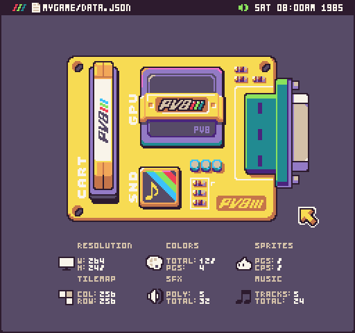
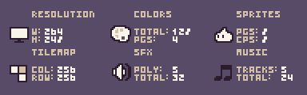
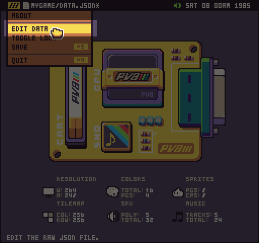
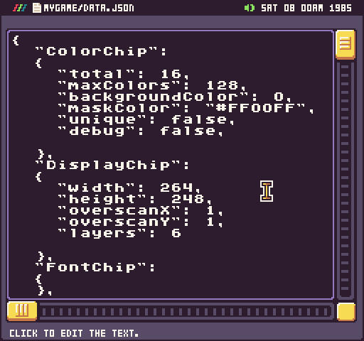

Under the hood, the Pixel Vision 8 engine is broken down into several "chips" that control how the engine behaves. The Chip Editor allows you to make changes to each of these chips and define the system limitations for each game.  After opening the `data.json` file, you’ll be presented with a graphical representation of the system’s chips.

The specs panel underneath the chips represents a summary of a system template’s limitations. 

It is broken down into six aspects that map over to Pixel Vision 8’s built-in chips. Here are the main chips groups that make up a working system: resolution, colors, sprites, tilemap, sounds, and music. Together these limitations help define what you can and can’t do when making PV8 games and tools.

Here is a breakdown of each property: 

### Resolution

<table>
  <tr>
    <td>W</td>
    <td>Width</td>
    <td>The width of the screen’s resolution.</td>
  </tr>
  <tr>
    <td>H</td>
    <td>Height</td>
    <td>The height of the screen’s resolution.</td>
  </tr>
</table>

### Colors

<table>
  <tr>
    <td>T</td>
    <td>Total</td>
    <td>The total number of colors the system supports.</td>
  </tr>
  <tr>
    <td>PS</td>
    <td>Colors Per Sprite</td>
    <td>Total colors per sprite.</td>
  </tr>
</table>

### Sprites

<table>
  <tr>
    <td>T</td>
    <td>Total Sprites</td>
    <td>The total number of sprites allowed in memory.</td>
  </tr>
  <tr>
    <td>Max</td>
    <td>Maximum Sprites</td>
    <td>The maximum number of sprites the display can render in a single frame.</td>
  </tr>
</table>

### Tilemap

<table>
  <tr>
    <td>W</td>
    <td>Width</td>
    <td>The width (in tiles) of the tilemap.</td>
  </tr>
  <tr>
    <td>H</td>
    <td>Height</td>
    <td>The height (in tiles) of the tilemap.</td>
  </tr>
</table>

### Sound

<table>
  <tr>
    <td>CH</td>
    <td>Channels</td>
    <td>The total number of channels on which the system can play sounds.</td>
  </tr>
  <tr>
    <td>T</td>
    <td>Total</td>
    <td>The total number of sound effects the system can store in its memory.</td>
  </tr>
</table>

### Music

<table>
  <tr>
    <td>TR</td>
    <td>Tracks</td>
    <td>The total number of tracks the music chip can use to playback sounds.</td>
  </tr>
  <tr>
    <td>T</td>
    <td>Total</td>
    <td>The total amount of music data the system can store in its memory.</td>
  </tr>
</table>

Finally, if you want to access some of the more advanced options, simply edit the `data.json` file directly. In the Chip Editor, you can access this option via the drop-down menu.

Each chip has its own properties. Changes here will directly impact how a Pixel Vision 8 game runs so be careful when editing these settings by hand.


