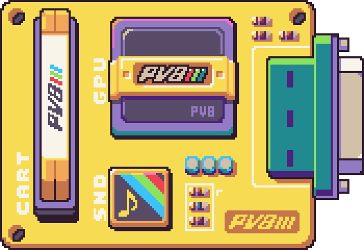

# Chip Properties

Each chip, that is defined in the `data.json` file, has its own properties that you can modify in order to change the look and feel of your game. You can edit this file by hand or use the Chip Editor which is included in the Pro Tools and has built-in system templates to make changing things easier. Since a game has at least 8 chips, it’s easier to look at system specs as three main categories: graphics, storage, and sound. 

While there is a bit of overlap between which chips are part of the GPU and storage group, each one focuses on a specific aspect of the engine and how it will perform.

## Graphics

The first group contains the storage properties. These are responsible for the visuals of PV8 games. This group is comprised of the following properties:

<table>
  <tr>
    <td>Property</td>
    <td>Chip</td>
    <td>Description</td>
  </tr>
  <tr>
    <td>width</td>
    <td>DisplayChip</td>
    <td>The width of the resolution in pixels.</td>
  </tr>
  <tr>
    <td>height</td>
    <td>DisplayChip</td>
    <td>The height of the resolution in pixels.</td>
  </tr>
  <tr>
    <td>overscanX</td>
    <td>DisplayChip</td>
    <td>The number of right side columns to subtract from the resolution.</td>
  </tr>
  <tr>
    <td>overscanY</td>
    <td>DisplayChip</td>
    <td>The number of bottom rows to subtract from the resolution.</td>
  </tr>
  <tr>
    <td>maxSpriteCount </td>
    <td>SpriteChip</td>
    <td>The total number of sprites that can be displayed at one time.</td>
  </tr>
  <tr>
    <td>maxColors</td>
    <td>ColorChip</td>
    <td>The total number of system colors.</td>
  </tr>
  <tr>
    <td>cps</td>
    <td>SpriteChip</td>
    <td>The total colors per sprite.</td>
  </tr>
</table>

## Storage

The second group makes up the storage properties. These properties are responsible for how much data can be stored in a PV8 game. This group is comprised of the following properties:

<table>
  <tr>
    <td>Property</td>
    <td>Chip</td>
    <td>Description</td>
  </tr>
  <tr>
    <td>columns</td>
    <td>TilemapChip</td>
    <td>The total number of columns that the tilemap is made up of.</td>
  </tr>
  <tr>
    <td>rows</td>
    <td>TilemapChip</td>
    <td>The total number of rows that the tilemap is made up of.</td>
  </tr>
  <tr>
    <td>pages</td>
    <td>SpriteChip</td>
    <td>The total number of sprite memory pages. Each page contains 256 sprites.</td>
  </tr>
  <tr>
    <td>maxSize</td>
    <td>GameChip</td>
    <td>The maximum size of the game cartridge. This is only enforced when building Lua games in Pixel Vision OS.</td>
  </tr>
  <tr>
    <td>saveSlots</td>
    <td>GameChip</td>
    <td>The number of save slots the game contains.</td>
  </tr>
</table>

## Audio

The last group makes up the audio properties. These properties define how sound effects and music work in a PV8 game. This group is comprised of the following properties:

<table>
  <tr>
    <td>Property</td>
    <td>Chip</td>
    <td>Description</td>
  </tr>
  <tr>
    <td>totalSounds</td>
    <td>SoundChip</td>
    <td>The total number of sound effects the sound chip can load into memory.</td>
  </tr>
  <tr>
    <td>totalChannels</td>
    <td>SoundChip</td>
    <td>The total channels that are avalible for playing back sound effects. This also represents the total number of tracks available to song patterns.</td>
  </tr>
  <tr>
    <td>channelTypes</td>
    <td>SoundChip</td>
    <td>An array representing the waveform ID each channel uses. Setting this to -1 will allow any waveform to be played on the channel.</td>
  </tr>
  <tr>
    <td>totalSongs</td>
    <td>MusicChip</td>
    <td>The total number of songs the MusicChip can store in memory.</td>
  </tr>
  <tr>
    <td>totalPatterns</td>
    <td>MusicChip  </td>
    <td>The total number of patterns the MusicChip can store in memory.</td>
  </tr>
</table>

## Extra Properties

Finally, there are additional properties that are useful for more advanced users. You should only edit these if you know what you are doing.

<table>
  <tr>
    <td>Property</td>
    <td>Chip</td>
    <td>Description</td>
  </tr>
  <tr>
    <td>backgroundColor</td>
    <td>ColorChip</td>
    <td>Sets the default background color for clearing the game’s screen.</td>
  </tr>
  <tr>
    <td>maskColor</td>
    <td>ColorChip</td>
    <td>This will change the default mask color, which is used to determine what color represents transparency when importing images and drawing them to the display.</td>
  </tr>
  <tr>
    <td>debug</td>
    <td>ColorChip</td>
    <td>Forces the engine to use the mask color when a color ID is out of range instead of defaulting to the background color.</td>
  </tr>
  <tr>
    <td>layers</td>
    <td>DisplayChip</td>
    <td>The number of layers you can use when drawing pixel data to the display.</td>
  </tr>
  <tr>
    <td>unique</td>
    <td>SpriteChip</td>
    <td>This will automatically optimize sprites as they are loaded making sure there are no duplicated sprites. This may affect the IDs of sprites in memory when you set to true.</td>
  </tr>
  <tr>
    <td>autoImport</td>
    <td>TilemapChip</td>
    <td>When load a tilemap.png file, any tiles not found in the SpriteChip’s memory will be added to ensure the tilemap has all the tiles it needs to render correctly.</td>
  </tr>
</table>


