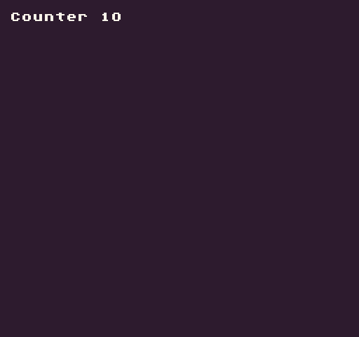

The `Clamp()` API limits a value between a minimum and maximum integer.

## Usage

`Clamp ( val, min, max )`

## Arguments

<table>
  <tr>
    <td>Name</td>
    <td>Value</td>
    <td>Description</td>
  </tr>
  <tr>
    <td>val</td>
    <td>int</td>
    <td>The value to clamp.</td>
  </tr>
  <tr>
    <td>min</td>
    <td>int</td>
    <td>The minimum value should be.</td>
  </tr>
  <tr>
    <td>max</td>
    <td>int</td>
    <td>The maximum value should be.</td>
  </tr>
</table>

## Returns

<table>
  <tr>
    <td>Value</td>
    <td>Description</td>
  </tr>
  <tr>
    <td>int</td>
    <td>Returns an int within the min and max range.</td>
  </tr>
</table>

## Example

In this example, we will increase the number by 1 every frame and clamp it at 100:

    class ClampExample : GameChip
    {

        private int counter;
        private int time;
        private int delay = 300;

        public override void Update( int timeDelta)
        { 
            // Add the time delay to the time
            time = time + timeDelta;

            // Check if time is greater than the delay
            if(time &gt; delay)
            { 

                // Increase the counter by 1
                counter = Clamp(counter + 1, 0, 10);

                // Reset the time
                time = 0;

            }
        }

        public override void Draw()
        {

            // Redraw the display
            RedrawDisplay();

            // Draw the counter to the display
            DrawText("Counter " + counter, 8, 8, DrawMode.Sprite, "large", 15);

        }

    }

Running this code will output the following:


