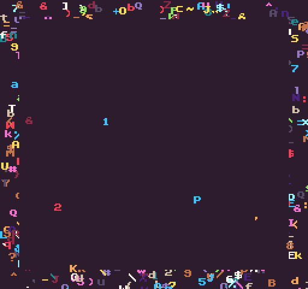

# Clear()

Clearing the display removes all of the existing pixel data, replacing it with the default background color. The `Clear()` API allows you to specify what region of the display to clear. By calling` Clear()`, with no arguments, it automatically clears the entire display. You can manually define an area of the screen to clear by supplying optional `x`, `y`, `width`, and `height` argument values. 

When clearing a specific area of the display, anything outside of the defined boundaries remains on the next draw phase. This is useful for drawing a HUD but clearing the display below for a scrolling map and sprites. The `Clear()` can only be used once during the draw phase.

## Usage

```csharp
Clear ( x, y, width, height )
```

## Arguments

| Name   | Value | Description                                                                                                                                                                                                                                                                                                                                              |
|--------|-------|----------------------------------------------------------------------------------------------------------------------------------------------------------------------------------------------------------------------------------------------------------------------------------------------------------------------------------------------------------|
| x      | int   | This is an optional value that defaults to 0 and defines where the clear's X position should begin\. When X is 0, clear starts on the far left\-hand side of the display\. Values less than 0 or greater than the width of the display are ignored\.                                                                                                     |
| y      | int   | This is an optional value that defaults to 0 and defines where the clear's Y position should begin\. When Y is 0, clear starts at the top of the display\. Values less than 0 or greater than the height of the display are ignored\.                                                                                                                    |
| width  | int   | This is an optional value that defaults to the width of the display and defines how many horizontal pixels to clear\. When the width is 0, clear starts at the x position and ends at the far right\-hand side of the display\. Values less than 0 or greater than the width are adjusted to stay within the boundaries of the screen's visible pixels\. |
| height | int   | This is an optional value that defaults to the height of the display and defines how many vertical pixels to clear\. When the height is 0, clear starts at the Y position and ends at the bottom of the display\. Values less than 0 or greater than the height are adjusted to stay within the boundaries of the screen's visible pixels\.              |


## Example

In this example, we are going to use a simple time to toggle between clearing the entire screen or just the center of the screen:

## Lua

```lua
local display = Display()

-- Create a delay and time value
local delay = 2000
local time = 0

-- This flag will toggle between a full or partial clear
local clearFlag = false

-- Store random integers for drawing a random character to the screen
local char, x, y, colorID = 0

function Update(timeDelta)

  -- Increase the time value base on the timeDelta between the last frame
  time = time + timeDelta

  -- Text to see if time is greater than the delay
  if(time &gt; delay) then

    -- Toggle the clear flag
    clearFlag = not clearFlag

    -- Reset the timer
    time = 0

  end

end

function Draw()

  -- Test the clear flag and do a full or partial clear based on the value
  if(clearFlag == true) then
    Clear()
  else
    Clear(16, 16, display.x - 32, display.y - 32)
  end

  -- Perform the next block of code 10 times
  for i = 1, 10 do

    -- Assign random values to each of these variable
    char = math.random(32, 126)
    x = math.random(0, display.x)
    y = math.random(0, display.y)
    colorID = math.random(1, 15)

    -- Draw a random character at a random position on the screen with a random color
    DrawText( string.char(char), x, y, DrawMode.Sprite, "large", colorID)

  end

end
```


## C#

```csharp
class ClearExample : GameChip
{
    // Create a new random generator
    Random random = new Random();

    // We'll store the display's boundaries here
    private Point display;
    
    // Create a delay and time value
    private int delay = 2000;
    private int time = 0;

    // This flag will toggle between a full or partial clear
    private bool clearFlag = false;

    // Store random integers for drawing a random character to the screen
    private int charID, x, y, colorID;

    public override void Init()
    {
        // Save the display's boundaries when the game starts up
        display = Display();
    }

    public override void Update(int timeDelta)
    { 
        // Increase the time value base on the timeDelta between the last frame
        time = time + timeDelta;

                   // Text to see if time is greater than the delay
        if(time &gt; delay)
        {

            // Toggle the clear flag
            clearFlag = !clearFlag;

            // Reset the timer
            time = 0;

        }
    }

    public override void Draw()
    { 
        // Test the clear flag and do a full or partial clear based on the value
        if (clearFlag == true)
        {
            Clear();
        } else {
            Clear(16, 16, display.X - 32, display.Y - 32);
        }

        // Perform the next block of code 10 times
        for (int i = 0; i &lt; 10; i++)
        {
         
            // Assign random values to each of these variable
            charID = random.Next(32, 126);
            x = random.Next(0, display.X);
            y = random.Next(0, display.Y);
            colorID = random.Next(1, 15);

            // Draw a random charIDacter at a random position on the screen with a random color
            DrawText(Convert.ToChar(charID).ToString(), x, y, DrawMode.Sprite, "large", colorID);

        }
    }
}
```


Running this code will output the following:




