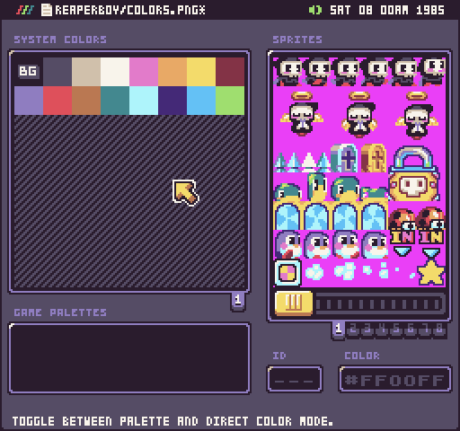

Pixel Vision OS has a built-in Color Tool to make previewing and editing system colors easier. You can use the Color Tool to also create individual palettes for swapping at run-time.

## Keyboard Shortcuts

The Color Tool has the following keyboard shortcuts based on what actions are available.

<table>
  <tr>
    <td>Name</td>
    <td>Shortcut</td>
    <td>Description</td>
  </tr>
  <tr>
    <td>Save</td>
    <td>Ctrl + S</td>
    <td>Save the changes to the color.png file.</td>
  </tr>
  <tr>
    <td>Add</td>
    <td>Ctrl + A</td>
    <td>Add a new color to the right of the currently selected color.</td>
  </tr>
  <tr>
    <td>Edit</td>
    <td>Ctrl + E</td>
    <td>Edit the currently selected color.</td>
  </tr>
  <tr>
    <td>Clear</td>
    <td>Ctrl + B</td>
    <td>Clear the currently selected palette color. This will make the color transparent.</td>
  </tr>
  <tr>
    <td>Delete</td>
    <td>Ctrl + D</td>
    <td>Delete the currently selected color.</td>
  </tr>
  <tr>
    <td>Undo</td>
    <td>Ctrl + Z</td>
    <td>Undo the last color change.</td>
  </tr>
  <tr>
    <td>Redo</td>
    <td>Ctrl + X</td>
    <td>Redo the last color change.</td>
  </tr>
  <tr>
    <td>Copy</td>
    <td>Ctrl + C</td>
    <td>Copy the currently selected color.</td>
  </tr>
  <tr>
    <td>Paste</td>
    <td>Ctrl + V</td>
    <td>Paste the currently selected color into a palette.</td>
  </tr>
  <tr>
    <td>Quit</td>
    <td>Ctrl + Q</td>
    <td>Quit the current tool.</td>
  </tr>
</table>


