Pixel Vision OS has a built-in Color Tool to make previewing and editing system colors easier. You can use the Color Tool to also create individual palettes for swapping at run-time.

## Keyboard Shortcuts

The Color Tool has the following keyboard shortcuts based on what actions are available.

| Name   | Shortcut  | Description                                                                         |
|--------|-----------|-------------------------------------------------------------------------------------|
| Save   | Ctrl \+ S | Save the changes to the color\.png file\.                                           |
| Add    | Ctrl \+ A | Add a new color to the right of the currently selected color\.                      |
| Edit   | Ctrl \+ E | Edit the currently selected color\.                                                 |
| Clear  | Ctrl \+ B | Clear the currently selected palette color\. This will make the color transparent\. |
| Delete | Ctrl \+ D | Delete the currently selected color\.                                               |
| Undo   | Ctrl \+ Z | Undo the last color change\.                                                        |
| Redo   | Ctrl \+ X | Redo the last color change\.                                                        |
| Copy   | Ctrl \+ C | Copy the currently selected color\.                                                 |
| Paste  | Ctrl \+ V | Paste the currently selected color into a palette\.                                 |
| Quit   | Ctrl \+ Q | Quit the current tool\.                                                             |

## Total System Colors

Let’s focus on how to configure system colors first. Pixel Vision 8 can store a maximum of 256 colors. You can change the total number of system colors by editing the `data.json` file. If you have the Chip Editor installed, simply click on the GPU chip and change the total.

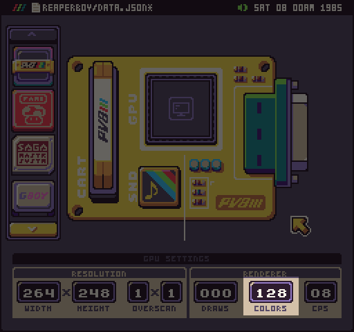

Likewise, you can change this property by hand in the `data.json` file by modifying the Color Chip’s `maxColor `property.

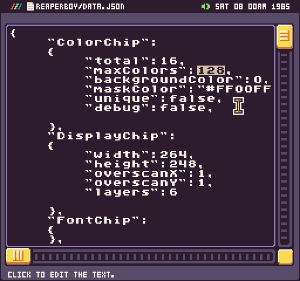

Changing this value will limit the number of colors you can have in a game. If you have more colors than the value in the `data.json` file, those colors will not load and it may impact the way that sprites are parsed.

In the Color Tool, system colors are broken up into pages; each page displays 64 colors. Pages are simply a paradigm for navigating the system colors and helping better organize them in the tool. 

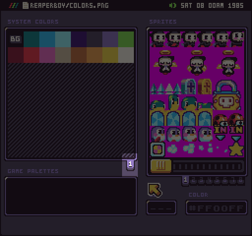

If you reach the limit of the total system colors, you will not be able to add any new colors in the Color Tool.

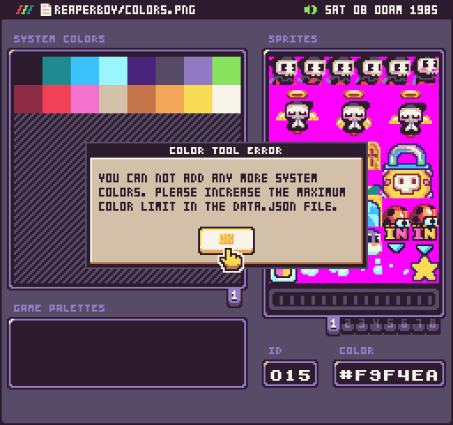

## Color IDs

Color IDs begin at 0 and go up to 255. These IDs can be referenced at runtime. Colors are stored as HEX values. You can replace any color at runtime by calling `Color()` and supplying the Color ID and HEX value. If you just call `Color()` with only an ID, it will return the HEX for that color.

You can preview the color IDs in the Color Tool by rolling over them. Clicking on a color will select it and populate the ID and Color input fields at the bottom of the screen.

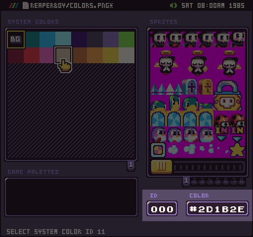

To change the currently selected color, enter a new HEX value. After hitting return, the value is added to the `ColorChip`. You can select and modify any populated color in the system color picker. If a color is set to magenta (`#FF00FF`) it will be treated as transparent and will not be displayed in the picker.

## Adding Colors

You can add, edit, and delete colors via the Color Tool’s drop-down menu. This allows you to customize your game’s colors.

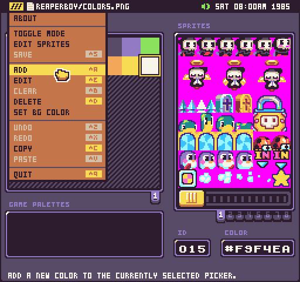

If a new color can be added, it will be placed to the right of the currently selected color shifting the remaining colors to the right. Deleting colors will shift the remaining colors to the left in place of the color that was removed. Keep in mind that editing or deleting colors could have an impact on the way sprites are parsed when the game is loading up. It’s best to only modify system colors befoe you begin creating artwork for the game.

In addition to using the drop-down menu, you can also reorder colors by dragging and dropping them within the system color picker.

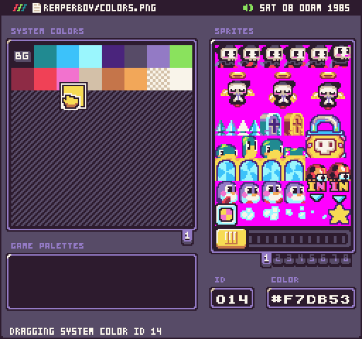

## Color Mixer

The Color Tools has a special color mixer you can access by selecting a color and choosing Edit from the drop-down or pressing `Ctrl + E`. You can also open it by double-clicking on the system color you want to edit.

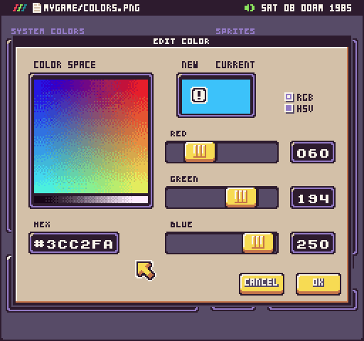

This tool allows you to have more granular control over change colors. There are two modes: RGB and HSV. RGB is the default mode and offers sliders for adjusting the red, green, and blue value of the currently selected color.

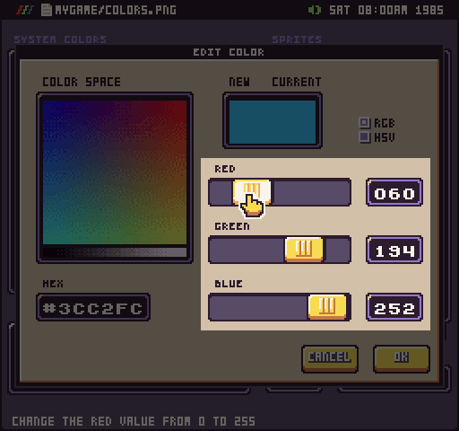

You can also use the input fields to the right of the slider to enter the exact value you are looking for. If the new color you select is the same as the currently selected color, you’ll see a warning icon in the color preview area.

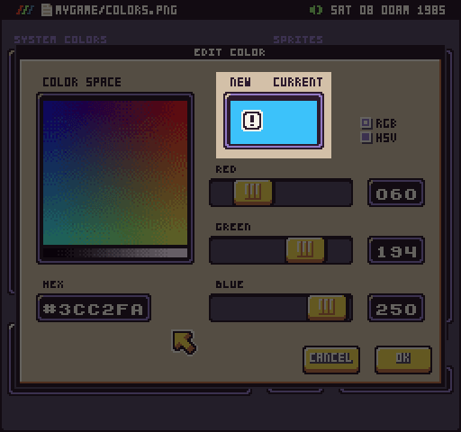

In RGB mode, you can use your mouse to navigate the color space. RGB values are on the top and greyscale run along the bottom.

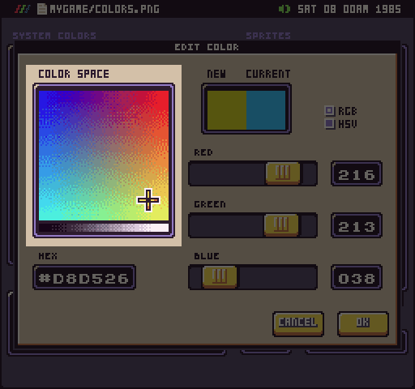

You can select a color by pressing the mouse down in the color space picker and dragging it around until you find one you like. This is a useful way to quickly find the general color you are looking for and then you can fine-tune it with the sliders and input fields.

If you switch over to HSV mode, you’ll notice that the color space and sliders change to reflect the new color mode.

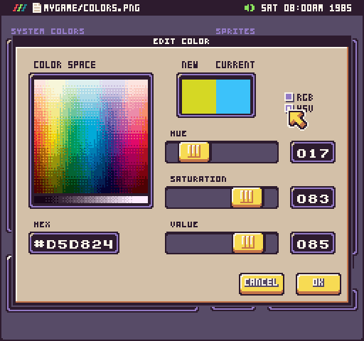

In HSV mode, you’ll be able to adjust the hue, saturation, and value of the color you are editing. Everything else should work similarly to RGB mode.

The last thing to point out is the HEX input. You can use this to enter the exact hex color you are looking for.

When you are happy with the new color, simply hit OK and the currently selected color will be updated.

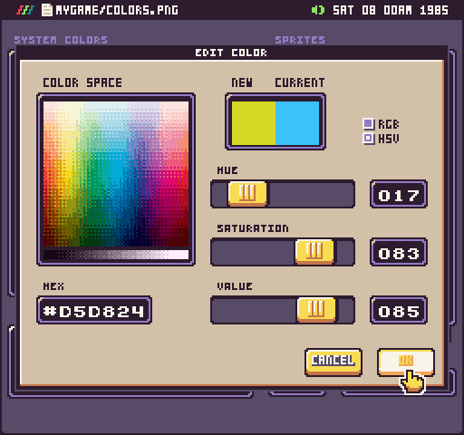

## Background Color

You can also use the Color Tool to set the background color. By default, the first color will be set to the background color. To change it, select a new color and chose Set BG Color from the drop-down.

Changing the background color will tell the game what color to use when clearing the screen and what to default to when a color is out of range. The background color will display a special icon in the Color Tool making it easy to identify which color is set.

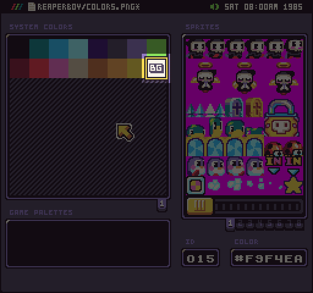

## Palette Pages

When editing colors in palette mode, the tools will display 8 palette pages. You can navigate between palettes by selected the page ID.

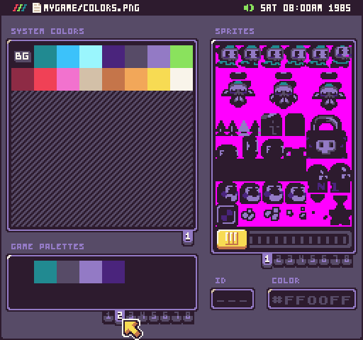

When you change between palette pages, the sprites will reflect the currently selected palette allowing you to preview the effect. Each palette can hold up to 16 colors for a total of 128 colors. Here is a mapping to help you understand each palette page’s color IDs and offsets.

| Palette | First Color ID | Last Color |
|---------|----------------|------------|
| 0       | 127            | 142        |
| 1       | 143            | 158        |
| 2       | 159            | 174        |
| 3       | 175            | 190        |
| 4       | 191            | 206        |
| 5       | 207            | 222        |
| 6       | 223            | 238        |
| 7       | 239            | 255        |

Remember that the palette numbers are zero-based, even though the pages start at 1. You can also roll over a palette color to get its palette color ID.

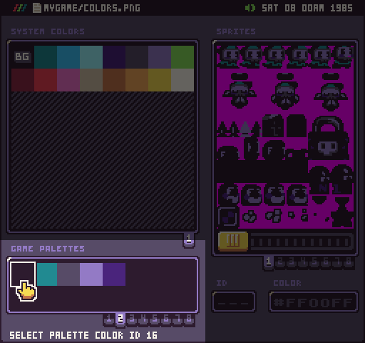

In the above example, the 1st color in the 2nd palette has an ID of 16. To find the real color ID simply add 127 to the value and that would be the color offset you pass in the draw call to shift the colors over by hand. In this case, you’d pass in 143.

## Palette Size

The colors per sprite are used to define the total number of colors you can have in a single palette. Even though each palette can contain 16 colors, you’ll only have access to the total colors per sprite you set in the Sprite Chip. 

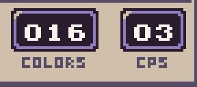

For example, here we have changed the CPS to 3. Reloading the color tool changes all of the palettes to have 3 colors.

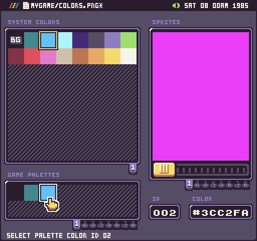

This means that you will only have 24 total colors across 8 palettes. One thing to note about palette size is when saving the colors.png, each palette’s colors will be saved in sets of 16. Any palette colors outside of the CPS value will be filled in by the mask color.

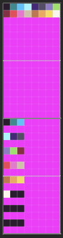

You’ll want to use the PaletteOffset() API to help you calculate the correct color offset, especially when working with palettes smaller than 16 to start at the right color ID.

## Building Palettes

You can build palettes from any of the system colors. Simply drag a system color over to an active slot on the palette.

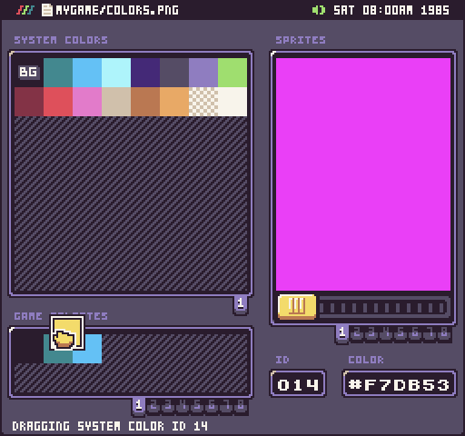

If you change a system color, it will also update all of the palette colors that reference it.

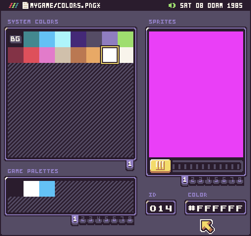

It’s important to note that this will only happen in the color tool. If you change a color at runtime, you will need to manually update any referenced palette color. Likewise, you can rearrange system colors and it will have no effect on the palette colors. As long as the system color exists, it will be referenced correctly in the palette. If you delete a color, any palette that references it will be substituted for the first system color.

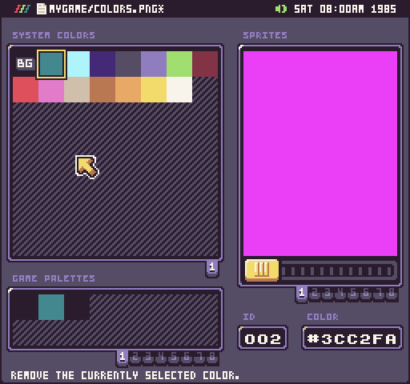

Finally, you can add more system colors, if the Color Chip allows, via the drop-down menu.

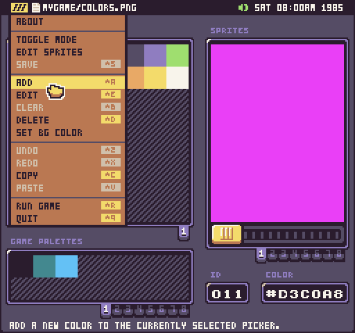

If you are out of system colors, you will get a warning asking you to increase the total color count in the data.json file.

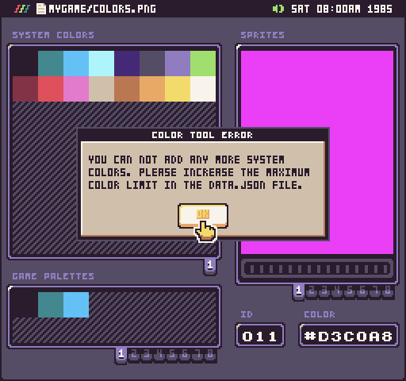

Finally, in palette mode, system colors must be unique.  If you attempt to create a new system color or edit one to a hex value that already exists you will get an error.

