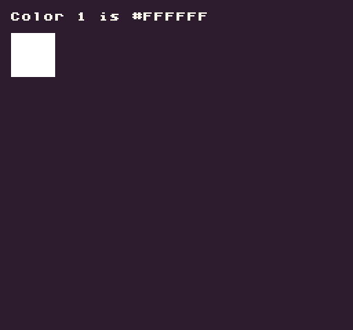

The `Color()` API allows you to read and update color values in the `ColorChip`. This API has two modes that require a color ID to work. By calling the method with just an ID, like `Color(0)`, it returns a HEX string for that color. If you supply an additional HEX string value, like `Color(0, "#FFFF00")`, you can change the color with the given ID. 

While you can use this method to modify color values directly, you should avoid doing this at run time since the `DisplayChip` must re-cache the new HEX value. It’s best to set up all the colors you need ahead of time in the `data.json` file.

## Usage

`Color ( int id, string value )`

## Arguments

<table>
  <tr>
    <td>Name</td>
    <td>Value</td>
    <td>Description</td>
  </tr>
  <tr>
    <td>id</td>
    <td>int</td>
    <td>The ID of the color you want to access.</td>
  </tr>
  <tr>
    <td>value</td>
    <td>string</td>
    <td>This argument is optional. It accepts a hex as a string and updates the supplied color ID's value.</td>
  </tr>
</table>

## Returns

<table>
  <tr>
    <td>Value</td>
    <td>Description</td>
  </tr>
  <tr>
    <td>string</td>
    <td>This method returns a hex string for the supplied color ID. If the color has not been set or is out of range, it returns magenta (#FF00FF) which is the default transparent system color.</td>
  </tr>
</table>

## Example

In this example, we are going to read the second color (ID `1`), draw a rectangle with it, then change the color every few milliseconds:

    class ColorExample : GameChip
    {

        // Create a delay and set the time to that value so it triggers right away
        private int delay = 500;
        private int time;

        // Create an array of colors and an index value to point to the currently selected color
        private int colorIndex = 1;
        private string[] colors = {"#000000", "#ffffff"};

        public override void Init()
        {
            // Set the time to the delay to force this run on the first frame
            time = delay;

            // Draw a rect with the second color
            DrawRect(8, 24, 32, 32, 1, DrawMode.TilemapCache);

        }

        public override void Update(int timeDelta)
        { 
            // Increase the time value base on the timeDelta between the last frame
            time = time + timeDelta;

            // Text to see if time is greater than the delay
            if(time &gt; delay)
            {
                
                // Increase the color index by 1 and reset if it's greater than the color array
                colorIndex = Repeat(colorIndex + 1, colors.Length);

                // Update the second color value from the array
                Color(1, colors[colorIndex]);

                // Reset the timer
                time = 0;

            }

        }

        public override void Draw()
        { 
            // Redraw the display
            RedrawDisplay();

            // Draw a label showing the 2nd colors current HEX value
            DrawText("Color 1 is " + Color(1), 8, 8, DrawMode.Sprite, "large", 15);

        }
    }

Running this code will output the following:


