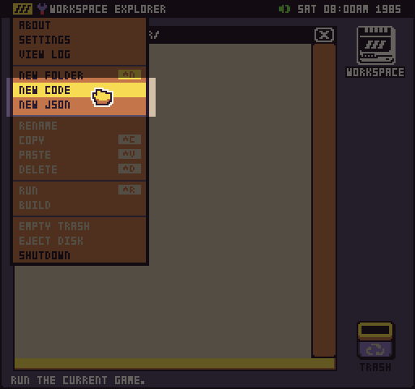
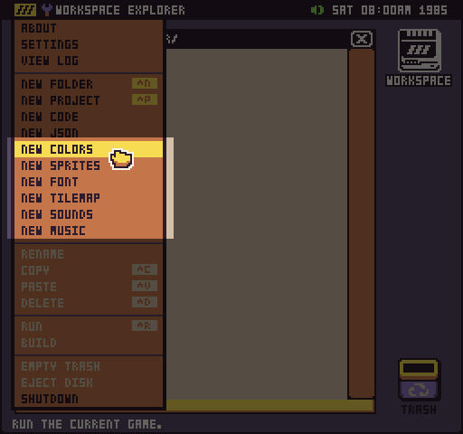
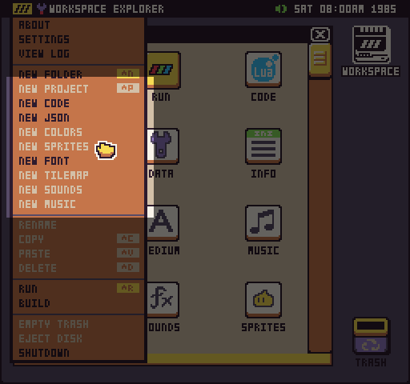
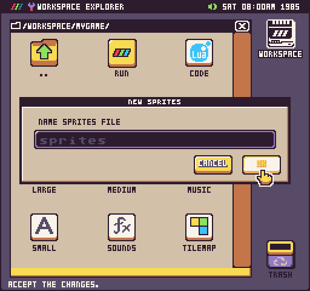
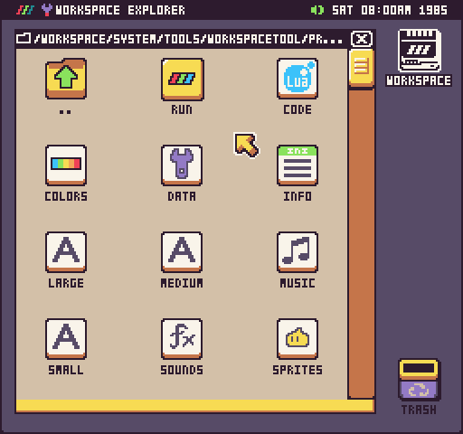

You can use the Workspace Explorer’s drop-down menu to create new files. The vanilla version of Pixel Vision OS includes the ability to create new `.json` and `.lua` files.

Depending on the way the Workspace Explorer is configured, you may have more file options. This could include the ability to create `colors.png`, `sprite.png`, `*.font.png`, `tilemap.json`, `sound.json` and `music.json` files.

In projects where you can only have one type of file, for example, sprites.png, the file creation options will be greyed out from the drop-down menu.

It’s also important to note, that some files can not be renamed when they are created. You’ll see the filename is greyed out but you are still presented with the file creation pop-up in case you want to cancel the action.

Finally, when you create a new file, it is actually copied from a project template folder that exists inside of the Workspace Tool Folder. You can preview this template by going to `/Workspace/System/Tools/WorkspaceTool/ProjectTemplate/`.

You can modify the files in this folder if you want to have default sprites or sound effects in your games. Keep in mind that any changes to files in this folder will affect what is included in the projects. Also, updating Pixel Vision OS will override the changes you make so you may want to back this folder up before installing a newer Workspace Tool.


