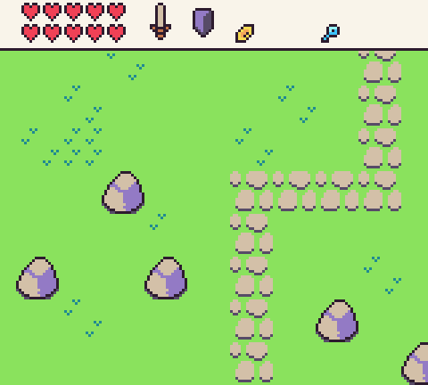

By default, calling the `Clear()` API will only redraw the background fill color. If you want to render the tilemap to the display, you will need to call `DrawTilemap()`. You can clear the display and draw the tilemap with a single API call by using `RedrawDisplay()`. While this is the easiest way to redraw the tilemap between frames, there are some advantages to manually clearing the display and drawing the tilemap.

There are several components that make up the tilemap. When you render the tilemap to the display, you are actually telling Pixel Vision 8’s renderer to copy a cached image to the display buffer. To understand how the tilemap renders, let’s take a quick look at how we convert the raw tilemap chip data into pixel data.

A tilemap is simply a collection of sprites IDs arranged in columns and rows. When the `TilemapChip` loads up, it attempts to pre-render the entire tilemap into memory to help speed up rendering. This layer is called the Tilemap Cache. Whenever you call `DrawTilemap()`, it samples the pixel data from the tilemap cache layer and copies it to the display. This means that you can copy an entire screen’s worth of tilemap pixel data to the display, or sample just the area you need to render.

By manually calling `DrawTilemap()` you can provide an optional `Width `and `Height `values as well as an `X` and `Y` position where it should be rendered on the screen. This allows you to not only control exactly where and how much of the tilemap is displayed on the screen during each frame, but you can use multiple `DrawTilemap()` calls to independently to layer different parts of the tilemap on top of each other. This is useful for rendering static UI or HUDs while the background is moving. Each `DrawTilemap()` call also supports adjusting the scroll offset without affecting the global `ScrollPos` value. 

For example, if the tilemap contains both the HUD and the background tiles, we could use two `DrawTilemap()` calls to display each part independently. First, to render the HUD, we would just draw part of the tilemap to the top of the screen like this:

`DrawTilemap(0, 0, 20, 3, 0, 0)`

This would display the top of the tilemap, `20 `tiles wide by `3 `tiles high, and lock the scroll position to `0`, `0`. Since the tilemap `X `and `Y `positions are set to `0`, it would start drawing from the upper left-hand corner of the screen.

To render the background as it scrolls, we simply call `DrawTilemap()` and offset it by the HUD and pass in the ScrollPos value so it’s in sync with any scrolling going on in the game’s `Update()` loop.

`DrawTilemap(0, 16, 20, 16, ScrollPosition().x, hudHeight)`

Here are the two independent `DrawTilemap()` calls used together.

The last thing to keep in mind is that while the `TilemapChip `will attempt to cache the tile pixel data, you can still make changes at any point to the tilemap or the actual sprite’s it references. The `TilemapChip `handles invalidating tiles that change and are cached on the game’s next `Draw()` call. There may be a performance penalty for changing large tilemaps so try to avoid invalidating the tilemap cache when possible.


