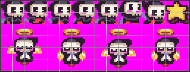
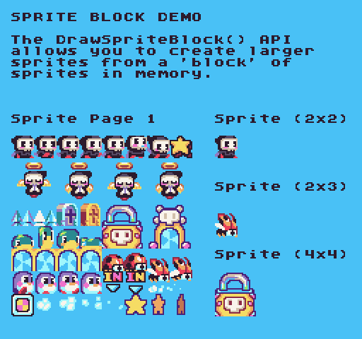
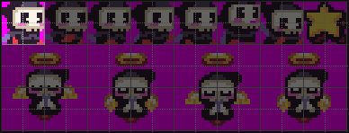
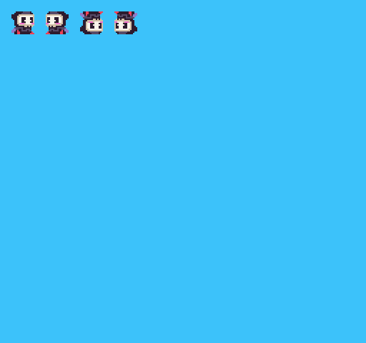

Pixel Vision 8 has two APIs that make it easier to multiple sprites to the screen at once. The `DrawSprites()` and `DrawSpriteBlock()` are very similar but differ in one important way which is how you supply it the sprite IDs to render. 

The `DrawSpriteBlock()` API is the easier one to start with. Similar to how `DrawSprite()` works, you supply a single sprite ID. This ID represents the upper-left-hand corner of the sprites you plan on drawing. From there you supply a `width `in columns and `height `in rows to tell the drawing API which sprites to use in memory. Here is a 16 x 6 section of memory from the SpriteChip.

The top left sprite is ID `0`. We can pass this into the `DrawSpriteBlock()` API as our starting point. 

Next, we’ll pass in a `width `of `2` and a `height `of `2` to combine all 4 sprites into a single draw call.

This is what the draw call looks like rendering the sprite at the `8`,`8` position of the display.

`DrawSpriteBlock(0, 8, 8, 2, 2)`

And if we can the code, we’d see the following 4 sprites on the display.

If we wanted to do this with the `DrawSprites()` API, we would need to supply all of the sprite IDs as an array.

`DrawSprites({0,1,16,17}, 8, 8, 2)`

As you can see, we only need to supply the `width` since the `height` is automatically calculated by the total number of sprites. You can also flip these sprites by passing in a value for `flipH` and `flipV`.

While the `DrawSpriteBlock()` and `DrawSprites()` APIs do not limit the number of sprites you can use, each one will still count against the maximum number of sprites you can draw per frame.


