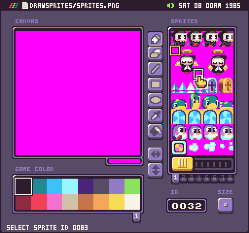
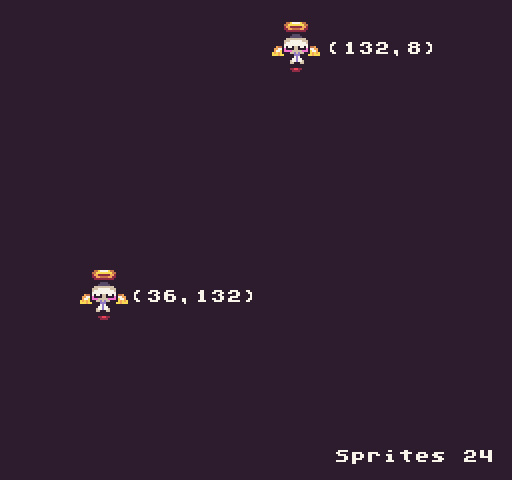
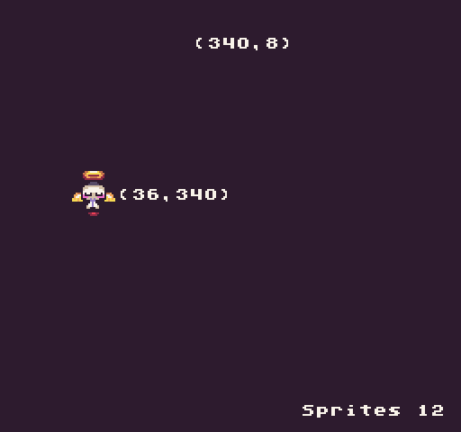

The `DrawSprites()` API makes it easier to draw a group of sprites to the display. Unlike the DrawSpriteBlock() API, you define the exact sprites you want to be drawn. This is useful when trying to render 4 sprites together as a larger 16x16 pixel graphic but their IDs are not next to each other in SpriteChip’s memory. While there is no limit on the size of the sprite group which can be rendered, it is important to note that each sprite in the array still counts as an individual sprite. 

While `DrawSprites()` renders the sprite group in a grid, you can flag some sprites to be ignored by setting their ID to `-1`. These will not count against the total sprites, unlike `DrawSpriteBlock()` which includes all sprites regardless if they are empty or not. This is also useful when sprites have been compressed and are not stored in the `SpriteChip` memory in blocks of IDs.

Similar to the `DrawSpriteBlock()`, `DrawSprites()` API also supports flipping the sprite and color offsets and has the same additional arguments to help make it easier to work with multiple sprites as a single sprite.

The first argument, `onScreen`, determines what should happen to the sprites when they go off-screen. The second argument, `useScrollPos`, will apply the current scroll position value to the sprite’s `X` and `Y` values for you. And the final argument, `bounds`, allows you to define a custom rectangle that acts similar to a mask.

## Usage

`DrawSprites ( ids, x, y, width, flipH, flipV, drawMode, int colorOffset, bool onScreen, bool useScrollPos, Rectangle? bounds )`

## Arguments

<table>
  <tr>
    <td>Name</td>
    <td>Value</td>
    <td>Description</td>
  </tr>
  <tr>
    <td>id</td>
    <td>int</td>
    <td>The top left sprite to start with.</td>
  </tr>
  <tr>
    <td>x</td>
    <td>int</td>
    <td>An int value representing the X position to place the sprites on the display. If set to 0, it renders on the far left-hand side of the screen.</td>
  </tr>
  <tr>
    <td>y</td>
    <td>int</td>
    <td>An int value representing the Y position to place sprite on the display. If set to 0, it renders on the top of the screen.</td>
  </tr>
  <tr>
    <td>width</td>
    <td>int</td>
    <td>The width, in sprites, of the grid. A value of 2 renders 2 sprites wide. The DrawSprites method continues to run through all of the sprites in the ID array until reaching the end. Sprite groups do not have to be perfect squares since the width value is only used to wrap sprites to the next row.</td>
  </tr>
  <tr>
    <td>flipH</td>
    <td>bool</td>
    <td>This is an optional argument which accepts a bool. The default value is set to false but passing in true flips the pixel data horizontally.</td>
  </tr>
  <tr>
    <td>flipV</td>
    <td>bool</td>
    <td>This is an optional argument which accepts a bool. The default value is set to false but passing in true flips the pixel data vertically.</td>
  </tr>
  <tr>
    <td>drawMode</td>
    <td>DrawMode</td>
    <td>This argument accepts the DrawMode enum. You can use Sprite, SpriteBelow, and TilemapCache to change where the pixel data is drawn to. By default, this value is DrawMode.Sprite.</td>
  </tr>
  <tr>
    <td>colorOffset</td>
    <td>int</td>
    <td>This optional argument accepts an int that offsets all the color IDs in the pixel data array. This value is added to each int, in the pixel data array, allowing you to simulate palette shifting.</td>
  </tr>
  <tr>
    <td>onScreen</td>
    <td>bool</td>
    <td>This flag defines if the sprites should not render when they are off the screen. Use this in conjunction with overscan border control what happens to sprites at the edge of the display. If this value is false, the sprites wrap around the screen when they reach the edges of the screen.</td>
  </tr>
  <tr>
    <td>useScrollPos</td>
    <td>bool</td>
    <td>This will automatically offset the sprite's x and y position based on the scroll value.</td>
  </tr>
  <tr>
    <td>bounds</td>
    <td>Rectangle</td>
    <td>A custom mask to constrain the sprite. Moving the sprites outside of the rectangle will hide them when onScreen is set to false.</td>
  </tr>
</table>

## Draw Modes

The `DrawSpriteBlock()` API supports the following draw modes:

<table>
  <tr>
    <td>DrawMode</td>
    <td>Layer ID</td>
    <td>Supported</td>
  </tr>
  <tr>
    <td>TilemapCache</td>
    <td>-1</td>
    <td>Yes</td>
  </tr>
  <tr>
    <td>Background</td>
    <td>0</td>
    <td>No</td>
  </tr>
  <tr>
    <td>SpriteBelow</td>
    <td>1</td>
    <td>Yes</td>
  </tr>
  <tr>
    <td>Tile</td>
    <td>2</td>
    <td>Yes</td>
  </tr>
  <tr>
    <td>Sprite</td>
    <td>3</td>
    <td>Yes</td>
  </tr>
  <tr>
    <td>UI</td>
    <td>4</td>
    <td>Yes</td>
  </tr>
  <tr>
    <td>SpriteAbove</td>
    <td>5</td>
    <td>Yes</td>
  </tr>
</table>

Attempting to use an unsupported draw mode will cancel the draw request. When using `DrawMode.TilemapCache` or `DrawMode.Tile`, the tilemap’s coordinate space will be used. In the case of `DrawMode.Tile`, the `X` and `Y` values will become `Column` and `Row`. For `DrawMode.TilemapCache` you can use `X` and `Y` to place the sprite on the tilemap itself. That means that wrapping for the sprite’s coordinates will switch from the screen boundaries to the tilemap itself.

## Example

For this example, we are going to render two groups of sprites to the display. The first group will hide when their `X` value goes past the screen and the second group will wrap when their Y value is offscreen similar to using the `DrawSprite()` API. To do this, we need to find all of the sprite IDs that make up the group by using Pixel Vision OS’s Sprite Tool.

To calculate a sprite’s ID by hand, you can find the first sprite at the top left part of the `sprites.png` file. For empty sprites, we’ll use -1 for the ID so they don’t count against the sprite limit. Once we have all of the sprite IDs we can use the following code example to draw it:

    class DrawSpritesExample : GameChip
    {
        // Use floats to store the subpixel position
        private float speed = 5;
        private float nextPos;

        // Use this point to position the  sprites
        private Point pos;

        // A group of sprite IDs for the DrawSprites() API
        private int[] spriteGroup =
        {
            -1, 33, 34, -1,
            48, 49, 50, 51,
            64, 65, 66, 67,
            -1, 81, 82, -1
        };

        public override void Update(int timeDelta)
        {
            // Calculate the next position
            nextPos = nextPos + (speed * (timeDelta / 100f));

            // Need to convert the nextPoint to an int, so we'll save it in a point
            pos.X = (int)nextPos;
            pos.Y = (int)nextPos;
        }

        public override void Draw()
        {
            // Redraw the display
            RedrawDisplay();

            // Draw sprite group moving horizontally and hide when it goes offscreen
            DrawSprites(spriteGroup, pos.X, 8, 4);

            // Draw flipped sprite group moving vertically but render when offscreen
            DrawSprites(spriteGroup, 36, pos.Y, 4, true, false, DrawMode.Sprite, 0, false);

            // Show the total number of sprites
            DrawText("Sprites " + CurrentSprites, 144 + 24, 224, DrawMode.Sprite, "large", 15);

            // Draw the x,y position of each sprite
            DrawText("(" + MathUtil.FloorToInt(nextPos) + ",8)", pos.X + 32, 8, DrawMode.Sprite, "large", 15);
            DrawText("(36," + MathUtil.FloorToInt(nextPos) + ")", 66, pos.Y + 12, DrawMode.Sprite, "large", 15);

        }
    }

Running this code will output the following:

While each sprite group is made up of `16 `sprites, only `12 `are rendered since the empty sprites are set to `-1`. When the horizontal sprite moves past the boundary of the screen, it will stop rendering even though the `X` value continues to increase. 

You can also see that the sprites from the first group stop rendering when their `X` position goes offscreen since the `onScreen `argument is set to true by default.


