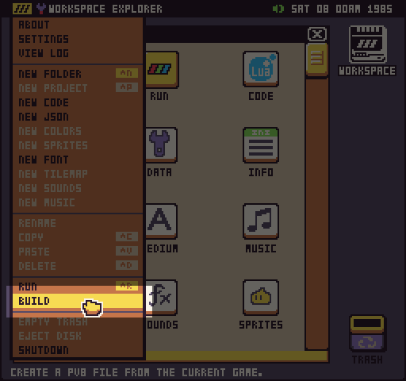
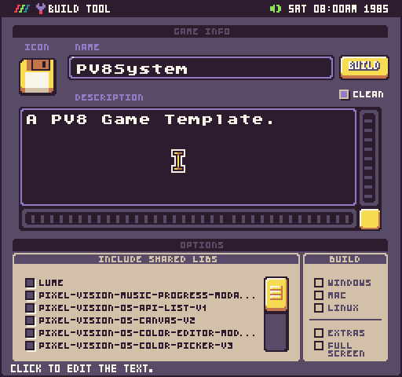
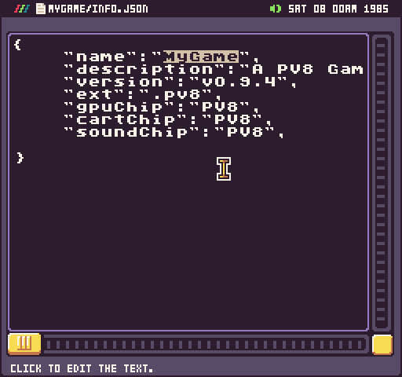
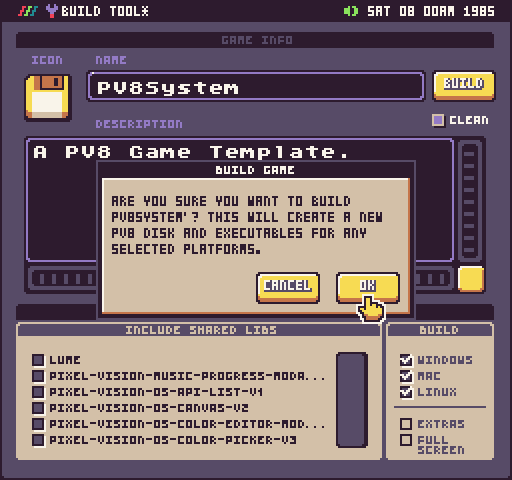
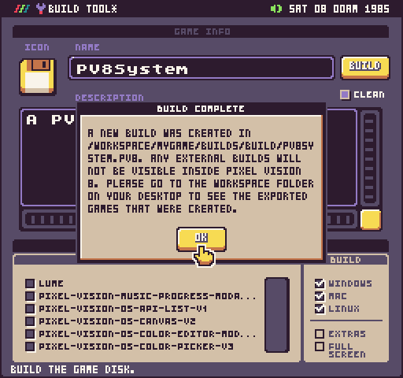

Pixel Vision 8 allows you to export the game’s you built in two ways. You can create a `.pv8` disk to share with other PV8 users or create a standalone executable for Windows, Mac, and Linux if you have the Pro Tools installed.

## Configuring Builds

If you have the Pro Tools installed, selecting the build option from the Workspace Explorer will launch the Build Tool. This tool allows configuring the build before the game is exported. When you select Build from the drop-down menu, with the Pro Tools installed, it will automatically launch the Build Tool.

There are 3 main panels to edit your game’s name, shared library files to include, and the platforms to build for.

It’s important to note that from most games, you won’t need to include any shared libraries. If you are using and of Pixel Vision OS’s UI for example or you have your own shared libraries you used across multiple games, be sure to find them and include them in the build. If you need to include all of the files, simply hold down the Shift key while pressing on a checkbox and it will toggle them all on or off.

If you do not have the Pro Tools installed, you can access the game’s name and description by editing the info.json file directly.

## Building Executables

You can initiate a build by pressing the Build button. This will ask you to confirm the build and start the process. 

Please note that creating stand-alone executables may momentarily lock up Pixel Vision 8 based on your computer’s specs. While PV8 will show you which step of the build process it is in, the actual build for each platform may take anywhere from a few seconds to a full minute. Once the build is done, you will be notified of the location for the build.

It’s also important to point out that you will not be able to view the stand-alone executable zip files that were generated by the build process in the Workspace Explorer. Simply navigate to your computer’s Workspace directory and find the build folder for the game you just exported from.