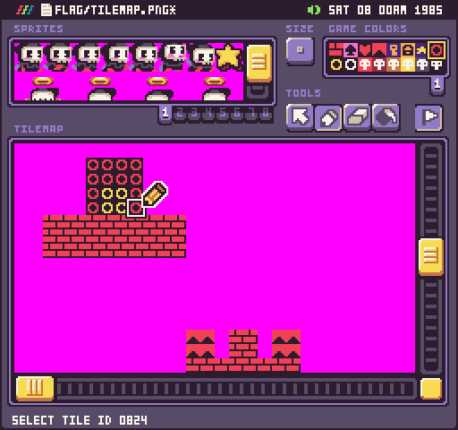
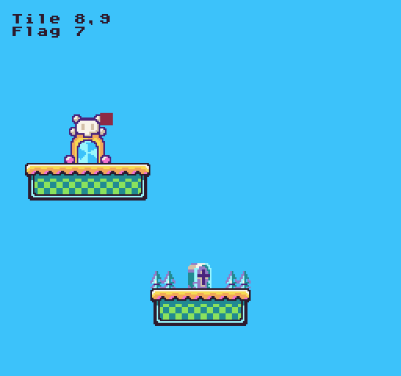

# Flag()

The `Flag()` API allows you to quickly access just the flag value of a tile. This is useful when trying to calculate collision on the tilemap. By default, you can call this method with just a `column `and `row `position to return the flag value at that tile. If you supply a new value, it will be overridden on the tile. Changing a tile's flag value does not force the tile to be redrawn to the tilemap cache. Flags can be set in Pixel Vision OS’s Tilemap Tool or manually at run-time.



By default, Pixel Vision 8 has 16 flag values starting a `0` and ending at `15`. The Tilemap Editor uses icons for each flag value to make it easier to keep track of different flag types but the assigned value is arbitrary and can represent anything you want it to in your own game.

## Usage

```csharp
Flag ( column, row, value )
```

## Arguments

| Name   | Value | Description                                                                                    |
|--------|-------|------------------------------------------------------------------------------------------------|
| column | int   | The X position of the tile in the tilemap\. The 0 position is on the far left of the tilemap\. |
| row    | int   | The Y position of the tile in the tilemap\. The 0 position is on the top of the tilemap\.      |
| value  | int   | The new value for the flag\. Setting the flag to \-1 means no collision\.                      |


## Returns

| Value | Description                                           |
|-------|-------------------------------------------------------|
| int   | A flag value between 0 and 15 with \-1 being no value |


## Example

In this example, we are going to use the mouse position to find a tile and get its flag ID:


## Lua

```lua
-- This point will store the current tile's position
local tilePosition = NewPoint()

-- This will store the current flag ID
local flagID = -1

function Update(timeDelta)

  -- Get the current mouse position
  tilePosition = MousePosition()

  -- Convert the mouse position to the tilemap's correct column and row
  tilePosition.x = math.floor(tilePosition.x / 8)
  tilePosition.y = math.floor(tilePosition.y / 8)

  -- Get the flag value of the current tile
  flagID = Flag(tilePosition.x, tilePosition.y)

end

function Draw()

  -- Redraws the display
  RedrawDisplay()

  -- Display the tile and flag text on the screen
  DrawText("Tile " .. tilePosition.x .. ",".. tilePosition.y, 8, 8, DrawMode.Sprite, "large")
  DrawText("Flag " .. flagID, 8, 16, DrawMode.Sprite, "large")

  -- Draw a rect to represent which tile the mouse is over and set the color to match the flag ID plus 1
  DrawRect(tilePosition.x * 8, tilePosition.y * 8, 8, 8, flagID + 1, DrawMode.Sprite)

end
```


## C#

```csharp
class FlagExample : GameChip
{
    // This point will store the current tile's position
    private Point tilePosition;

    // This will store the current flag ID
    private int flagID = -1;

    public override void Update(int timeDelta)
    {
        // Get the current mouse position
        tilePosition = MousePosition();

        // Convert the mouse position to the tilemap's correct column and row
        tilePosition.X = MathUtil.FloorToInt(tilePosition.X / 8f);
        tilePosition.Y = MathUtil.FloorToInt(tilePosition.Y / 8f);

        // Get the flag value of the current tile
        flagID = Flag(tilePosition.X, tilePosition.Y);

    }

    public override void Draw()
    {

        // Redraws the display
        RedrawDisplay();

        // Display the tile and flag text on the screen
        DrawText("Tile " + tilePosition.X + "," + tilePosition.Y, 8, 8, DrawMode.Sprite, "large");
        DrawText("Flag " + flagID, 8, 16, DrawMode.Sprite, "large");

        // Draw a rect to represent which tile the mouse is over and set the color to match the flag ID plus 1
        DrawRect(tilePosition.X * 8, tilePosition.Y * 8, 8, 8, flagID + 1, DrawMode.Sprite);

    }
}
```


Running this code will output the following:




