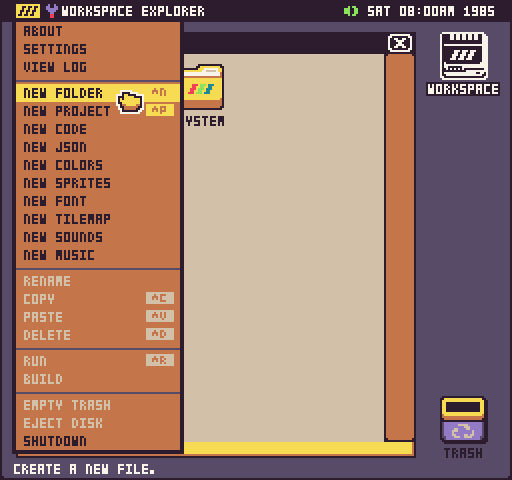
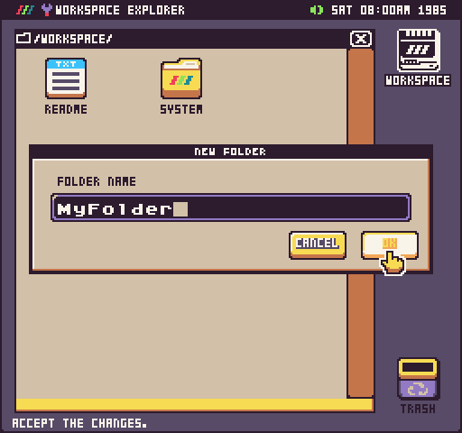
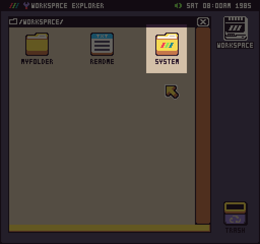
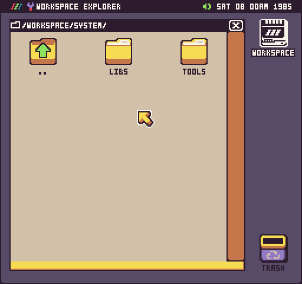

Pixel Vision OS allows you to organize files inside of folders on the Workspace drive and on disks. Folders can also be nested inside of other folders to create a folder hierarchy on in your Workspace. You can create a new folder from the Workspace drop-down menu.

When you create a new folder, you’ll get an option to name it.

While you can name your folder anything you like, there are three reserved folder names: System, Libs, and Tools. If Pixel Vision OS detects a System folder on the root of the Workspace or a disk, it will give it a special icon.

This icon means that Pixel Vision OS will treat this as a system folder. If you have a Libs or Tools folder inside, they will be analyzed for any special functionality that will enhance the Workspace Explorer.

You can place any custom tools you build inside of the Tools folder. Any Lua files in the Libs folder will be made avaiable when your game loads up.


