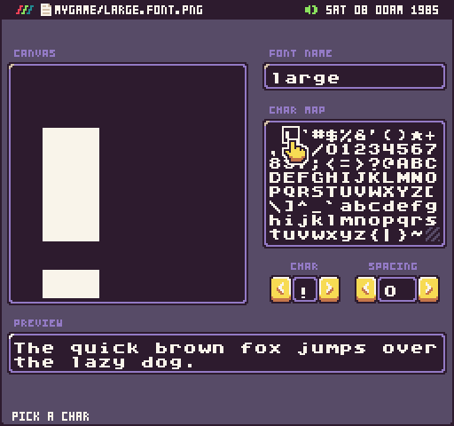
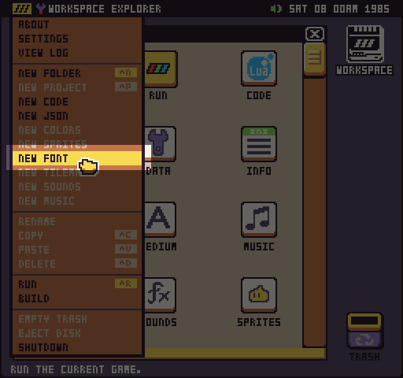
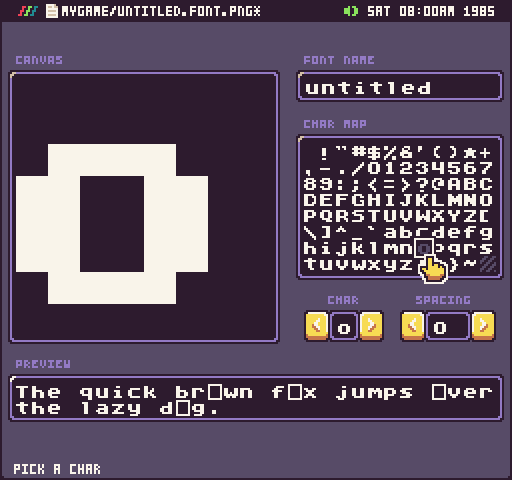
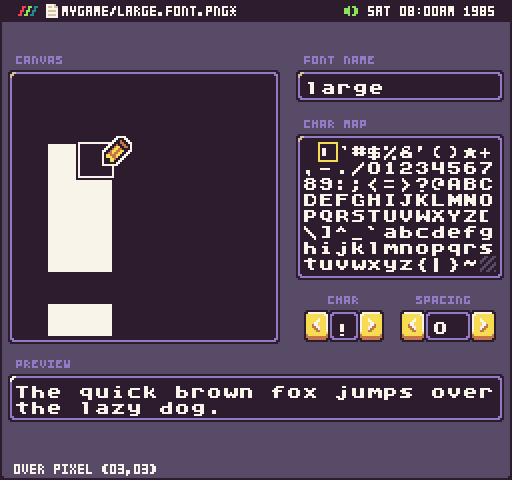
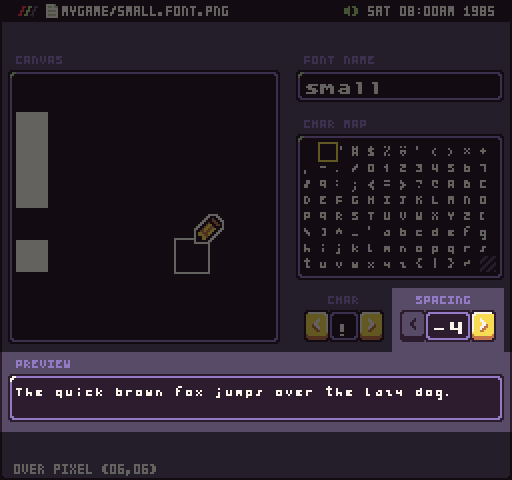
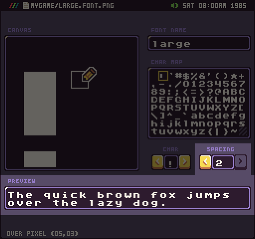

# Font Tool

The Font Tool, which is installed as part of the Pro Tools, allows you to view and modify Pixel Vision 8 sprite fonts.

## Layout

 The Font Tool shows you how a font’s characters map to these ASCII character ID so you can make sure they will display correctly.

The Font Tool consists of a character picker, a canvas, a char picker, a letter-spacing field for testing and a preview area to see what the font will look like at runtime. Simply use the Char input field or click on the character in the picker to load it in the canvas for editing. All font characters are 8 x 8 pixels but you can design smaller fonts and use the spacing input field to see how they will work.

## Shortcuts

The Color Tool has the following keyboard shortcuts based on what actions are available.

| Name  | Shortcut  | Description                                                                     |
|-------|-----------|---------------------------------------------------------------------------------|
| Clear | Ctrl \+ D | Clear all of the pixel data in the currently selected character\.               |
| Save  | Ctrl \+ S | Save the changes to the \*\.font\.png file\.                                    |
| Undo  | Ctrl \+ Z | Undo the last sprite pixel data change\.                                        |
| Redo  | Ctrl \+ Y | Redo the last sprite pixel data change\.                                        |
| Copy  | Ctrl \+ C | Copy the currently selected sprite\.                                            |
| Paste | Ctrl \+ P | Paste the previously copied sprite data over to the currently selected sprite\. |
| Quit  | Ctrl \+ Q | Quit the current tool\.                                                         |

## New

While all of the game templates included in Pixel Vision OS include fonts, you can create your own from scratch. When inside of a project folder in the Workspace Explorer Tool, select Font from the drop-down menu.

When you create a font, Pixel Vision 8’s large font will be copied over to your project. You’ll need to go through and draw all-new characters on top of the existing ones.

When a character is missing from the font you’ll see a greyed out character so you know what should go where and the preview will display a missing font character. Missing font characters will not display at runtime, you’ll simply be missing the character.

## Editing

The Font Tool consists of a character picker, a canvas, a char picker, a letter-spacing field for testing and a preview area to see what the font will look like at runtime. Simply use the Char input field or click on the character in the picker to load it in the canvas for editing. 

The drawing tool is part pen and part eraser based on where you start drawing. If you are over pixel data, it will erase when trying to draw. If you start drawing where it’s transparent, it will draw like a pen.

All font characters are 8 x 8 pixels but you can design smaller fonts and use the spacing input field to see how they will work.

When drawing sprites to the display, you can modify the letter spacing so the Font Tool shows you exactly what that will look like. Spacing in the Font Tool can be set from -4 to 2 but in your game, you can make the spacing however you like.

