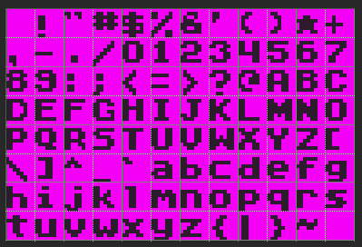

# Fonts

Pixel Vision 8 also supports loading sprite fonts into memory. Each font should be saved with a `.font.png` extension. PV8 fonts are similar to the` sprites.png` but you can actually have multiple fonts in a single game project. Each font character is 8 x 8 pixels and goes into any of the `FontChip`'s free memory slots. By default, there is room for 512 unique sprite characters in the `FontChip`’s memory.

## Font Template

While you can arrange your `.font.png` character sprites in any grid-based layout, the order of the characters is important. To allow the FontChip to correctly map each character to it’s ASCII equivalent, it is best practice to follow this template:

While the default template only supports the standard English character set, special characters can also be added. They will be parsed and assigned an ASCII ID exactly like the main set of characters.

Finally, any characters that match or are empty will be optimized by the importer. So you can ignore some character sets, such as lowercase if you need to save memory. Simply leave those characters empty in the font file.

## Font Characters

Each font character in the `.font.png` file should match up to their ASCII values. The parser starts cutting out characters from the upper left-hand corner of the png so the first sprite will map to ASCII 32, which represents empty space. Each character after that goes up in value. Here is a chart showing the breakdown of the default supported characters:

| DEC | Symbol | Description              |   | DEC | Symbol | Description               |
|-----|--------|--------------------------|---|-----|--------|---------------------------|
| 32  |        | Space                    |   | 80  | P      | Uppercase P               |
| 33  | \!     | Exclamation mark         |   | 81  | Q      | Uppercase Q               |
| 34  | "      | Double quotes            |   | 82  | R      | Uppercase R               |
| 35  | \#     | Number                   |   | 83  | S      | Uppercase S               |
| 36  | $      | Dollar                   |   | 84  | T      | Uppercase T               |
| 37  | %      | Percent                  |   | 85  | U      | Uppercase U               |
| 38  | &      | Ampersand                |   | 86  | V      | Uppercase V               |
| 39  | '      | Single quote             |   | 87  | W      | Uppercase W               |
| 40  | \(     | Open parenthesis         |   | 88  | X      | Uppercase X               |
| 41  | \)     | Close parenthesis        |   | 89  | Y      | Uppercase Y               |
| 42  | \*     | Asterisk                 |   | 90  | Z      | Uppercase Z               |
| 43  | \+     | Plus                     |   | 91  | \[     | Opening bracket           |
| 44  | ,      | Comma                    |   | 92  | \\     | Backslash                 |
| 45  | \-     | Hyphen                   |   | 93  | \]     | Closing bracket           |
| 46  | \.     | Period, dot or full stop |   | 94  | ^      | Caret \- circumflex       |
| 47  | /      | Slash or divide          |   | 95  | \_     | Underscore                |
| 48  | 0      | Zero                     |   | 96  | \`     | Grave accent              |
| 49  | 1      | One                      |   | 97  | a      | Lowercase a               |
| 50  | 2      | Two                      |   | 98  | b      | Lowercase b               |
| 51  | 3      | Three                    |   | 99  | c      | Lowercase c               |
| 52  | 4      | Four                     |   | 100 | d      | Lowercase d               |
| 53  | 5      | Five                     |   | 101 | e      | Lowercase e               |
| 54  | 6      | Six                      |   | 102 | f      | Lowercase f               |
| 55  | 7      | Seven                    |   | 103 | g      | Lowercase g               |
| 56  | 8      | Eight                    |   | 104 | h      | Lowercase h               |
| 57  | 9      | Nine                     |   | 105 | i      | Lowercase i               |
| 58  | :      | Colon                    |   | 106 | j      | Lowercase j               |
| 59  | ;      | Semicolon                |   | 107 | k      | Lowercase k               |
| 60  | <      | Less than                |   | 108 | l      | Lowercase l               |
| 61  | =      | Equals                   |   | 109 | m      | Lowercase m               |
| 62  | >      | Greater than             |   | 110 | n      | Lowercase n               |
| 63  | ?      | Question mark            |   | 111 | o      | Lowercase o               |
| 64  | @      | At symbol                |   | 112 | p      | Lowercase p               |
| 65  | A      | Uppercase A              |   | 113 | q      | Lowercase q               |
| 66  | B      | Uppercase B              |   | 114 | r      | Lowercase r               |
| 67  | C      | Uppercase C              |   | 115 | s      | Lowercase s               |
| 68  | D      | Uppercase D              |   | 116 | t      | Lowercase t               |
| 69  | E      | Uppercase E              |   | 117 | u      | Lowercase u               |
| 70  | F      | Uppercase F              |   | 118 | v      | Lowercase v               |
| 71  | G      | Uppercase G              |   | 119 | w      | Lowercase w               |
| 72  | H      | Uppercase H              |   | 120 | x      | Lowercase x               |
| 73  | I      | Uppercase I              |   | 121 | y      | Lowercase y               |
| 74  | J      | Uppercase J              |   | 122 | z      | Lowercase z               |
| 75  | K      | Uppercase K              |   | 123 | \{     | Opening brace             |
| 76  | L      | Uppercase L              |   | 124 | \|     | Vertical bar              |
| 77  | M      | Uppercase M              |   | 125 | \}     | Closing brace             |
| 78  | N      | Uppercase N              |   | 126 | ~      | Equivalency sign \- tilde |
| 79  | O      | Uppercase O              |   |     |        |                           |
