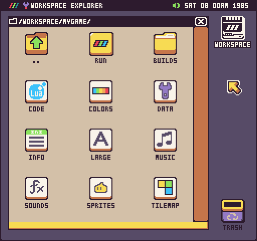
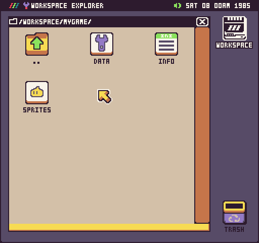

# Inside a Game Project

A game is simply a collection of files that Pixel Vision 8 loads into its memory. Each of these files has a specific purpose in the project. A folder will be considered a game project if it has a `data.json` and `info.json` file inside of it. 

When these two files exist, additional game files will automatically be registered with their respective editor. For example, adding a sprites.png file to a game folder and opening it will launch the Sprite Tool.


