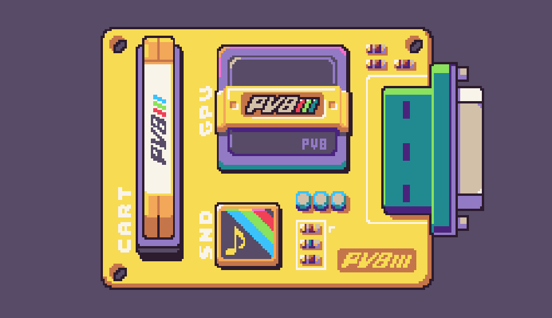
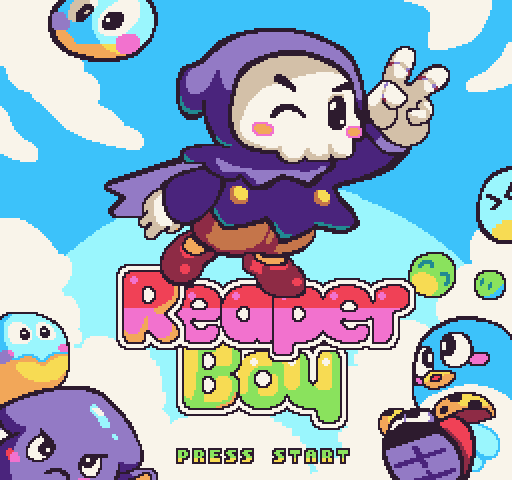
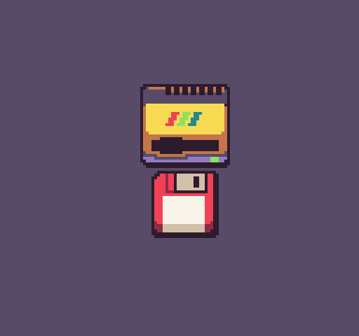

# What Is Pixel Vision 8

Pixel Vision 8 is a Fantasy Console that simulates imaginary 8-bit hardware. Out of the box, you can play PV8 games. However, PV8 can also help you create games with limited resolutions, colors, sprites, sound, and memory.

## Playing Games

Pixel Vision 8 supports playing games with keyboard or controllers. Games can also save their progress and are self-contained. You can share PV8 games with your friends that also have a copy of Pixel Vision 8.

## Insert A Disk

Pixel Vision 8 is like a real game console. Just drop any PV8 disk file onto the window and watch it load up! Each disk can contain a single game or a collection of games. You can even have one game load another game inside the same disk to create more significant experiences.

## Pixel Vision OS

You can turn Pixel Vision 8 into an 8-bit computer with Pixel Vision OS. This open-source operating system offers a desktop, editors, and other tools for creating PV8 games. You can even build a custom operating system for Pixel Vision 8!

# Features

Pixel Vision 8 is a powerful fantasy console with the following features:

* Support for Mac, Windows, and Linux with Xbox, Windows 10, iOS and Android Support coming soon.

* Full controller, keyboard and mouse support.

* Run in scalable window mode or fullscreen.

* Play, Make and Share PV8 games with Pixel Vision OS.

* Customize the hardware limitations for each game.

* Code games in Lua with an easy to learn set of APIs.

* Share your games with others.

Pixel Vision 8: Draw is still in development. Currently, it is offered as "early access" and may contain bugs, unexpectedly crash, or have missing/incomplete features. You'll receive free updates for the life of the project.


