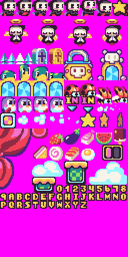

Pixel Vision 8 supports importing 8 x 8 pixel sprites from a `sprite.png` file. The importer moves through the `sprite.png` file starting in the upper left-hand corner, converting each 8 x 8 pixel block of pixel data into a format the `SpriteChip` can store. By default, all sprites are added to the `SpriteChip` memory, until space runs out. The `SpriteChip` can store up to 2,048 unique sprites in memory.

It’s important to note that transparent pixel data is ignored and converted to the system’s default mask color which is magenta (`#FF00FF`). PV8 does not store transparent colors. Colors that are not available to the system, including one that contains any transparency, are simply ignored. You can still use transparent colors when importing sprites from PNGs and the importer will automatically convert it to the default mask color.


