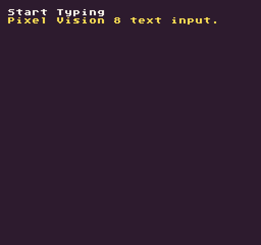

The `InputString()` API returns the keyboard input from the current frame. This API is useful for capturing keyboard text input.

## Usage

`InputString ( )`

## Returns

<table>
  <tr>
    <td>Value</td>
    <td>Description</td>
  </tr>
  <tr>
    <td>string</td>
    <td>A string of characters entered during the current frame.</td>
  </tr>
</table>

## Example

In this example, we are going to capture any text typed and display it on the screen:

    class InputStringExample : GameChip
    {
        // Store the text between frames
        private string inputText = "";

        // Cap on how much text will be displayed
        private int maxCharacters = 30;

        public override void Init()
        {
            // Display the instructions
            DrawText("Start Typing", 1, 1, DrawMode.Tile, "large", 15);

        }

        public override void Update(int timeDelta)
        {
            // Check how long the input text is and clear it if when it gets too long
            if (inputText.Length &gt; maxCharacters)
            {
                inputText = "";
            }

            // Add the current frame's input to the previous frame's text
            inputText = inputText + InputString();

        }

        public override void Draw()
        {
            // Redraw display
            RedrawDisplay();

            // Display the text that has been entered
            DrawText(inputText, 8, 16, DrawMode.Sprite, "large", 14);

        }
    }

Running this code will output the following:


