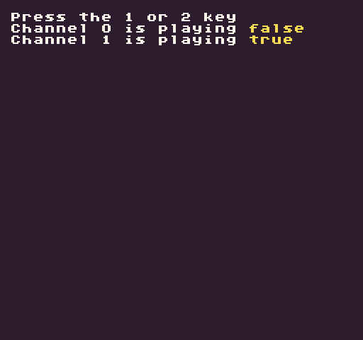

Returns a bool if the specified audio channel is playing a sound. Since channels can only play one sound effect at a time, you may need to test if a channel is currently playing before playing a new sound effect.

## Usage

`IsChannelPlaying ( channel )`

## Arguments

<table>
  <tr>
    <td>Name</td>
    <td>Value</td>
    <td>Description</td>
  </tr>
  <tr>
    <td>channel</td>
    <td>int</td>
    <td>The ID of the channel you want to test. There are 5 audio channels but each game’s SoundChip can be configured to have less.</td>
  </tr>
</table>

## Returns

<table>
  <tr>
    <td>Value</td>
    <td>Description</td>
  </tr>
  <tr>
    <td>bool</td>
    <td>Returns true if there is a sound playing on the audio chanel</td>
  </tr>
</table>

## Example

In this example, we are going to play two different sound effects on their own channels. The first song will play every time you hit the 1 key and the second sound effect, key 2, will only play when the previous sound has completed:

    class IsChannelPlayingExample : GameChip
    {
        public override void Init()
        {
            // Display the instructions
            DrawText("Press the 1 or 2 key", 1, 1, DrawMode.Tile, "large", 15);
            DrawText("Channel 0 is playing ", 1, 2, DrawMode.Tile, "large", 15);
            DrawText("Channel 1 is playing ", 1, 3, DrawMode.Tile, "large", 15);

        }

        public override void Update(int timeDelta)
        {
            // Check for the 1 key to be pressed and play sound ID 0 on channel 0
            if (Key(Keys.Alpha1, InputState.Released))
            {
                PlaySound(0, 0);
            }

            // Only play sound 1 if the channel is not currently playing a sound
            if (Key(Keys.Alpha2, InputState.Released) & IsChannelPlaying(1) == false)
            {
                PlaySound(1, 1);
            }

        }

        // The Draw() method is part of the game's life cycle. It is called after Update() and is where
        // all of our draw calls should go. We'll be using this to render sprites to the display.
        public override void Draw()
        {

            // Redraw the display
            RedrawDisplay();

            // Draw channel 0 and 1's current playing state to the display
            DrawText(IsChannelPlaying(0).ToString(), 176, 16, DrawMode.Sprite, "large", 14);
            DrawText(IsChannelPlaying(1).ToString(), 176, 24, DrawMode.Sprite, "large", 14); 

        }
    }

Running this code will output the following:


