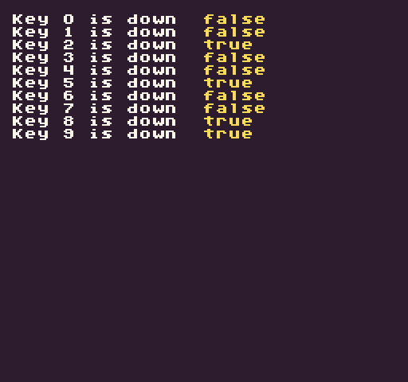

While the main forms of input for Pixel Vision 8 are the controllers, you can test for keyboard input by calling the `Key()` API. When this API is called, it returns the current state of that specific key. The method accepts the `Keys` enum, or an `int`, for a specific key. In addition, you need to provide the input state to check for. The `InputState `enum has two states, `Down` and `Released`. By default, `Down` is automatically used which returns `true` when the key is being pressed in the current frame. When using `Released`, the API returns `true `only when the key was `Down `in the last frame and `Up `in the current frame.

## Usage

`Key ( key, state )`

## Arguments

<table>
  <tr>
    <td>Name</td>
    <td>Value</td>
    <td>Description</td>
  </tr>
  <tr>
    <td>key</td>
    <td>Keys</td>
    <td>This argument accepts the Keys enum or an int for the key's ID.</td>
  </tr>
  <tr>
    <td>state</td>
    <td>InputState</td>
    <td>Optional InputState enum. Returns down state by default. This argument accepts InputState.Down (0) or InputState.Released (1).</td>
  </tr>
</table>

## Returns

<table>
  <tr>
    <td>Value</td>
    <td>Description</td>
  </tr>
  <tr>
    <td>bool</td>
    <td>This method returns a bool based on the state of the button.</td>
  </tr>
</table>

## Keys

These are the valid keys that Pixel Vision 8 can see and their correspondin ID.

<table>
  <tr>
    <td>Enum</td>
    <td>Value</td>
    <td>Enum</td>
    <td>Value</td>
  </tr>
  <tr>
    <td>Keys.None</td>
    <td>0</td>
    <td>Keys.S</td>
    <td>83</td>
  </tr>
  <tr>
    <td>Keys.Backspace</td>
    <td>8</td>
    <td>Keys.T</td>
    <td>84</td>
  </tr>
  <tr>
    <td>Keys.Tab</td>
    <td>9</td>
    <td>Keys.U</td>
    <td>85</td>
  </tr>
  <tr>
    <td>Keys.Enter</td>
    <td>13</td>
    <td>Keys.V</td>
    <td>86</td>
  </tr>
  <tr>
    <td>Keys.Escape</td>
    <td>27</td>
    <td>Keys.W</td>
    <td>87</td>
  </tr>
  <tr>
    <td>Keys.Space</td>
    <td>32</td>
    <td>Keys.X</td>
    <td>88</td>
  </tr>
  <tr>
    <td>Keys.PageUp</td>
    <td>33</td>
    <td>Keys.Y</td>
    <td>89</td>
  </tr>
  <tr>
    <td>Keys.PageDown</td>
    <td>34</td>
    <td>Keys.Z</td>
    <td>90</td>
  </tr>
  <tr>
    <td>Keys.End</td>
    <td>35</td>
    <td>Keys.NumPad0</td>
    <td>96</td>
  </tr>
  <tr>
    <td>Keys.Home</td>
    <td>36</td>
    <td>Keys.NumPad1</td>
    <td>97</td>
  </tr>
  <tr>
    <td>Keys.Left</td>
    <td>37</td>
    <td>Keys.NumPad2</td>
    <td>98</td>
  </tr>
  <tr>
    <td>Keys.Up</td>
    <td>38</td>
    <td>Keys.NumPad3</td>
    <td>99</td>
  </tr>
  <tr>
    <td>Keys.Right</td>
    <td>39</td>
    <td>Keys.NumPad4</td>
    <td>100</td>
  </tr>
  <tr>
    <td>Keys.Down</td>
    <td>40</td>
    <td>Keys.NumPad5</td>
    <td>101</td>
  </tr>
  <tr>
    <td>Keys.Insert</td>
    <td>45</td>
    <td>Keys.NumPad6</td>
    <td>102</td>
  </tr>
  <tr>
    <td>Keys.Delete</td>
    <td>46</td>
    <td>Keys.NumPad7</td>
    <td>103</td>
  </tr>
  <tr>
    <td>Keys.Alpha0</td>
    <td>48</td>
    <td>Keys.NumPad8</td>
    <td>104</td>
  </tr>
  <tr>
    <td>Keys.Alpha1</td>
    <td>49</td>
    <td>Keys.NumPad9</td>
    <td>105</td>
  </tr>
  <tr>
    <td>Keys.Alpha2</td>
    <td>50</td>
    <td>Keys.Multiply</td>
    <td>106</td>
  </tr>
  <tr>
    <td>Keys.Alpha3</td>
    <td>51</td>
    <td>Keys.Add</td>
    <td>107</td>
  </tr>
  <tr>
    <td>Keys.Alpha4</td>
    <td>52</td>
    <td>Keys.Separator</td>
    <td>108</td>
  </tr>
  <tr>
    <td>Keys.Alpha5</td>
    <td>53</td>
    <td>Keys.Subtract</td>
    <td>109</td>
  </tr>
  <tr>
    <td>Keys.Alpha6</td>
    <td>54</td>
    <td>Keys.Decimal</td>
    <td>110</td>
  </tr>
  <tr>
    <td>Keys.Alpha7</td>
    <td>55</td>
    <td>Keys.Divide</td>
    <td>111</td>
  </tr>
  <tr>
    <td>Keys.Alpha8</td>
    <td>56</td>
    <td>Keys.LeftShift</td>
    <td>160</td>
  </tr>
  <tr>
    <td>Keys.Alpha9</td>
    <td>57</td>
    <td>Keys.RightShift</td>
    <td>161</td>
  </tr>
  <tr>
    <td>Keys.A</td>
    <td>65</td>
    <td>Keys.LeftControl</td>
    <td>162</td>
  </tr>
  <tr>
    <td>Keys.B</td>
    <td>66</td>
    <td>Keys.RightControl</td>
    <td>163</td>
  </tr>
  <tr>
    <td>Keys.C</td>
    <td>67</td>
    <td>Keys.LeftAlt</td>
    <td>164</td>
  </tr>
  <tr>
    <td>Keys.D</td>
    <td>68</td>
    <td>Keys.RightAlt</td>
    <td>165</td>
  </tr>
  <tr>
    <td>Keys.E</td>
    <td>69</td>
    <td>Keys.Semicolon</td>
    <td>186</td>
  </tr>
  <tr>
    <td>Keys.F</td>
    <td>70</td>
    <td>Keys.Plus</td>
    <td>187</td>
  </tr>
  <tr>
    <td>Keys.G</td>
    <td>71</td>
    <td>Keys.Comma</td>
    <td>188</td>
  </tr>
  <tr>
    <td>Keys.H</td>
    <td>72</td>
    <td>Keys.Minus</td>
    <td>189</td>
  </tr>
  <tr>
    <td>Keys.I</td>
    <td>73</td>
    <td>Keys.Period</td>
    <td>190</td>
  </tr>
  <tr>
    <td>Keys.J</td>
    <td>74</td>
    <td>Keys.Question</td>
    <td>191</td>
  </tr>
  <tr>
    <td>Keys.K</td>
    <td>75</td>
    <td>Keys.Tilde</td>
    <td>192</td>
  </tr>
  <tr>
    <td>Keys.L</td>
    <td>76</td>
    <td>Keys.OpenBrackets</td>
    <td>219</td>
  </tr>
  <tr>
    <td>Keys.M</td>
    <td>77</td>
    <td>Keys.Pipe</td>
    <td>220</td>
  </tr>
  <tr>
    <td>Keys.N</td>
    <td>78</td>
    <td>Keys.CloseBrackets</td>
    <td>221</td>
  </tr>
  <tr>
    <td>Keys.O</td>
    <td>79</td>
    <td>Keys.Quotes</td>
    <td>222</td>
  </tr>
  <tr>
    <td>Keys.P</td>
    <td>80</td>
    <td>Keys.Backslash</td>
    <td>226</td>
  </tr>
  <tr>
    <td>Keys.Q</td>
    <td>81</td>
    <td>Keys.OemClear</td>
    <td>254</td>
  </tr>
  <tr>
    <td>Keys.R</td>
    <td>82</td>
    <td></td>
    <td></td>
  </tr>
</table>

## Input State Enumes

There are two input states you can use to test a key’s current state:

<table>
  <tr>
    <td>Enum</td>
    <td>Value</td>
  </tr>
  <tr>
    <td>InputState.Down</td>
    <td>0</td>
  </tr>
  <tr>
    <td>InputState.Released</td>
    <td>1</td>
  </tr>
</table>

## Example

In this example, we are going to test for any of the number keys to be pressed:

    class KeyExample : GameChip
    {
        // List of keys to test for
        private Dictionary&lt;Keys, bool&gt; keyStates = new Dictionary&lt;Keys, bool&gt;()
        {
            {Keys.Alpha0, false},
            {Keys.Alpha1, false},
            {Keys.Alpha2, false},
            {Keys.Alpha3, false},
            {Keys.Alpha4, false},
            {Keys.Alpha5, false},
            {Keys.Alpha6, false},
            {Keys.Alpha7, false},
            {Keys.Alpha8, false},
            {Keys.Alpha9, false}
        };

        public override void Init()
        {

            // Use this counter during the foreach loop below
            var counter = 1;

            // Create labels for all of the keys
            foreach (var keyState in keyStates)
            {
                DrawText("Key " + keyState.Key + " is down ", 1, counter, DrawMode.Tile, "large", 15);
                counter++;
            }

        }

        public override void Update(int timeDelta)
        {
            
            // Need t o get a list of all the Dictionary's keys so we can iterate over them while updating each value
            var keyNames = new List&lt;Keys&gt;(keyStates.Keys);

            // Loop through all of the number keys and save the current state value
            foreach (Keys keyName in keyNames)
            {
                keyStates[keyName] = Key(keyName);
            }
        }

        public override void Draw()
        {
            // Redraw the display
            RedrawDisplay();

            // Use this counter during the foreach loop below
            var counter = 1;

            // Loop through all the keys and display their current down state
            foreach (var key in keyStates.Keys)
            {
                DrawText(keyStates[key].ToString(), 128 + 36, (counter * 8), DrawMode.Sprite, "large", 14);
                counter++;
            }

        }
    }

Running this code will output the following:


