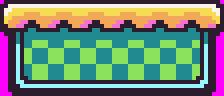
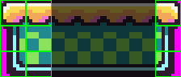
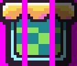

Even though Pixel Vision 8 can only support 8x8 sprites, you can still use larger sprites in your game. To do this, you will need to combine those sprites at run-time. Let's take a look at a simple platform made up from a couple of 8x8 sprites:

In this example, there is a 7 x 3 grid with a total of 21 sprites: 

Some of these sprites repeat, which helps cut down on the total number of sprites that are stored in memory. You will see that we have 9 unique sprites, but we still need 21 sprites to render. We can reduce this even more by mirroring the right side and get the total unique sprites down to 6.

Just keep in mind that some system templates have a limit on the number of sprites that can be drawn to the display in a single frame. So the larger your sprites, the less you may have to display other elements of your scene. Don’t forget that you can also leverage the tilemap to render larger areas of static sprites that don’t need to move on the screen.


