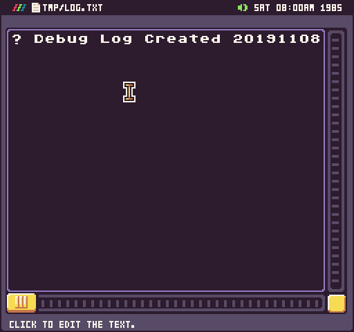
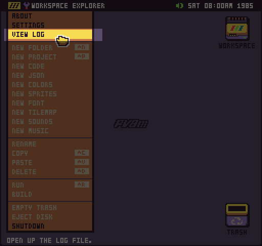
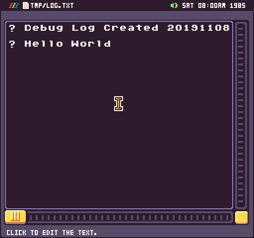
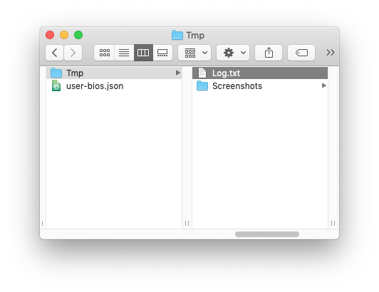

# Log Tool

Pixel Vision OS includes a basic tool for viewing Pixel Vision 8’s log file. This file is maintained and updated while Pixel Vision 8 is running. 

You can preview this log at any time by opening up the Debug Tool from the Workspace Explorer’s drop-down menu.

Here you can read through the log.txt file and see the activity from the engine itself in the form of errors or Lua print() statements in your game. 

One thing to keep in mind, however, is that Pixel Vision 8 automatically destroys the `log.txt` file when you shut down Pixel Vision OS. You can access the raw `log.txt` file at any time from Pixel Vision 8’s `Tmp` directory on your computer.

The `log.txt` file is located in one of the following locations based on the OS you are running Pixel Vision 8 on.

| Version | Path                                                            |
|---------|-----------------------------------------------------------------|
| Windows | C:\\Users\\UserName\\AppData\\Local\\PixelVision8\\Tmp\\Trash\\ |
| MacOS   | /Users/UserName/\.local/share/PixelVision8/Tmp/Trash/           |
| Linux   | /Users/UserName/\.local/share/PixelVision8/Tmp/Trash/           |

If you would like to view the log while running Pixel Vision 8, you can open it from the termnial window or use a text editor that automatically refreshes files after external changes are detected.

