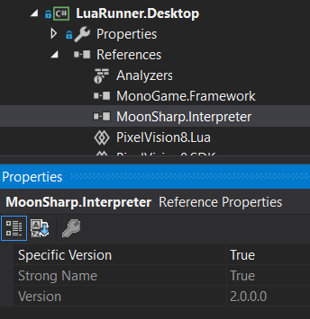

MonoGame Runners are bare bone wrappers for Pixel Vision 8 games. There are two runners, one for C# games and the other for Lua. Each runner helps bridge the gap between the Pixel Vision 8’s C# code and the native operating system. Both runners have the same basic functionality, so you’ll need to figure out the one that best suits your needs base on the programming language you prefer to use. The two MonoGame Runners are inside of the `MonoGameRunners.snl` solution at the root of the project folder.

First up, let’s take a look at the MonoGame C# runner. This is the most basic type of Pixel Vision 8 Runner you can build. Let’s take a look at how the runner is structured.

Here you’ll find a` Progame.cs` file that launches the application. Next is the `CSharpRunner.cs` file which configured Pixel Vision 8, loads the content files, and runs the default game which is located in the `ExampleGameChip.cs` file. Finally, the game contents are located in the Content folder. This is referenced from the project default Pixel Vision 8 template which is located in the Disk folder at the root of the project’s directory.

Make sure you select the correct runner from the build menu.

From here you can start the build and you will end up with the following game.

 

For the C# Runner, you can modify the game by making changes in the `ExampleGameChip.cs` file. If you are looking to build a pure C# Pixel Vision 8 game, you’ll want to start with this project.

If you have an existing PV8 game that was written in Lua, or you want to create a bare-bones Lua game directly on top of C#, you can use the LuaRunner project. This is set up similar to the C# Runner with a Program.cs file, a Content directory, but this project uses the Pixel Vision 8’s LuaRunner which is located in the `Shared/PixelVision8.Lua/` project folder.

When you compile the LuaRunner, you’ll see the same empty PV8 project that the C# Runner uses.

The only difference here is that the code for the project is located in `Contents/code.lua` file. If you’d like to compile your own PV8 game written in Lua, simply copy over all of the project files to the root of the Content directory and recompile. Even better, you can continue to make changes to your Lua game without having to recompile by pressing `Ctrl + 4`. Just remember that it will reload the files located in the build’s `Contents` folder and not the ones located in the solution since they are copied over on each new build.

Any chances you make here will be overwritten if you recompile in Visual Studio so be sure to copy these back over to your projects Contents folder.

Finally, it’s important to point out that both projects have dependencies on MonoGame. 

The Lua Runner requires a reference to [MoonSharp](https://www.nuget.org/packages/MoonSharp) which is the Lua Interpritore Pixel Vision 8 uses.

These NuGet projects are not included in the git repo so you may need to force the project to reimport them or install them by hand.


