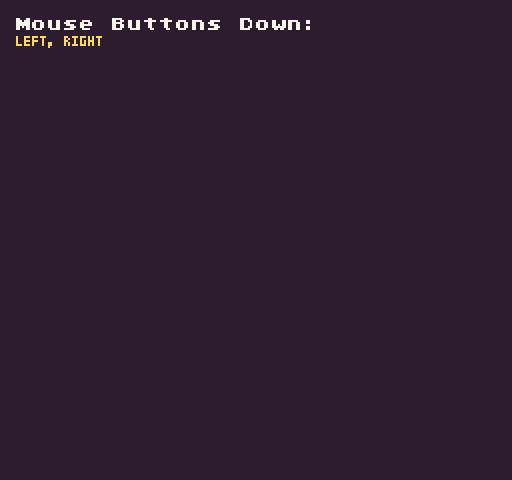

Pixel Vision 8 supports mouse input. You can get the current state of the mouse's left (`0`) and right (`1`) buttons by calling `MouseButton()`API. In addition to supplying a button ID, you can also provide an option `InputState`. 

The `InputState` enum contains options for testing the `Down` and `Released` states of the supplied button ID. By default, `Down` is automatically used which returns true when the key was pressed in the current frame. When using `Released`, the method returns `true `if the key is currently up but was down in the last frame.

## Usage

`MouseButton ( button, state )`

## Arguments

<table>
  <tr>
    <td>Name</td>
    <td>Value</td>
    <td>Description</td>
  </tr>
  <tr>
    <td>button</td>
    <td>int</td>
    <td>Accepts an int for the left (0) or right (1) mouse button.</td>
  </tr>
  <tr>
    <td>state</td>
    <td>InputState</td>
    <td>An optional InputState enum. Uses InputState.Down default.</td>
  </tr>
</table>

## Returns

<table>
  <tr>
    <td>Value</td>
    <td>Description</td>
  </tr>
  <tr>
    <td>bool</td>
    <td>Returns a bool based on the state of the button.</td>
  </tr>
</table>

## Mouse Buttons

The mouse has two buttons you can access by their ID.

 

<table>
  <tr>
    <td>Enum</td>
    <td>Value</td>
  </tr>
  <tr>
    <td>Left</td>
    <td>0</td>
  </tr>
  <tr>
    <td>Right</td>
    <td>1</td>
  </tr>
</table>

## Input State Enums

There are two input states you can use to test a button’s current state:

<table>
  <tr>
    <td>Enum</td>
    <td>Value</td>
  </tr>
  <tr>
    <td>InputState.Down</td>
    <td>0</td>
  </tr>
  <tr>
    <td>InputState.Released</td>
    <td>1</td>
  </tr>
</table>

## Example

In this example, we will display if the mouse buttons are down:

    class MouseButtonExample : GameChip
    {
        // This array will store any buttons pressed during the current frame
        List&lt;string&gt; pressedButtons = new List&lt;string&gt;();

        // A list of mouse buttons to check on each frame
        private string[] buttons = {"left", "right"};

        public override void Update( int timeDelta)
        { 
            // Clear the pressedButtons array on each frame
            pressedButtons.Clear();

            // Loop through all the buttons
            for (int i = 0; i &lt; buttons.Length; i++)
            {
                // Test if the current mouse button ID is down and saves it to the pressedButtons array
                if (MouseButton(i, InputState.Down))
                {
                    pressedButtons.Add(buttons[i]);
                }
            }

        }

        public override void Draw()
        { 
            // Clear the display
            Clear();

            // Convert the pressedButtons into a string and draw to the display
            var message = string.Join(", ", pressedButtons.ToArray()).ToUpper();
            DrawText("Mouse Buttons Down:", 8, 8, DrawMode.Sprite, "large", 15);
            DrawText(message.Substring(0, message.Length), 8, 16, DrawMode.Sprite, "medium", 14, - 4);

        }

    }

Running this code will output the following:

## 


