The Music Tool allows you to create music from scratch, edit existing songs, and can also generate random music to help get you started. This is what you are presented with when loading up a `music.json` file.

The Music Tool is divided into 4 different zones: song playback, song editor, the tracker, and note input.

## Keyboard Shortcuts

The Music Tool has the following keyboard shortcuts based on what actions are available.

| Name        | Shortcut  | Description                                                              |
|-------------|-----------|--------------------------------------------------------------------------|
| Save        | Ctrl \+ S | Save the changes to the music\.json file\.                               |
| Undo Note   | Ctrl \+ Z | Undo the last note change\.                                              |
| Redo Note   | Ctrl \+ Y | Redo the last note change\.                                              |
| Clear Note  | Ctrl \+ D | Clear the currently selected note\.                                      |
| Copy Note   | Ctrl \+ C | Copy the currently selected sound\.                                      |
| Paste Note  | Ctrl \+ V | Paste the previously copied sound over to the currently selected sound\. |
| Export Song | Ctrl \+ E | Export the current song to a \.wav file\.                                |
| Quit        | Ctrl \+ Q | Quit the current tool\.                                                  |

## Preview Songs

The first zone focuses on playback and navigating between songs which are collections of patterns. 

Here you will find buttons for randomly generating a new song (which also clears an existing one), play a single pattern, single play a song, pattern play a song and stop. You can also navigate between songs and name them. 

## The Tracker

The main part of the Music Tool is the tracker and music keys. This is where you will spend the majority of the time arranging and editing notes in the tracker. 

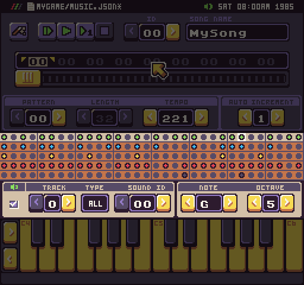

You can select any note in the tracker to see its value or use the keys to add a new value. Every time you enter a note, the tracker automatically advances to the next note based on the autoincrement field, which is set to 1 by default.

The final part of the Music Tool is the track and note edit area.

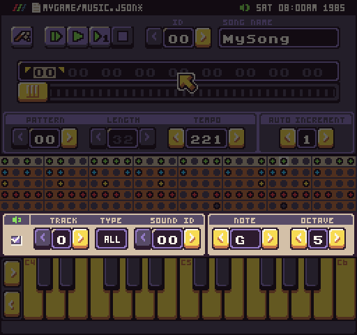

This is where you can mute a track while playing the pattern, change a track’s instrument, modify a note’s value, the octave of the note and the volume for the entire track. This will also show you a preview of the channel’s waveform type which may alter the way a sound effect plays on a particular track.

### Adding Notes

Now that you know about each of the different parts of the Music Tool, let’s talk a little bit about adding notes and editing them. The primary tool for adding notes in the tracker are the keys at the bottom of the screen. Each key represents a midi note value. You can change the octave with the arrows on the left of the keys.

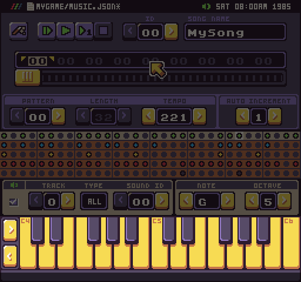

The Music Tool can display up to two sets of note octaves a time, not including the last key. You can see the current C key octave at the top left corner of the key. When you press a key, the note will be added to the currently selected beat in the tracker. You can use the mouse or the input fields, above the keys, to make more granular changes to each note created.

You can also use the keyboard to input musical notes. Each keyboard key maps to the music tool’s key.

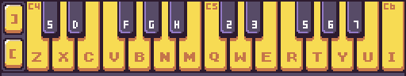

Remember that when you use the keyboard to input a key, it will automatically advance to the next note based on the auto-increment value.

### Modifying Tracks

Each track is assigned a sound effect ID. This is the sound that is used to playback the note based on the given note and octave. When you create a new project or use one of the templates, the first four sound effects are already set to musical instruments: melody, harmony, bass, and drums. Each track is assigned to one of these instrument IDs. This allows you to start making music without having to set up any of the tracks by hand. You can also modify the number of tracks in the `data.json` file or with the help of the Chip Editor Tool. Some of the templates such as the GBoy System only have 3 track available.

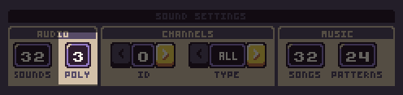

If a track is unavailable, it will be grayed out. It is important to note that each track corresponds to a giving audio channel. That means if you are playing a pattern that uses all 4 tracks, and a sound effect is played on one of the channels, the music note will be ignored until the sound effect is done playing. If the sound effect is longer than a single note, the tracker may try to change the note value of the sound effect which could have some strange side effects. 

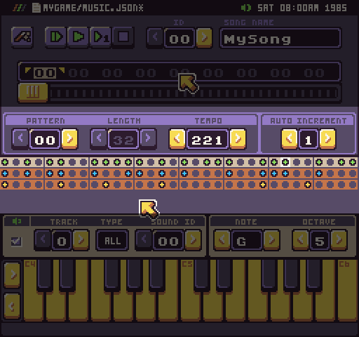

It is best to leave a single channel open just for sound effects or limit the length of sound effects so they don’t bleed over into the next note of the tracker. So if your game has 4 channels, you can reserve the last channel for sound effects. The Music Tool can only edit 4 tracks so you can manually change the track total in the data.json file to add an additional channel dedicated to sound effects as well. It is up to you and how faithful to a system’s specs you want to stay.

## Editing Patterns

The next area allows you to navigate between patterns, which are smaller parts of a song. 

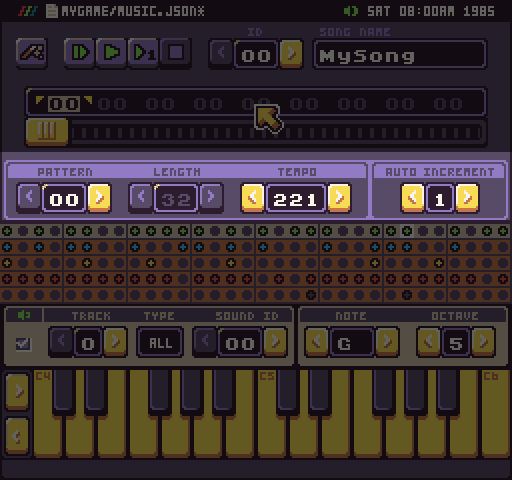

Changing the pattern here will automatically load that pattern and change the pattern of the currently selected index of the song editor.

## Editing Songs

Finally, you can create a song from a collection of patterns in the song editor. This allows you to alos preview an entire song’s collection of patterns and select a pattern to edit.

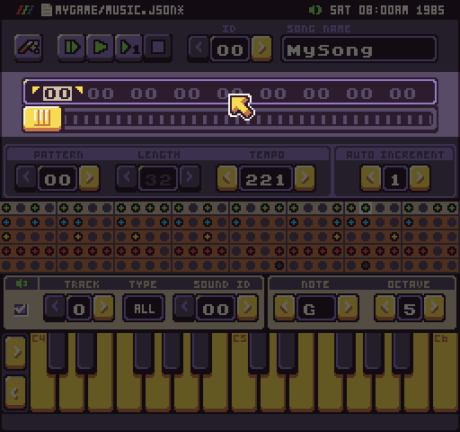

To add more patterns to a song, you’ll need to extend its endpoint by clicking in the upper right-hand corner of any pattern ID in the list.

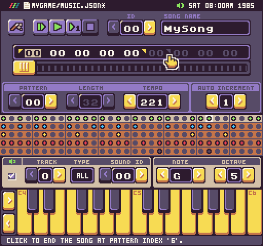

To edit a pattern, click on it in the song editor and it will switch to that part of the song and load the pattern.

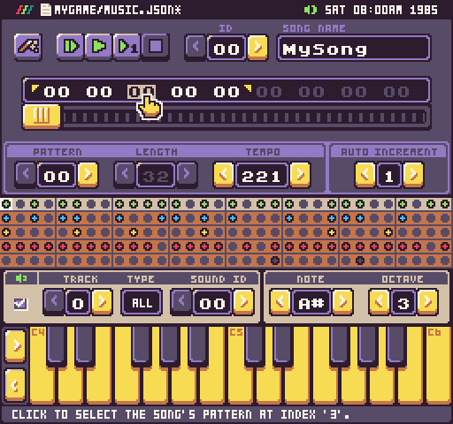

## Random Music Generator

If you are looking for a little help creating new patterns, the Music Tool can randomly generate a one for you. Simply press the music generator button, and the tracks will be automatically populated with random notes.

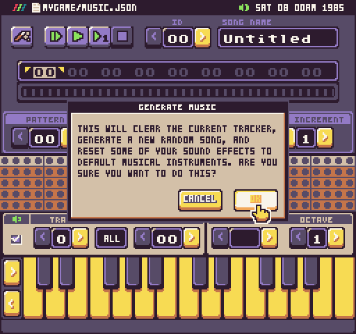

The music generator will use its default settings to automatically create notes on each track based on specific song properties. It is also important to note that in the default configuration, the sound effects for each track will automatically be overwritten and new ones will be created specifically for the song. You’ll want to reserve the first 5 sound effects or however many audio channels your game has, to the music generators instruments.

### Configure Music Generator

You can change the values of the Music Generator by accessing its settings from the drop-down menu.

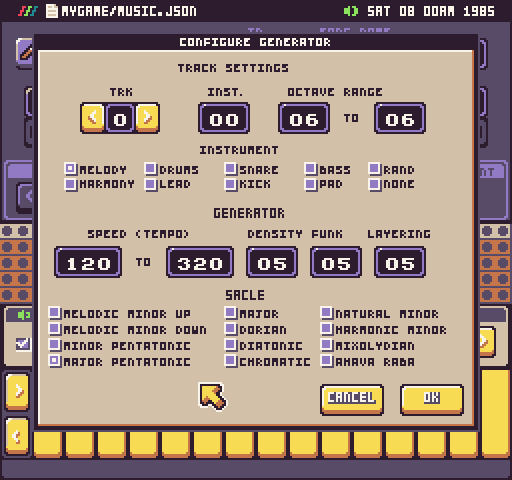

You can keep the Music Generator from creating default music instrument sound effects by changing a tracks instrument value to none. It will simply use the current sound effect settings and not generate new values. Use this if you have created custom instruments already but note that the generator works best when it knows the default instrument type.

You can modify each track’s settings to fit your needs at the top of the configure panel.

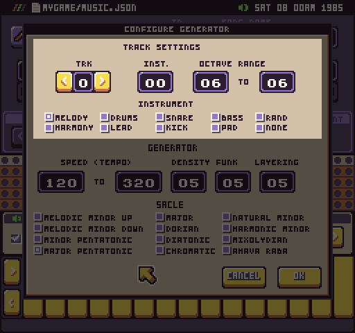

The next area allows you to change the global values of the generator itself such as the speed in tempo, the density, funk, and layer which alters the number and types of note per track. 

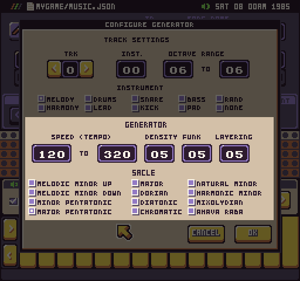

Finally, you can modify the musical scale to use. When you are done making changes the generator, hit the OK button to return to the music tool. Changes you make to the music generator are not saved between projects and will be lost when quitting Pixel Vision 8.

When you have built a collection of patterns, you can use the `PlaySong()` method and supply an array of pattern IDs to create a single song. A song builder is currently under development for a future release.
