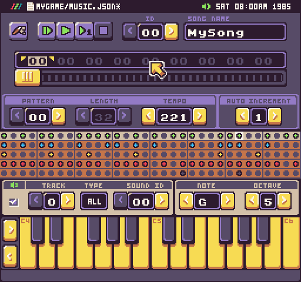

The Music Tool allows you to create music from scratch, edit existing songs, and can also generate random music to help get you started. This is what you are presented with when loading up a `music.json` file.

The Music Tool is divided into 4 different zones: song playback, song editor, the tracker, and note input.

## Keyboard Shortcuts

The Music Tool has the following keyboard shortcuts based on what actions are available.

<table>
  <tr>
    <td>Name</td>
    <td>Shortcut</td>
    <td>Description</td>
  </tr>
  <tr>
    <td>Save</td>
    <td>Ctrl + S</td>
    <td>Save the changes to the music.json file.</td>
  </tr>
  <tr>
    <td>Undo Note</td>
    <td>Ctrl + Z</td>
    <td>Undo the last note change.</td>
  </tr>
  <tr>
    <td>Redo Note</td>
    <td>Ctrl + Y</td>
    <td>Redo the last note change.</td>
  </tr>
  <tr>
    <td>Clear Note</td>
    <td>Ctrl + D</td>
    <td>Clear the currently selected note.</td>
  </tr>
  <tr>
    <td>Copy Note</td>
    <td>Ctrl + C</td>
    <td>Copy the currently selected sound.</td>
  </tr>
  <tr>
    <td>Paste Note</td>
    <td>Ctrl + V</td>
    <td>Paste the previously copied sound over to the currently selected sound.</td>
  </tr>
  <tr>
    <td>Export Song</td>
    <td>Ctrl + E</td>
    <td>Export the current song to a .wav file.</td>
  </tr>
  <tr>
    <td>Quit</td>
    <td>Ctrl + Q</td>
    <td>Quit the current tool.</td>
  </tr>
</table>


