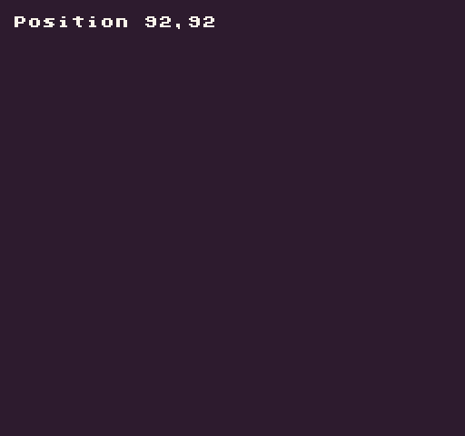

A `Point `is a Pixel Vision 8 primitive used for defining an `X` and `Y` position on the display. The NewPoint() API creates a new instance for you. It’s important to keep in mind that point only stores integers for the `X` and `Y` value. 

## Usage

`NewPoint ( x, y )`

## Arguments

<table>
  <tr>
    <td>Name</td>
    <td>Value</td>
    <td>Description</td>
  </tr>
  <tr>
    <td>x</td>
    <td>int</td>
    <td>The X position of the Point as an integer.</td>
  </tr>
  <tr>
    <td>y</td>
    <td>int</td>
    <td>The Y position of the Point as an integer.</td>
  </tr>
</table>

## Returns

<table>
  <tr>
    <td>Value</td>
    <td>Description</td>
  </tr>
  <tr>
    <td>Point</td>
    <td>Returns a new instance of a Point to be used as a Lua object.</td>
  </tr>
</table>

## Example

In this example, we are going to create a new point, increase it by `1` on every frame, and display it’s `X` and `Y` values on the screen:

    class NewPointExample : GameChip
    {
        // Store the point
        private Point pos;

        public override void Init()
        {
            // Use the game's NewPoint() to create a point instance
            pos = NewPoint();
        }

        public override void Update(int timeDelta)
        {

            // Increase the position by one and have it reset back to 0 if it gets bigger than the display's boundaries
            pos.X = Repeat(pos.X + 1, Display().X);
            pos.Y = Repeat(pos.Y + 1, Display().Y);

        }

        public override void Draw()
        {
            // Redraw the display
            RedrawDisplay();

            // Draw the X and Y value of the position
            DrawText("Position " + pos.X + "," + pos.Y, 8, 8, DrawMode.Sprite, "large", 15);

        }

    }

Running this code will output the following:


