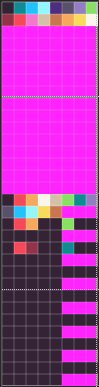
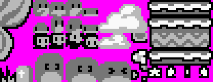
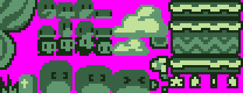
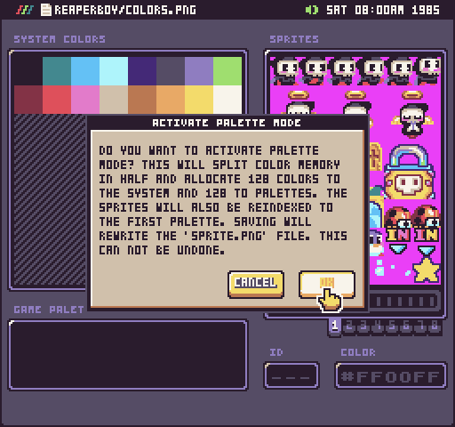
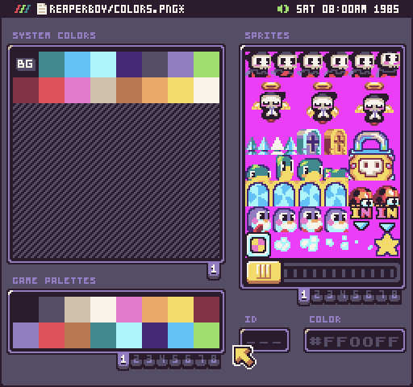
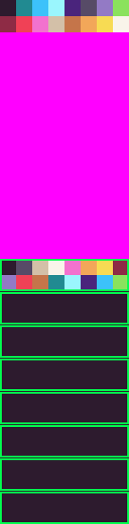
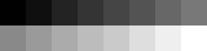
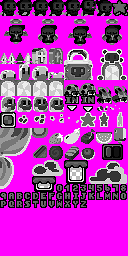
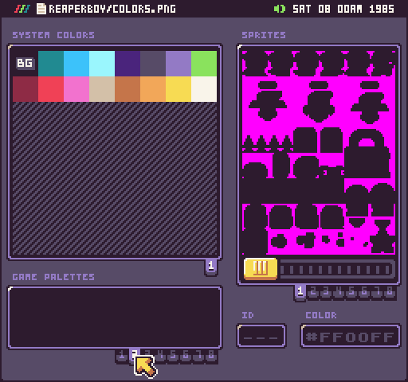

Pixel Vision 8 doesn’t have a built-in palette mode. Instead, there is an ability to shift the color ID of a sprite by an offset value before it is drawn to the display. 

## Using Color Offset

You can use the color offset value to simulate palette swapping in your own game based on how you organize the system colors. This means you will need to calculate the color offset by hand and supply it when drawing sprites to the screen. Let’s take a look at how this actually works in code. We’ll start with a grey-scale sprite that uses a color-map.png file to map the default system colors.


All of the DrawAPIs have an optional color offset argument. By default, this value is set to 0. If we were to draw this sprite to the display, it would map directly to the system colors in the order of each grey value in the color-map.png file.


If you change the color offset value, it will be added to all of the color IDs that make up a sprite’s pixel data. For example, if you have a sprite that uses the first color, it’s pixel data will be 0. If you pass in 5 for the color offset, all of the sprite’s color IDs will shift over to 5. Once you understand the basics, there are a few advanced ways you can use this.


When it comes to palettes, the Color Tool will split the color memory in half. The first 128 colors will be reserved for system colors and the other 128 colors are for palettes. When this is used with a color-map.png file, the sprite’s colors are matched up with the color-map.png instead of the system colors instead of how to direct color mode works. It’s important to note that the color-map.png file contains 16 colors starting a 0 and ending at 15. If you do not change the color offset of your sprites, they will display the first 16 system colors.

If you want to remap the sprites to the first palette, you can pass in 127 as the color offset. Keep in mind that color IDs are zero-based so 127 is where the palette colors begin. To help you calculate the palette color offsets, you can use the `PaletteOffset()` API to find the right offset for you. For example, if you want to set the sprites to the first palette, you can do the following:

```lua
DrawSprite (0, 0, 0, false, false, DrawMode.Sprite, PaletteOffset(0))
```

In this example, a palette has been set up to re-color the flower. Supplying the first palette offset value will shift all of the colors over to the intended values.


If you wanted to use the second palette, just change the value to 1:

```lua
DrawSprite (0, 0, 0, false, false, DrawMode.Sprite, PaletteOffset(1))
```

Shifting the colors to the second palette will recolor the stem since that palette has a new color where the green was in the previous palette.


You can also use the `PaletteOffset()` API to find a specific color ID inside of a palette. Let’s say you want to change the 2nd color of the first palette, you can calculate it’s ID by doing the following:

```lua
var colorID = PaletteOffset(0, 1)
```

Again, remember that all colors are zero-based so you’ll want to account for that when referencing color IDs or shifting color offsets. Once you understand how palette mode and color offset work together, you’ll be able to do more advanced techniques common to an 8-bit system such as palette swapping, color cycling, and replacing colors at runtime.

Here is an example of how the color.png file was set up to achieve this color swapping effect.



You can see all of the palette colors at the bottom half of the color.png file. While you can set these up by hand, it’s best to use Pixel Vision 8’s Color Tool in Palette Mode.

## Color Maps

The color map allows the engine to better understand how to index sprite, font and tilemap PNG colors when they don’t match up to the system colors. Without a `color-map.png`, the engine automatically attempts to use the system colors as the index for each color found in a sprite. With the color map, you can set the colors of your sprites independent of the game’s actual system colors re-map them to default colors so they render correctly. Let’s take a look at a few sprites and how their colors are indexed when imported:



Here you can see that these sprites contain four colors, not including transparency which is represented as magenta. They could work well with a Game Boy color palette, but that system uses four shades of green:


To fix this, we can create a color map that has the native sprite colors in the same order as the system colors, like this:


Now when the sprites are loaded up in memory, they will automatically use the correct system colors:



Here is an example of the color mapper converting the grayscale sprites into the system’s four shades of green:


As a best practice, you should always design your sprites in shades of gray and include a `color-map.png`. That way, the engine knows how to correctly parse your sprite and tilemap data independently from the system colors.

## Remapping Sprite Colors

Converting sprites to palettes is a bit challenging but the Color Tool can automatically attempt to do this for you when changing between color modes. For example, if you change a project from direct color mode to palette mode, the Color Tool is going to make the necessary changes to the  `color.png` and `sprites.png`. You’ll get the following warning before any changes take place.



While in palette mode, the Color Tool will split the color memory in half. It will reserve the first 128 colors for unique system colors and the other 128 colors will be split up into 8 palettes of 16 colors each. The sprite colors will also be remapped to the first palette.



When you convert sprites to work in palette mode, the sprite colors are parsed and up to 16 colors will be placed in the first palette. This will overwrite the default CPS limitation in the Sprite Chip to give you a chance to manually fix the colors in the palette. You can see the changes in the updated `colors.png` file by opening it in an external image editor. 



As you can see, the last 128 colors are now reserved for the palettes. The first palette uses the colors found in the `sprites.png` file and the background color is used to fill the colors for the remaining palettes. The tool will also create a new `color-map.png` file. Inside will be 16 grayscale colors used to map the colors back to the first palette.



In addition to adding a `color-map.png` file, the `sprites.png` file will be recolored to match up to it. Here is an example of the new `sprites.png` file after switching to palette mode.



The remaining palettes will all be filled in by the first system color. 



It’s up to you to recolor the sprites, limit the size of the palettes, and make sure any existing sprites map over to the new palette colors correctly.

Finally, you can switch back to direct color mode and the Color Tool will attempt to build the color.png and sprite.png file accordingly. It will re-map all of the sprites back to the first palette, remove the palette colors from the `color.png` file, and delete the `color-map.png` file. Try to avoid switching between modes as sprite colors may get shifted or corrupted. While this tool is here to help, it’s usually best to choose the color mode you want to work in before creating artwork.

