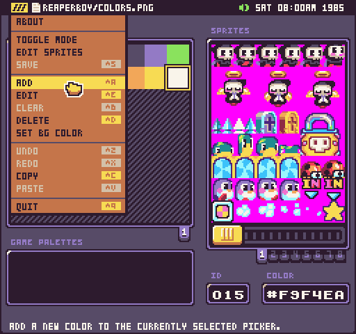
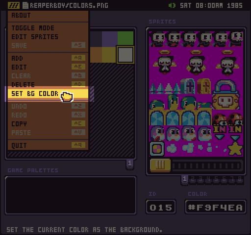

# Color Tool

Pixel Vision OS has a built-in Color Tool to make previewing and editing system colors easier. You can use the Color Tool to also create individual palettes for swapping at run-time.

You can add, edit, and delete colors from the drop-down menu. 

If a new color can be added, it will be placed to the right of the currently selected color shifting the remaining colors to the right. Deleting colors will shift the remaining colors to the left in place of the color that is removed. Keep in mind that editing or deleting colors could have an impact on the way sprites are parsed when the game is loading up. It’s best to only modify system colors befoe you begin creating artwork for the game.

You can also use the Color Tool to set the background color. By default, the first color will be set to the background color. To change it, select a new color and chose Set BG Color from the drop-down.

Changing the background color will tell the game what color to use when clearing the screen and what to default to when a color is out of range. The background color will display a special icon in the Color Tool making it easy to identify which color is set.

## Keyboard Shortcuts

The Color Tool has the following keyboard shortcuts based on what actions are available.

<table>
  <tr>
    <td>Name</td>
    <td>Shortcut</td>
    <td>Description</td>
  </tr>
  <tr>
    <td>Save</td>
    <td>Ctrl + S</td>
    <td>Save the changes to the color.png file.</td>
  </tr>
  <tr>
    <td>Add</td>
    <td>Ctrl + A</td>
    <td>Add a new color to the right of the currently selected color.</td>
  </tr>
  <tr>
    <td>Edit</td>
    <td>Ctrl + E</td>
    <td>Edit the currently selected color.</td>
  </tr>
  <tr>
    <td>Clear</td>
    <td>Ctrl + B</td>
    <td>Clear the currently selected palette color. This will make the color transparent.</td>
  </tr>
  <tr>
    <td>Delete</td>
    <td>Ctrl + D</td>
    <td>Delete the currently selected color.</td>
  </tr>
  <tr>
    <td>Undo</td>
    <td>Ctrl + Z</td>
    <td>Undo the last color change.</td>
  </tr>
  <tr>
    <td>Redo</td>
    <td>Ctrl + X</td>
    <td>Redo the last color change.</td>
  </tr>
  <tr>
    <td>Copy</td>
    <td>Ctrl + C</td>
    <td>Copy the currently selected color.</td>
  </tr>
  <tr>
    <td>Paste</td>
    <td>Ctrl + V</td>
    <td>Paste the currently selected color into a palette.</td>
  </tr>
  <tr>
    <td>Quit</td>
    <td>Ctrl + Q</td>
    <td>Quit the current tool.</td>
  </tr>
</table>


