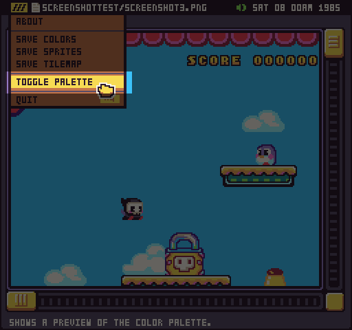
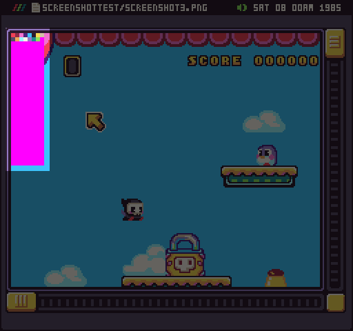
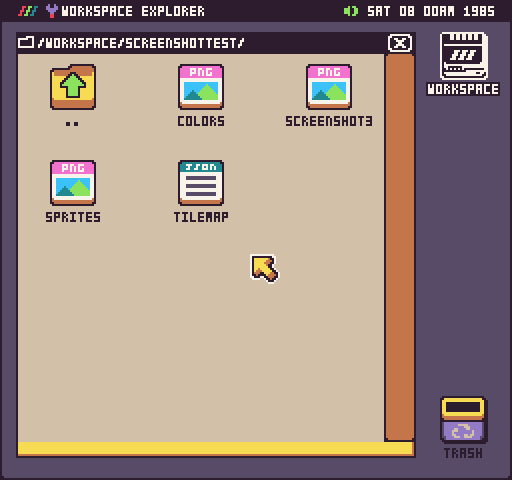
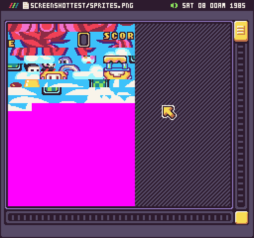
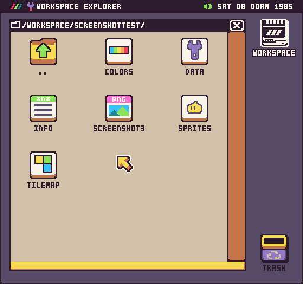
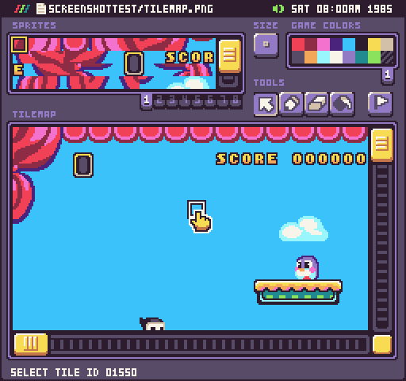

# Image Preview Tool

Pixel Vision OS has a built-in image viewer. You can use it to open any PNG file that is not associated with an editor. You can tell the PNG will be opened by the Image Preview Tool if it has the generic PNG icon. For example, you can use the Image Preview Tool to open any screenshot you take by pressing Ctrl + 2. These are located in the /Workspace/Screenshots/ folder.

The Image Preview Tool has some extra functionality outside of just displaying PNGs. You can use it to generate color, sprite, tilemaps from the currently displayed image. To illustrate how this works, copy a screenshot to a new empty folder.

 

After you open up the image, you’ll be able to preview the PNG’s colors by selecting Toggle Palette from the drop-down menu.

When to toggle the palette, the Image Preview Tool will overlay a copy of the 256 color palette it is using to render the current image. Any transparent colors will be displayed as magenta (#FF00FF) which is the default mask color. The preview will hover above the upper left-hand corner of the scrolling window.

In addition to previewing the PNG’s color palette, you can use the Image Tool to export a color.png, sprite.png, and tilemap.json file from the current image. These options are also available in the drop-down menu.

When you select either of these options, the exported file will appear in the same directory as the PNG file you are previewing.

 By default, exporting each of these files in an empty directory will create PNG files you can open in the Image Preview Tool. For example, if you open up the sprites.png file, you’ll see all of the unique sprites from the source image.

In order to open these files in their associated editor, you’ll need to add an `info.json` and `data.json` file. These two files tell Pixel Vision OS that this is a game folder and to remap the files to their respective editors. To verify that this a game project, the icons will change for each of the files.

Once the folder is converted into a game project, you’ll be able to open the tilemap.json file with the Tilemap Tool.

It’s important to note that generating out the sprite.png file from an image is dependant on exporting the color.png file first. In turn, the tilemap.json file is dependant on the sprites.png file and will reference each sprite ID. When used correctly, the Image Preview Tool can help convert a PNG into sprites and tilemaps you can use to help speed up your game development.


