# Settings Tool

​The System Setting Tool allows you to configure the global settings of Pixel Vision OS in one place. The Settings Tool is available from the Workspace Explorer’s drop-down menu.

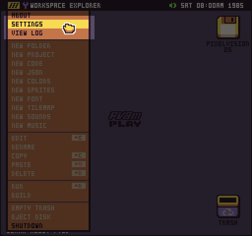

The first panel of the settings tool allows you to modify the system volume. This will not only affect the currently loaded game, but all sounds played by Pixel Vision 8.  

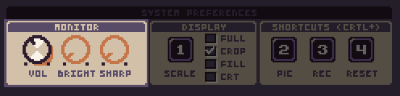

You can also mute all sounds if you prefer to work in silence. Pixel Vision 8 saves the mute and volume values in the `user-bios.json`.

The next setting panel controls Pixel Vision 8’s resolution. Changes made to these settings are applied immediately. The first option is changing the scale of Pixel Vision 8’s window.

When in windowed mode, Pixel Vision 8’s native resolution is 512 x 480. Games are scaled up to fit inside of that resolution. Since Pixel Vision OS’s resolution is set to 256 x 240, it will be scaled x2 to fit inside of the window. This allows Pixel Vision 8 to support game resolution of up to 512 x 480.

There are 4 scale options to chose if you want to change the size of Pixel Vision 8 in window mode. Scale mode 1 sets the resolution to 512 x 480. Increasing the scale to 2 changes the window size to 1024 x 960. You can not resize the window manually. This scale system ensures that games always look pixel-perfect at the correct resolution.  

Be careful not to change the scale to something larger than your monitor can support or you’ll need to restart Pixel Vision 8 and hold down the 1 key while the boot animation is playing to reset the scale back to its default value.

One thing to note, when creating games at resolutions that are not 256 x 240, is that black bars are displayed based on the game's suggested aspect ratio.

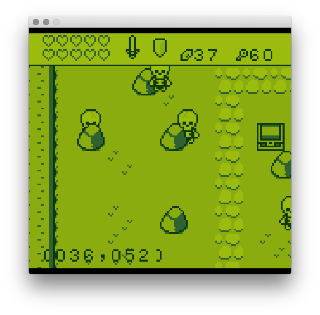

You can remove the black bars in window mode by checking the crop setting.

When crop is on, Pixel Vision 8 will scale the game up to fit in the vertical height of 480 pixels. From there, the window chrome is resized horizontally to fit perfectly around the game at its newly upscaled resolution.

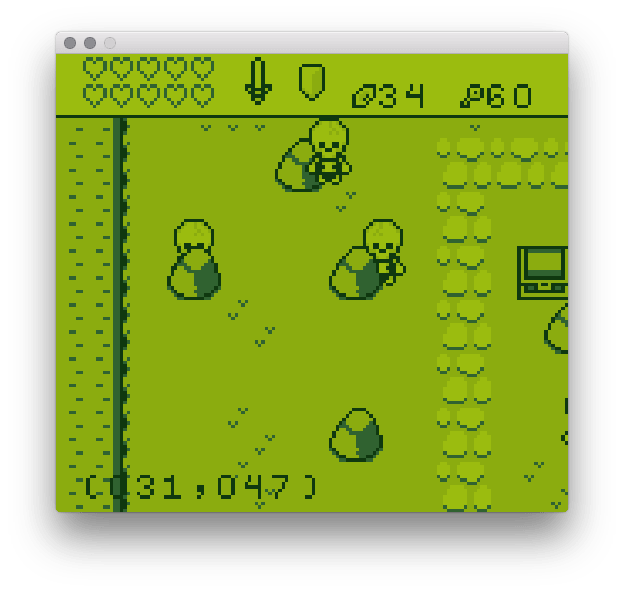

Pixel Vision 8 will always prioritize maintaining perfectly square pixels when upscaling games of any resolution. You may find some resolutions work better than others so keep these settings in mind when designing your game’s resolution.

The last option is fullscreen, which allows Pixel Vision 8 to completely take over the entire screen. When going into fullscreen mode, the Game Creator automatically adjusts the scale mode based on your monitor’s maximum vertical resolution. Since most monitors are 16:9, there will always be black bars on the sides of the game. You can use the full-screen option to stretch the image and remove the bars.

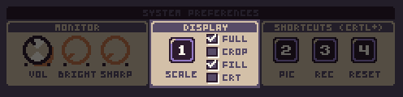

As you can see, this will stretch the image horizontally and Pixel Vision 8 will not be able to maintain perfectly square pixels.

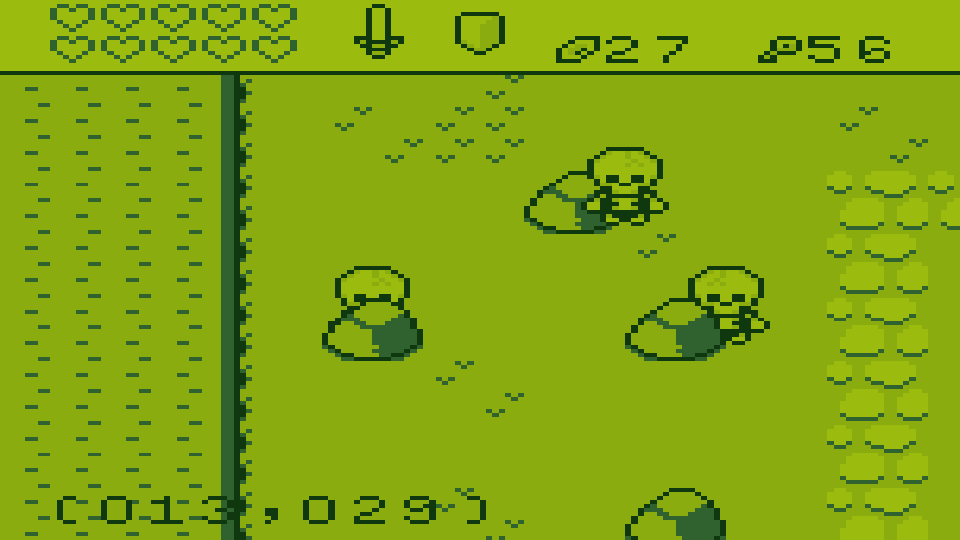

If you run into an issue with fullscreen or scale mode, you can manually change the values in the user’s bios file. Simply search for `FullScreen `Or `Scale`:

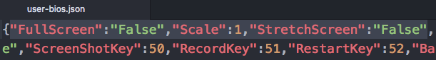

If you change these values and restart Pixel Vision 8, it should adjust the display accordingly. Just be sure to only change user bios settings when Pixel Vision 8 is shut down or your changes may be overwritten when quitting.

The last resolution option is CRT mode. Checking this will apply a CRT shader filter to the entire screen.

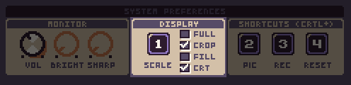

When this mode is activated, you will see scanlines and the edges of the display will be slightly warped as if PV8 was being viewed on a CRT monitor.

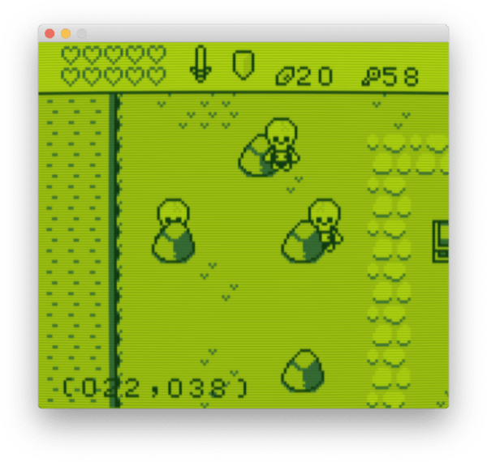

You may need to restart Pixel Vision 8 in order to see the CRT filter correctly the first time you apply it. Also in CRT mode, you will have access to adjusting the brightness and sharpness of the CRT monitor.

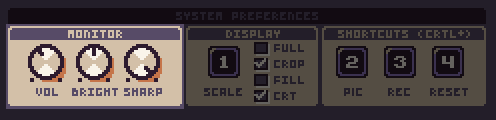

It’s important to note that the CRT filter is not applied to any screenshots or recordings done while a game is running. This effect can only be seen on the Pixel Vision 8 window itself.

Finally, the last panel allows you to change the shortcut keys for taking screenshots and animated gifs in Pixel Vision 8.

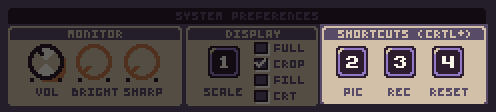

You can change the shortcuts to any number from 0-9 on your keyboard as long as it does not conflict with another keyboard shortcut.


